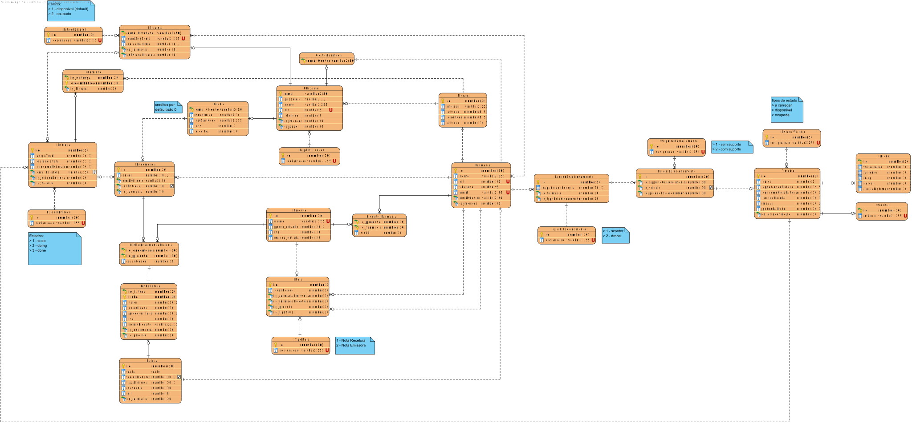

# Projeto de LAPR3 2020-2021

## 1. Constituição do Grupo de Trabalho ###

O grupo de trabalho é constituído pelo estudantes identificados na tabela seguinte.

| Aluno Nr.	   | Nome do Aluno			      |
|--------------|------------------------------|
| **1190713**  | João Osório                  |
| **1190903**  | Miguel Gonçalves             |
| **1191018**  | Rúben Rodrigues              |
| **1191033**  | Rui Vieira                   |
| **1191042**  | Rui Pinto                    |
| **1191106**  | Tomás Limbado                |

## 2. Introdução

Neste projeto criamos uma aplicação que permite registar farmácias com gestores. Estas farmácias possuem produtos disponíveis para compra. Sempre que um cliente pretende fazer uma compra este deve adicionar os produtos que pretende comprar ao carrinho e por fim finalizar a compra. Sempre que uma farmácia não tem stock de um produto, esta pede o produto à farmácia mais próxima que possui stock desse produto e é gerada uma nota de entrega e uma de receção. Quando a compra é finalizada, é gerada uma fatura e uma encomenda que fica pronta para ser entregue.  Para satisfazer as encomendas dos clientes as farmácias possuem parques de estacionamento com drones e scooters (que são conduzidas por Estafetas que trabalham para farmácias) para fazer entregas das encomendas realizadas até às moradas respetivas dos clientes que as realizaram.  
A aplicação permite obter os caminhos mais eficientes e mais curtos para as entregas com uma ou mais encomendas e também estimar o consumo para esses caminhos. A aplicação possui também a funcionalidade de, sempre que um veículo é estacionado, enviar email ao estafeta / gestor de farmácia com a confirmação que este foi bem estacionado e com uma estimativa de carregamento que depende do número de veículos a carregar no momento.

## 3. Documentação referente ao projeto ###

Na tabela seguinte é possível aceder a toda a documentação referente ao projeto.

| Documentação                |
|-----------------------------|
| [Diagrama Casos de Uso (DUC)](doc/DUC/DUC.svg) |
| [Modelo de Domínio (MD)](doc/MD/MD.md)           |  
| [Modelo Relacional (MR)](doc/MR/MR.md)|
| [UC - Adicionar Drone](doc/UC/UC-Adicionar Drone/ReadMe.md)  |  
| [UC - Adicionar Farmácia](doc/UC/UC-Adicionar Farmácia/ReadMe.md)  |  
| [UC - Adicionar Parque Estacionamento Drones](doc/UC/UC-Adicionar Parque Estacionamento Drones/ReadMe.md)  |  
| [UC - Adicionar Produto Ao Carrinho](doc/UC/UC-Adicionar Produto Ao Carrinho/ReadMe.md)  |  
| [UC - Adicionar Scooter](doc/UC/UC-Adicionar Scooter/ReadMe.md)  |  
| [UC - Adicionar Stock de Produto](doc/UC/UC-Adicionar Stock de Produto/ReadMe.md)  |
| [UC - Atribuir Farmácia Proxima](doc/UC/UC-Atribuir Farmácia Próxima/ReadMe.md)  |  
| [UC - Atribuir Scooter](doc/UC/UC-Atribuir Scooter/ReadMe.md)  |
| [UC - Atualizar Drone](doc/UC/UC-Atualizar Drone/ReadMe.md)  |  
| [UC - Atualizar Scooter](doc/UC/UC-Atualizar Scooter/ReadMe.md)  |  
| [UC - Calcular Caminho Entrega](doc/UC/UC-Calcular Caminho Entrega/ReadMe.md)  |
| [UC - Criar Entrega](doc/UC/UC-Criar Entrega/ReadMe.md)|
| [UC - EmailAPI](doc/UC/UC-EmailAPI/ReadMe.md)  |  
| [UC - Enviar Email de Estimativa](doc/UC/UC-Enviar Email de Estimativa/ReadMe.md)  |  
| [UC - Enviar Email de Segurança do Estacionamento](doc/UC/UC-Enviar Email de Segurança do Estacionamento/ReadMe.md)  |  
| [UC - Estimar Consumo Energético Drone](doc/UC/UC-Estimar Consumo Energético Drone/ReadMe.md)  |  
| [UC - Estimar Consumo Energético Scooter](doc/UC/UC-Estimar Consumo Energético Scooter/ReadMe.md)  |  
| [UC - Finalizar Compra](doc/UC/UC-Finalizar Compra/ReadMe.md) |  
| [UC - Iniciar Entrega](doc/UC/UC-Iniciar Entrega/ReadMe.md)  |  
| [UC - Pedir Produto](doc/UC/UC-Pedir Produto/ReadMe.md)  |  
| [UC - Registar Estafeta](doc/UC/UC-Registar Estafeta/ReadMe.md)  |  
| [UC - Registo Cliente](doc/UC/UC-Registo Cliente/ReadMe.md)  |  
| [UC - Registo Produto](doc/UC/UC-Registo Produto/ReadMe.md)  |  
| [UC - Remover Drone](doc/UC/UC-Remover Drone/ReadMe.md)  |  
| [UC - Remover Scooter](doc/UC/UC-Remover Scooter/ReadMe.md) |  
| [UC - Visualizar Catalogo de Produtos](doc/UC/UC-Visualizar Catalogo de Produtos/ReadMe.md)  |  

## 4. Modelo de domínio ###

## 5. Modelo Relacional ###

