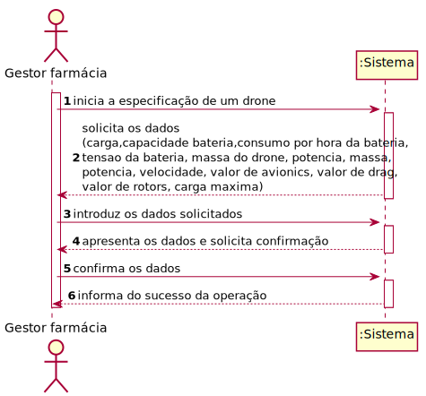

# ReadMe #

## 1. Requisitos
LAP3AP1-107 Como gestor da farmácia pretendo adicionar um drone à farmácia.

A interpretação feita deste requisito foi no sentido de que o gestor de farmácia pretende adicionar um novo drone à lista de drones existentes no sistema, relativas à sua farmácia. Para tal, introduz a informação necessária e o sistema
verifica a possibilidade, informa da possibilidade e guarda a informação correspondente num lugar de drone disponível da farmácia.

## 2. Análise
### Descrição e Regras de Negócio
Foi utilizado o mecanismo de persistência de dados na base de dados.
Desta forma, os dados relativos ao drone são inseridos na base de dados,
no respetivo repositório que neste contexto, é o Lugar de estacionamento. Desta forma, a
informação dos drones fica guardada, podendo ser utilizada ou alterada posteriormente.

### Pré-condições
O sistema contém farmácias com lugares de estacionamento de drones (um repositório onde se encontra toda a informação relativa aos drones).

### Pós-condições
A informação do novo drone é persistida/guardada no sistema.

### SSD

## 3. Design
### 3.1. Realização da Funcionalidade
#### SD

#### CD

### 3.2. Padrões Aplicados
Aplicamos o padrão de projeto de software MVC, focado na reutilização de código e a separação de conceitos em três camadas interconectadas, onde a apresentação dos dados e a interação dos utilizadores são separados dos métodos que interagem com a base de dados.

### 3.3. Testes

Teste 1: Verificar que é possível criar uma instância da classe Drone e retornar um lugar de estacionamento de drone disponível.

    @Test
    void novoDrone() {
        droneBD = mock(DroneBD.class);
        farmaciaBD = mock(FarmaciaBD.class);
        utilizadorBD = mock(UtilizadorBD.class);

        instance = new AdicionarDroneController(droneBD, farmaciaBD);

        Drone drone = new Drone(2, 20, 20, 1, 300, 20, 10, 100,8,1.5,4,0.2,3);
        LugarDrone lugarDrone = new LugarDrone(true, 1, 2);
        String email = "teste@email.com";

        when(utilizadorBD.procuraUtilizador("teste@email.com")).thenReturn(new Utilizador("teste", "teste@email.com", 123456789, 123456789, "password", 1));
        when(droneBD.lastIDdrone()).thenReturn(1);
        when(farmaciaBD.getFarmaciabyGestor(email)).thenReturn(new Farmacia(1, "farm", 111111111, 919191919, "teste@email.com", email, "1", lugarDrone));
        when(farmaciaBD.getLugarDronebyFarm(1)).thenReturn(new LugarDrone(true, 1, 1));

        AplicacaoPOT app = AplicacaoPOT.getInstance();
        app.getAutorizacaoFacade().setUtilizadorBD(utilizadorBD);
        app.getAutorizacaoFacade().doLogin(email,"password");

        Pair<Drone, LugarDrone> expResult = new Pair<Drone, LugarDrone>(drone, lugarDrone);
        Pair<Drone, LugarDrone> result = instance.novoDrone(20, 20, 1, 300, 20, 10, 100,8,1.5,4,0.2,3);
        assertEquals(expResult, result);
    }

Teste 2: Verifica que é possível inserir os dados do drone no lugar de estacionamento de drone obtido anteriormente.

    @Test
    void testUpdate() {
        droneBD = mock(DroneBD.class);
        farmaciaBD = mock(FarmaciaBD.class);
        instance = new AdicionarDroneController(droneBD, farmaciaBD);
        AplicacaoPOT.getInstance();
        LugarDrone lugarDrone = new LugarDrone(1, true, 1, 1);
        Drone drone = new Drone(1, 20, 300, 1, 250, 50, 300, 10,8,1.5,4,0.2,3);
        when(droneBD.updateDrone(drone)).thenReturn(true);
        when(farmaciaBD.updateLugarDrone(lugarDrone)).thenReturn(true);
        boolean result = instance.updateDrone(lugarDrone, drone);
        assertTrue(result);
    }

## 4. Implementação
Métodos Controller:

    public Pair<Drone, LugarDrone> novoDrone(int carga, double capacidadeBateria, int estadoDroneID, double consumoHoraBateria, double tensaoBateria, double massa, double potencia, double velocidade, double avionics, double drag, double rotors, double cargaMaxima){}

    public boolean updateDrone(LugarDrone lugar, Drone drone){}

## 5. Integração/Demonstração
-/
## 6. Observações
-/