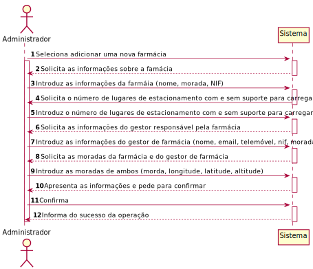
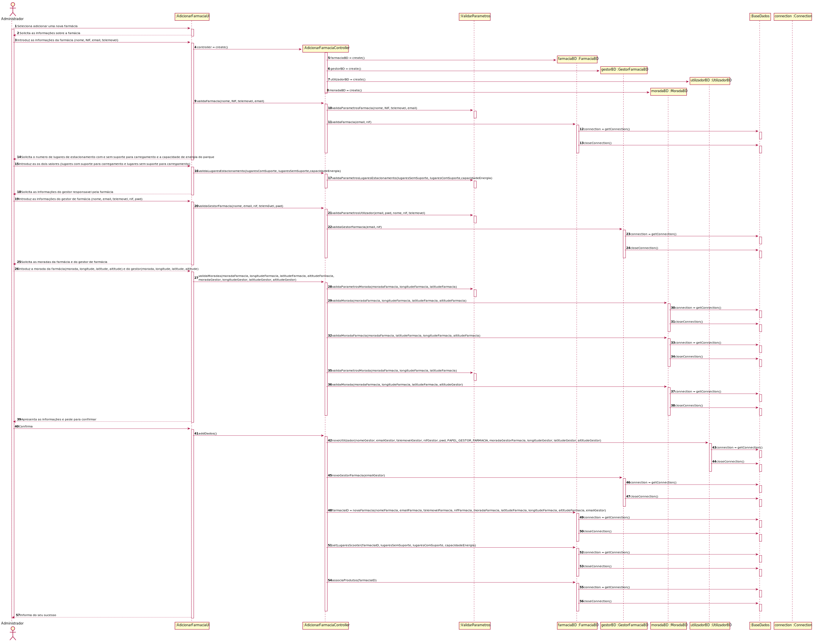
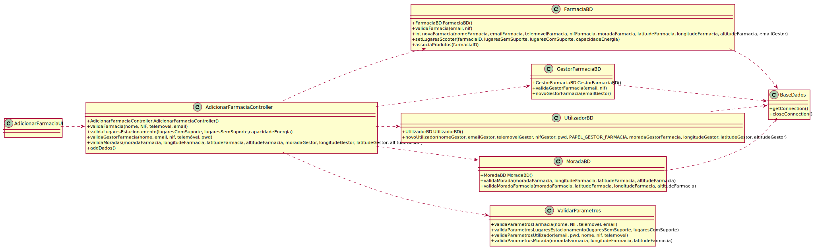

# ReadMe #

## 1. Requisitos
LAP3AP1-59 Como Administrador da plataforma, desejo adicionar uma nova farmácia ao sistema.

A interpretação feita deste requisito foi no sentido de que o administrador da plataforma pretende adicionar uma farmácia ao sistema para que assim a sua rede de distribuição de produtos aumente. Para tal, introduz todas as informações referentes à farmácia (nome, NIF, email, telefone), ao parque de estacionamento das scooters (número de lugares com suporte para carregamento e sem suporte para carregamento), ao gestor da farmácia (nome, email, telefone, NIF, password) e por último as moradas tanto da farmácia como do gestor (morada, latitude, longitude, altitude). O sistema valida todas as informações introduzidas e pede para confirmar. Depois de confirmado, todas as informações são guardadas na base de dados para futuramente serem usadas e alteradas se necessário.

## 2. Análise
### Descrição e Regras de Negócio
Foi utilizado o mecanismo de persistência de dados na base de dados. Desta forma, os dados relativos à farmácia, lugares de estacionamento, gestor de farmácia e moradas são inseridos na base de dados, no respetivo repositório que neste contexto, é, respetivamente, a Farmácia, o LugaresEstacionamento, o Utilizador/GestorFarmacia e a Morada. Desta forma, a informação da farmácia e dos dados relacionados com a mesma ficam guardados, podendo ser utilizados ou alterados posteriormente.

### Pré-condições
- O sistema contém todos os repositórios necessários para conter toda a informação introduzida.

### Pós-condições
- Todas as informações da nova farmácia e dos dados relacionados são persistidas/guardadas no sistema.

### SSD

## 3. Design
### 3.1. Realização da Funcionalidade

#### SD - Diagrama de Sequência

#### CD - Diagrama de Classes

### 3.2. Padrões Aplicados
Aplicamos o padrão de projeto de software MVC, focado na reutilização de código e a separação de conceitos em três camadas interconectadas, onde a apresentação dos dados e a interação dos utilizadores são separados dos métodos que interagem com o a base de dados.

### 3.3. Testes

- **Teste 1**: verifica que, dadas as informações relativas à farmácia, é possível, caso estejam bem, correr o método sem que este não lance nenhuma exceção, caso contrário, serão lançadas as devidas exceções.

      @Test
      void validaFarmacia() {

          //sucesso
          nome = "Farmacia";

          when(farmaciaBD.validaFarmacia(email, 123456789)).thenReturn(true);

          try {
            controller.validaFarmacia(nome, nif, telemovel, email);
          } catch (Exception e) {
            assertTrue(false);
          }

          //insucesso (nome)
          nome = "";

          try {
            controller.validaFarmacia(nome, nif, telemovel, email);
          } catch (Exception e) {
            assertEquals("Nome inválido.", e.getMessage());
          }

          //insucesso (nif)
          nome = "Farmacia";
          nif = 12;

          try {
            controller.validaFarmacia(nome, nif, telemovel, email);
          } catch (Exception e) {
            assertEquals("NIF inválido", e.getMessage());
          }

          //insucesso (telemovel)
          nif = 123456789;
          telemovel = 12;

          try {
            controller.validaFarmacia(nome, nif, telemovel, email);
          } catch (Exception e) {
            assertEquals("Número de telefone inválido", e.getMessage());
          }

          //insucesso (email)
          telemovel = 123456789;
          email = "";

          try {
            controller.validaFarmacia(nome, nif, telemovel, email);
          } catch (Exception e) {
            assertEquals("Endereço de email inválido.", e.getMessage());
          }

          //insucesso (base de dados)
          email = "email@email.com";

          when(farmaciaBD.validaFarmacia(email, nif)).thenReturn(false);

          try {
            controller.validaFarmacia(nome, nif, telemovel, email);
          } catch (Exception e) {
            assertEquals("Farmacia invalida", e.getMessage());
          }
      }

- **Teste 2**: verifica que, dadas as informações relativas aos lugares de estacionamento, é possível, caso estejam bem, correr o método sem que este não lance nenhuma exceção, caso contrário, serão lançadas as devidas exceções.

      @Test
      void validaLugaresEstacionamento() {

          double capacidadeValida=200;
          double capacidadeInvalida=-200;
          int parametroCerto = 10;
          int parametroErrado = -10;

          //caso de sucesso
          try {
              controller.validaLugaresEstacionamento(parametroCerto, parametroCerto,capacidadeValida);
          } catch (Exception e) {
              assertTrue(false);
          }

          //caso de insucesso (lugares com suporte errado)
          try {
              controller.validaLugaresEstacionamento(parametroErrado, parametroCerto,capacidadeValida);
          } catch (Exception e) {
              assertEquals("Número de lugares de estacionamento com carregamento inválido", e.getMessage());
          }

          //caso de insucesso (os dois errados)
          try {
              controller.validaLugaresEstacionamento(parametroErrado, parametroErrado,capacidadeInvalida);
          } catch (Exception e) {
              assertEquals("Número de lugares de estacionamento sem carregamento inválido", e.getMessage());
          }

          //caso de insucesso (lugares sem suporte errado)
          try {
              controller.validaLugaresEstacionamento(parametroCerto, parametroErrado,capacidadeValida);
          } catch (Exception e) {
              assertEquals("Número de lugares de estacionamento sem carregamento inválido", e.getMessage());
          }
          //caso de insucesso (capacidade engergia inválida)
          try {
              controller.validaLugaresEstacionamento(parametroCerto, parametroCerto,capacidadeInvalida);
          } catch (Exception e) {
              assertEquals("Capacidade de energia do parque inválida", e.getMessage());
          }
      }

- **Teste 3**: verifica que, dadas as informações relativas ao gestor de farmácia, é possível, caso estejam bem, correr o método sem que este não lance nenhuma exceção, caso contrário, serão lançadas as devidas exceções.

      @Test
      void validaGestorFarmacia() {
          //sucesso
          nome = "Gestor";
          password = "123";

          when(gestorBD.validaGestor(email)).thenReturn(true);

          try {
              controller.validaGestorFarmacia(nome, email, nif, telemovel, password);
          } catch (Exception e) {
              assertTrue(false);
          }

          //insucesso (nome)
          nome = "";

          try {
              controller.validaGestorFarmacia(nome, email, nif, telemovel, password);
          } catch (Exception e) {
              assertEquals("Nome inválido.", e.getMessage());
          }

          //insucesso (nif)
          nome = "Farmacia";
          nif = 12;

          try {
              controller.validaGestorFarmacia(nome, email, nif, telemovel, password);
          } catch (Exception e) {
              assertEquals("NIF inválido", e.getMessage());
          }

          //insucesso (telemovel)
          nif = 123456789;
          telemovel = 12;

          try {
              controller.validaGestorFarmacia(nome, email, nif, telemovel, password);
          } catch (Exception e) {
              assertEquals("Número de telefone inválido", e.getMessage());
          }

          //insucesso (email)
          telemovel = 123456789;
          email = "";

          try {
              controller.validaGestorFarmacia(nome, email, nif, telemovel, password);
          } catch (Exception e) {
              assertEquals("Endereço de email inválido.", e.getMessage());
          }

          //insucesso (password)
          email = "email@email.com";
          password = "";
          try {
              controller.validaGestorFarmacia(nome, email, nif, telemovel, password);
          } catch (Exception e) {
              assertEquals("Password inválida.", e.getMessage());
          }

          //insucesso (base de dados)
          password = "123";
          when(gestorBD.validaGestor(email)).thenReturn(false);

          try {
              controller.validaGestorFarmacia(nome, email, nif, telemovel, password);
          } catch (Exception e) {
              assertEquals("Existe um utilizador com o mesmo email", e.getMessage());
          }
      }

- **Teste 4**: verifica que, dadas as informações relativas às moradas da farmácia e do gestor de farmácias, é possível, caso estejam bem, correr o método sem que este não lance nenhuma exceção, caso contrário, serão lançadas as devidas exceções.

      @Test
      void validaMoradas() {

          //sucesso
          String moradaCorreta = "rua1";
          double longitudeCorreta = 1;
          double latitudeCorreta = 1;
          double altitude = 1;
          String moradaIncorreta = "";
          double longitudeIncorreta = 4000;
          double latitudeIncorreta = 4000;
          String moradaOcupada = "rua123";

          String moradaInexistente = "rua";

          when(moradaBD.validaMorada(moradaCorreta, latitudeCorreta, longitudeCorreta, altitude)).thenReturn(true);
          when(moradaBD.validaMorada(moradaOcupada, latitudeCorreta, longitudeCorreta, altitude)).thenReturn(true);
          when(moradaBD.validaMorada(moradaInexistente, latitudeCorreta, longitudeCorreta, altitude)).thenReturn(false);
          when(moradaBD.validaMorada(moradaIncorreta, latitudeCorreta, longitudeCorreta, altitude)).thenReturn(false);
          when(moradaBD.validaMorada(moradaCorreta, latitudeIncorreta, longitudeCorreta, altitude)).thenReturn(false);
          when(moradaBD.validaMorada(moradaCorreta, latitudeCorreta, longitudeIncorreta, altitude)).thenReturn(false);

          when(moradaBD.validaMoradaFarmacia(moradaCorreta, latitudeCorreta, longitudeCorreta, altitude)).thenReturn(true);
          when(moradaBD.validaMoradaFarmacia(moradaInexistente, latitudeCorreta, longitudeCorreta, altitude)).thenReturn(true);
          when(moradaBD.validaMoradaFarmacia(moradaOcupada, latitudeCorreta, longitudeCorreta, altitude)).thenReturn(false);

          //sucesso
          try {
              controller.validaMoradas(moradaCorreta, latitudeCorreta, longitudeCorreta, altitude, moradaCorreta, latitudeCorreta, longitudeCorreta, altitude);
          } catch (Exception e) {
              assertTrue(false);
          }

          //insucesso(morada da farmacia ja tem uma farmacia)
          try {
              controller.validaMoradas(moradaOcupada,latitudeCorreta,  longitudeCorreta, altitude, moradaCorreta, latitudeCorreta, longitudeCorreta, altitude);
          } catch (Exception e) {
              assertEquals("Ja existe uma farmacia com essa morada", e.getMessage());
          }

          //insucesso(morada da farmacia nao consta na base de dados)
          try {
              controller.validaMoradas(moradaInexistente,latitudeCorreta,  longitudeCorreta, altitude, moradaCorreta, latitudeCorreta, longitudeCorreta, altitude);
          } catch (Exception e) {
              assertEquals("Morada da Farmacia inexistente na base dados", e.getMessage());
          }

          //insucesso(morada do gestor nao consta na base de dados)
          try {
              controller.validaMoradas(moradaCorreta, latitudeCorreta, longitudeCorreta, altitude, moradaInexistente, latitudeCorreta, longitudeCorreta, altitude);
          } catch (Exception e) {
              assertEquals("Morada da Gestor de Farmacia inexistente na base dados", e.getMessage());
          }

          //insucesso (moradaFarmacia)
          try {
              controller.validaMoradas(moradaIncorreta, latitudeCorreta, longitudeCorreta, altitude, moradaCorreta, latitudeCorreta, longitudeCorreta, altitude);
          } catch (Exception e) {
              assertEquals("Morada inválida", e.getMessage());
          }

          //insucesso (longitudeFarmacia)
          try {
              controller.validaMoradas(moradaCorreta, latitudeCorreta, longitudeIncorreta, altitude, moradaCorreta, latitudeCorreta, longitudeCorreta, altitude);
          } catch (Exception e) {
              assertEquals("Longitude inválida", e.getMessage());
          }

          //insucesso (latitudeFarmacia)
          try {
              controller.validaMoradas(moradaCorreta, latitudeIncorreta, longitudeCorreta, altitude, moradaCorreta, latitudeCorreta, longitudeCorreta, altitude);
          } catch (Exception e) {
              assertEquals("Latitude inválida", e.getMessage());
          }

          //insucesso (moradaGestor)
          try {
              controller.validaMoradas(moradaCorreta, latitudeCorreta, longitudeCorreta, altitude, moradaIncorreta, latitudeCorreta, longitudeCorreta, altitude);
          } catch (Exception e) {
              assertEquals("Morada inválida", e.getMessage());
          }

          //insucesso (longitudeGestor)
          try {
              controller.validaMoradas(moradaCorreta, latitudeCorreta, longitudeCorreta, altitude, moradaCorreta, latitudeCorreta, longitudeIncorreta, altitude);
          } catch (Exception e) {
              assertEquals("Longitude inválida", e.getMessage());
          }

          //insucesso (latitudeGestor)
          try {
              controller.validaMoradas(moradaCorreta, latitudeCorreta, longitudeCorreta, altitude, moradaCorreta, latitudeIncorreta, longitudeCorreta, altitude);
          } catch (Exception e) {
              assertEquals("Latitude inválida", e.getMessage());
          }
      }

- **Teste 5**: verifica que caso em todas as verificações anteriores, consegue adicionar todas as informações relativas à farmácia na base de dados, caso contrário, serão lançadas as devidas exceções.

      @Test
      void addDados() {
          nome = "Gestor";
          password = "123";
          morada1 = "rua1";
          longitude = 1;
          latitude = 1;
          int lugaresComSuporte = 10;
          int lugaresSemSuporte = 10;
          double capacidade=200;

          //necessario para guardar os valores que serao usados pelo metodo addDados()
          when(farmaciaBD.validaFarmacia(email, nif)).thenReturn(true);
          when(gestorBD.validaGestor(email)).thenReturn(true);
          when(moradaBD.validaMorada(morada1, latitude, longitude, altitude)).thenReturn(true);
          when(moradaBD.validaMoradaFarmacia(morada1, latitude, longitude, altitude)).thenReturn(true);

          controller.validaFarmacia(nome, nif, telemovel, email);
          controller.validaLugaresEstacionamento(lugaresComSuporte, lugaresSemSuporte,capacidade);
          controller.validaGestorFarmacia(nome, email, nif, telemovel, password);
          controller.validaMoradas(morada1, latitude, longitude, altitude, morada1, latitude, longitude, altitude);

          //sucesso
          when(utilizadorBD.novoUtilizador(email, password, nome, nif, telemovel, Constantes.PAPEL_GESTOR_FARMACIA, morada1, longitude, latitude, altitude)).thenReturn(true);
          when(gestorBD.novoGestorFarmacia(email)).thenReturn(true);
          when(farmaciaBD.novaFarmacia(nome, email, telemovel, nif, morada1, latitude, longitude, altitude, email)).thenReturn(1);
          when(farmaciaBD.setLugaresScooter(1,lugaresSemSuporte, lugaresComSuporte, capacidade)).thenReturn(true);
          when(farmaciaBD.associaProdutos(1)).thenReturn(true);

          try {
              controller.addDados();
          } catch (Exception e) {
              assertTrue(false);
          }

          //insucesso (novo utilizador)
          when(utilizadorBD.novoUtilizador(email, password, nome, nif, telemovel, Constantes.PAPEL_GESTOR_FARMACIA, morada1, latitude, longitude, altitude)).thenReturn(false);

          try {
              controller.addDados();
          } catch (Exception e) {
              assertEquals("Erro ao criar o novo utilizador!", e.getMessage());
          }

          //insucesso (novo gestor)
          when(utilizadorBD.novoUtilizador(email, password, nome, nif, telemovel, Constantes.PAPEL_GESTOR_FARMACIA, morada1, latitude, longitude, altitude)).thenReturn(true);
          when(gestorBD.novoGestorFarmacia(email)).thenReturn(false);

          try {
              controller.addDados();
          } catch (Exception e) {
              assertEquals("Erro ao criar o novo gestor!", e.getMessage());
          }

          //insucesso (nova farmacia)
          when(gestorBD.novoGestorFarmacia(email)).thenReturn(true);
          when(farmaciaBD.novaFarmacia(nome, email, telemovel, nif, morada1, latitude, longitude, altitude, email)).thenReturn(0);

          try {
              controller.addDados();
          } catch (Exception e) {
              assertEquals("Erro ao criar a nova farmacia!", e.getMessage());
          }

          //insucesso (parque de estacionamento)
          when(gestorBD.novoGestorFarmacia(email)).thenReturn(true);
          when(farmaciaBD.novaFarmacia(nome, email, telemovel, nif, morada1, latitude, longitude, altitude, email)).thenReturn(1);
          when(farmaciaBD.setLugaresScooter(1,lugaresSemSuporte, lugaresComSuporte, capacidade)).thenReturn(false);

          try {
              controller.addDados();
          } catch (Exception e) {
              assertEquals("Erro ao criar o parque de estacionamento", e.getMessage());
          }

          //insucesso (associar os produtos)
          when(gestorBD.novoGestorFarmacia(email)).thenReturn(true);
          when(farmaciaBD.novaFarmacia(nome, email, telemovel, nif, morada1, latitude, longitude, altitude, email)).thenReturn(1);
          when(farmaciaBD.setLugaresScooter(1,lugaresSemSuporte, lugaresComSuporte, capacidade)).thenReturn(true);
          when(farmaciaBD.associaProdutos(1)).thenReturn(false);

          try {
              controller.addDados();
          } catch (Exception e) {
              assertEquals("Erro ao associar os produtos com a farmacia", e.getMessage());
          }
      }

## 4. Implementação

- **Metodos do Controller**

> public void validaFarmacia(String nome, int nif, int telemovel, String email)

> public void validaLugaresEstacionamento(int lugaresComSuporte, int lugaresSemSuporte)

> public void validaGestorFarmacia(String nome, String email, int nif, int telemovel, String password)

> public void validaMoradas(String moradaFarmacia, double latitudeFarmacia, double longitudeFarmacia, double altitudeFarmacia, String moradaGestor, double latitudeGestor, double longitudeGestor, double altitudeGestor)

> public void addDados()

## 5. Integração/Demonstração
-/

## 6. Observações
-/
