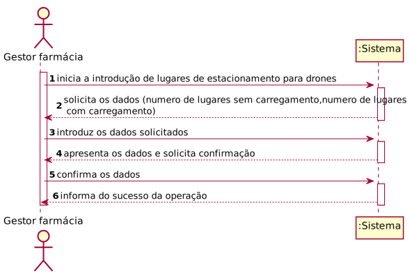
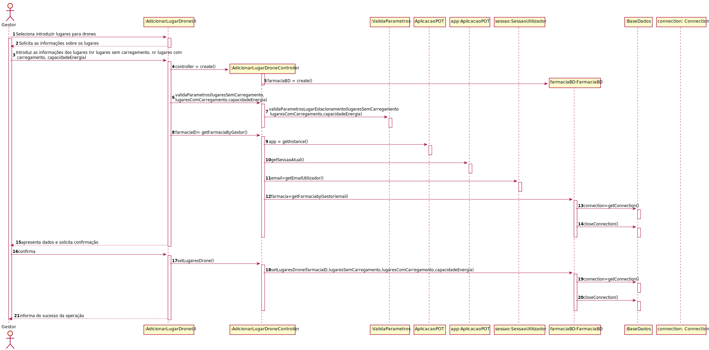
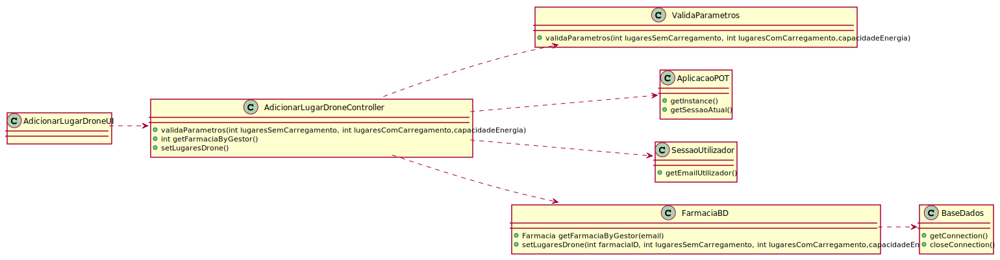

# ReadMe #

## 1. Requisitos
LAP3AP1-111 - Como gestor da farmácia pretendo adicionar um parque estacionamento para drones

A interpretação feita deste requisito foi no sentido de que o gestor de farmácia pretende adicionar um parque de estacionamento para drones à sua farmácia. Para tal, introduz a informação necessária e o sistema
verifica a possibilidade, informa da possibilidade e guarda a informação correspondente na farmácia.

## 2. Análise
### Descrição e Regras de Negócio
Foi utilizado o mecanismo de persistência de dados na base de dados.
Desta forma, os dados relativos ao parque de estacionamento para drones são inseridos na base de dados,
no respetivo repositório que neste contexto, é o Lugar de estacionamento. Desta forma, a
informação do parque estacionamento, podendo ser utilizada ou alterada posteriormente.

### Pré-condições
O sistema contém farmácias  (um repositório onde se encontra toda a informação relativa aos parques de estacionamento).

### Pós-condições
A informação do novo parque estacionamento é persistida/guardada no sistema.

### SSD

## 3. Design
### 3.1. Realização da Funcionalidade

### 3.2. Padrões Aplicados
Aplicamos o padrão de projeto de software MVC, focado na reutilização de código e a separação de conceitos em três camadas interconectadas, onde a apresentação dos dados e a interação dos utilizadores são separados dos métodos que interagem com o a base de dados.

### 3.3. Testes

Teste 1

    @Test
        void validaParametros() {
            farmaciaBD= mock(FarmaciaBD.class);
            instance= new AdicionarLugarDroneController(farmaciaBD);
            assertTrue(instance.validaParametros(10,5,200));
            assertEquals(instance.getLugaresSemCarregamento(),10);
            assertEquals(instance.getLugaresComCarregamento(),5);
            assertEquals(instance.getCapacidadeEnergia(),200);
        }

Teste 2: 

    @Test
        void validaParametrosSuccess2(){
            farmaciaBD= mock(FarmaciaBD.class);
            instance= new AdicionarLugarDroneController(farmaciaBD);
            instance.validaParametros(0,0,0);
            assertEquals(instance.getLugaresSemCarregamento(),0);
            assertEquals(instance.getLugaresComCarregamento(),0);
            assertEquals(instance.getCapacidadeEnergia(),0);
        }

Teste 3:

     @Test
        void getFarmaciaByGestor() {
            utilizadorBD = mock(UtilizadorBD.class);
            farmaciaBD= mock(FarmaciaBD.class);
            instance= new AdicionarLugarDroneController(farmaciaBD);
            String email = "teste@email.com";
    
            LugarEstacionamento lE = new LugarEstacionamento(true, 1, 2);
    
            when(utilizadorBD.procuraUtilizador("teste@email.com")).thenReturn(new Utilizador("teste", "teste@email.com", 123456789, 123456789, "password", 1));
    
            when(farmaciaBD.getFarmaciabyGestor(email)).thenReturn(new Farmacia(1, "farm", 111111111, 919191919, "teste@email.com", email, "1", lE));
    
            AplicacaoPOT app = AplicacaoPOT.getInstance();
            app.getAutorizacaoFacade().setUtilizadorBD(utilizadorBD);
            app.getAutorizacaoFacade().doLogin(email,"password");
    
            assertEquals(instance.getFarmaciaByGestor(),1);
            assertEquals(instance.getFarmaciaID(),1);
    
        }
        
Teste 4:

     @Test
         void setLugaresDrone() {
             utilizadorBD = mock(UtilizadorBD.class);
             farmaciaBD= mock(FarmaciaBD.class);
             instance= new AdicionarLugarDroneController(farmaciaBD);
     
             instance.validaParametros(10,5,200);
     
             String email = "teste@email.com";
     
             LugarEstacionamento lE = new LugarEstacionamento(true, 1, 2);
     
             when(utilizadorBD.procuraUtilizador("teste@email.com")).thenReturn(new Utilizador("teste", "teste@email.com", 123456789, 123456789, "password", 1));
     
             when(farmaciaBD.getFarmaciabyGestor(email)).thenReturn(new Farmacia(1, "farm", 111111111, 919191919, "teste@email.com", email, "1", lE));
     
             AplicacaoPOT app = AplicacaoPOT.getInstance();
             app.getAutorizacaoFacade().setUtilizadorBD(utilizadorBD);
             app.getAutorizacaoFacade().doLogin(email,"password");
     
     
             instance.getFarmaciaByGestor();
     
     
             when(farmaciaBD.setLugaresDrone(1,10,5,200)).thenReturn(true);
     
             assertTrue(instance.setLugaresDrone());
         }

## 4. Implementação
Métodos Controller:

    public boolean validaParametros(int lugaresSemCarregamento, int lugaresComCarregamento, double capacidadeEnergia){}

    public int getFarmaciaByGestor(){}
    
    
     public boolean setLugaresDrone(){}

## 5. Integração/Demonstração
-/
## 6. Observações
-/
