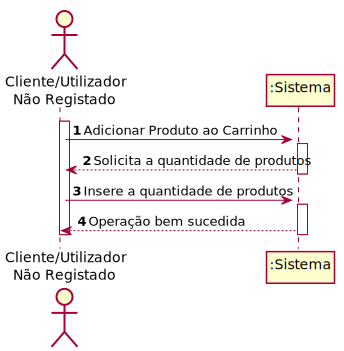
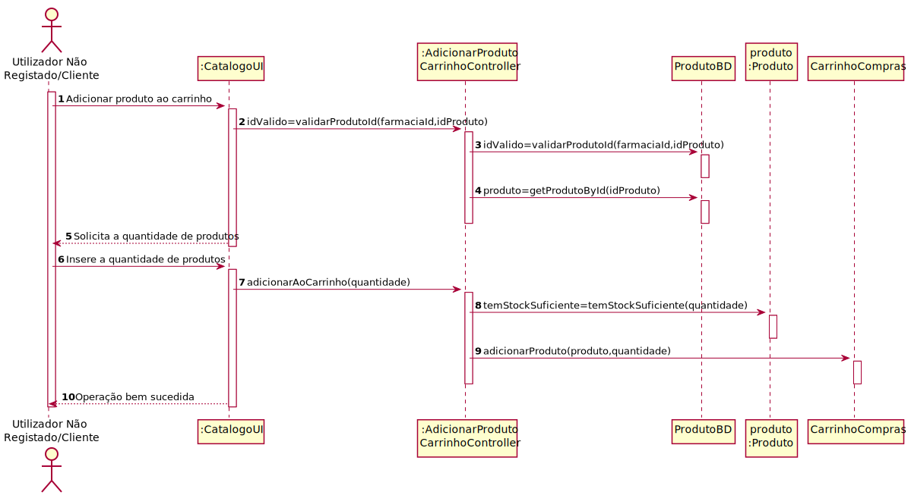
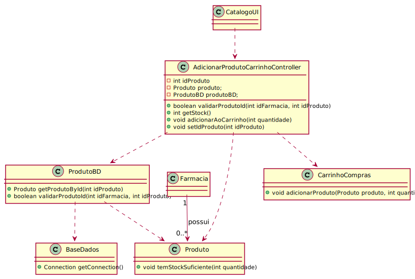

# ReadMe #

## 1. Requisitos
LAP3AP1-71 Como cliente/utilizador não registado, desejo adicionar produto ao carrinho.

A interpretação feita deste requisito foi no sentido de que o cliente/utilizador não registado pretende adicionar um novo produto
ao carrinho. Para tal, introduz a informação necessária e o sistema
verifica a possibilidade, informa da possibilidade.

## 2. Análise
### Descrição e Regras de Negócio
Foi utilizado o mecanismo de persitência na medida em que os dados relativos aos produto são acedidos a partir da base de dados. Desta forma, a
informação dos produtos e quantidade dos mesmos poderá ser colocada no carrinho de compras.

### Pré-condições
O sistema contém um catálogo de produtos na base de dados.

### Pós-condições
A informação do carrinho é persistida/guardada no sistema.

### SSD

## 3. Design
### 3.1. Realização da Funcionalidade

### 3.2. Padrões Aplicados
Aplicamos o padrão de projeto de software MVC, focado na reutilização de código e a separação de conceitos em três camadas interconectadas, onde a apresentação dos dados e a interação dos utilizadores são separados dos métodos que interagem com o a base de dados.

### 3.3. Testes
Exemplos de testes implementados no programa.

Teste 1: Verificar que foi adicionado ao carrinho um produto e a respetiva quantidade.

    @Test
    void adicionarAoCarrinho() {
        CarrinhoCompras.limparCarrinho();
        produtoBD = mock(ProdutoBD.class);
        Produto produto=new Produto(1, "Produto", 1, 10, 1);
        when(produtoBD.getProdutoById(1)).thenReturn(produto);
        AdicionarProdutoCarrinhoController adicionarProdutoCarrinhoController = new AdicionarProdutoCarrinhoController(produtoBD);
        adicionarProdutoCarrinhoController.setIdProduto(1);
        adicionarProdutoCarrinhoController.adicionarAoCarrinho(10);
        HashMap<Produto,Integer> expResult=new HashMap<>();
        expResult.put(produto,10);
        assertEquals(expResult,CarrinhoCompras.getCarrinho());
    }

Teste 2: Verificar que não foi adicionado ao carrinho um produto e a respetiva quantidade e foi lançada uma exceção.

    @Test
    void adicionarAoCarrinhoFail() {
        CarrinhoCompras.limparCarrinho();
        try {
            produtoBD = mock(ProdutoBD.class);
            when(produtoBD.getProdutoById(1)).thenReturn(new Produto(1, "Produto", 1, 10, 1));
            AdicionarProdutoCarrinhoController adicionarProdutoCarrinhoController = new AdicionarProdutoCarrinhoController(produtoBD);
            adicionarProdutoCarrinhoController.setIdProduto(1);
            adicionarProdutoCarrinhoController.adicionarAoCarrinho(20000);
        }catch (InvalidParameterException e){
            assertEquals(e.getMessage(),"Não tem stock suficiente");
        }

## 4. Implementação
Metodos do Controller:

  public AdicionarProdutoCarrinhoController(ProdutoBD produtoBD) {
  }

  public boolean validarProdutoId(int idFarmacia, int idProduto) throws InvalidNameException {
  }

  public int getStock() {
  }

  public void adicionarAoCarrinho(int quantidade){
  }

  public void setIdProduto(int idProduto) {
  }

## 5. Integração/Demonstração

## 6. Observações
