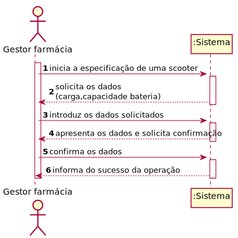
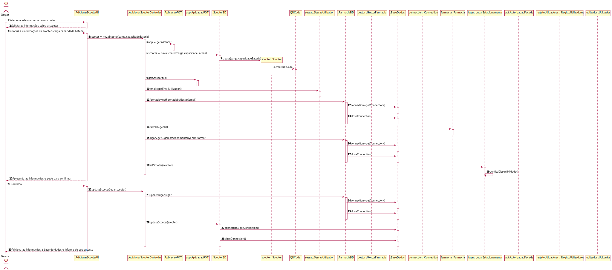
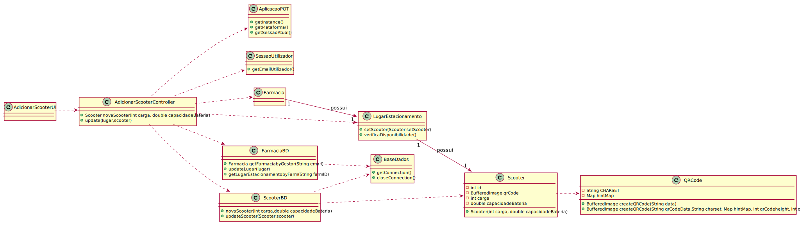

# ReadMe #

## 1. Requisitos
LAP3AP1-37 - Como gestor da farmácia pretendo adicionar uma scooter à farmácia.

A interpretação feita deste requisito foi no sentido de que o gestor de farmácia pretende adicionar uma nova scooter à lista de scooters existentes no sistema, relativas à sua farmácia. Para tal, introduz a informação necessária e o sistema
verifica a possibilidade, informa da possibilidade e guarda a informação correspondente num lugar de estacionamento disponível da farmácia.

## 2. Análise
### Descrição e Regras de Negócio
Foi utilizado o mecanismo de persistência de dados na base de dados.
Desta forma, os dados relativos à scooter são inseridos na base de dados,
no respetivo repositório que neste contexto, é o Lugar de estacionamento. Desta forma, a
informação das scooters fica guardada, podendo ser utilizada ou alterada posteriormente.

### Pré-condições
O sistema contém farmácias com lugares de estacionamento (um repositório onde se encontra toda a informação relativa às scooters).

### Pós-condições
A informação da nova scooter é persistida/guardada no sistema.

### SSD

## 3. Design
### 3.1. Realização da Funcionalidade

### 3.2. Padrões Aplicados
Aplicamos o padrão de projeto de software MVC, focado na reutilização de código e a separação de conceitos em três camadas interconectadas, onde a apresentação dos dados e a interação dos utilizadores são separados dos métodos que interagem com o a base de dados.

### 3.3. Testes

Teste 1: Verificar que é possível criar uma instância da classe Scooter e retornar um lugar de estacionamento disponível.

    @Test
    void novaScooter() throws Exception {
    scooterBD = mock(ScooterBD.class);
    farmaciaBD = mock(FarmaciaBD.class);
    utilizadorBD = mock(UtilizadorBD.class);

    instance = new AdicionarScooterController(scooterBD, farmaciaBD);

    Scooter s = new Scooter(2, 20, 20, 1, 300, 20, 10, 100);
    LugarEstacionamento lE = new LugarEstacionamento(true, 1, 2);
    String email = "teste@email.com";

    when(utilizadorBD.procuraUtilizador("teste@email.com")).thenReturn(new Utilizador("teste", "teste@email.com", 123456789, 123456789, "password", 1));
    when(scooterBD.lastID()).thenReturn(1);
    when(farmaciaBD.getFarmaciabyGestor(email)).thenReturn(new Farmacia(1, "farm", 111111111, 919191919, "teste@email.com", email, "1", lE));
    when(farmaciaBD.getLugarEstacionamentobyFarm(1)).thenReturn(new LugarEstacionamento(true, 1, 1));

    AplicacaoPOT app = AplicacaoPOT.getInstance();
    app.getAutorizacaoFacade().setUtilizadorBD(utilizadorBD);
    app.getAutorizacaoFacade().doLogin(email,"password");

    Pair<Scooter, LugarEstacionamento> expResult = new Pair<Scooter, LugarEstacionamento>(s, lE);
    Pair<Scooter, LugarEstacionamento> result = instance.novaScooter(20, 20, 1, 300, 20, 10, 100);
    assertEquals(expResult, result);
    }

Teste 2: Verifica que é possível inserir os dados da scooter no lugar de estacionamento obtido anteriormente.

    @Test
    void testUpdate() throws SQLException, IOException, WriterException, NotFoundException {
      scooterBD = mock(ScooterBD.class);
      farmaciaBD = mock(FarmaciaBD.class);
      instance = new AdicionarScooterController(scooterBD, farmaciaBD);
      AplicacaoPOT.getInstance();
      LugarEstacionamento lugarEstacionamento = new LugarEstacionamento(1, true, 1, 1);
      Scooter scooter = new Scooter(1, 20, 300, 1, 250, 50, 300, 10);
      when(scooterBD.updateScooter(scooter)).thenReturn(true);
      when(farmaciaBD.updateLugar(lugarEstacionamento)).thenReturn(true);
      boolean result = instance.update(lugarEstacionamento, scooter);
      assertTrue(result);
      }

## 4. Implementação
Métodos Controller:

    public Pair<Scooter,LugarEstacionamento> novaScooter(int carga, double capacidadeBateria,int estadoScooterID,double consumoHoraBateria,double tensaoBateria,double peso,double potenciaMotor) throws Exception {}

    public boolean update(LugarEstacionamento lugar, Scooter scooter) throws NotFoundException {}

## 5. Integração/Demonstração
-/
## 6. Observações
-/
