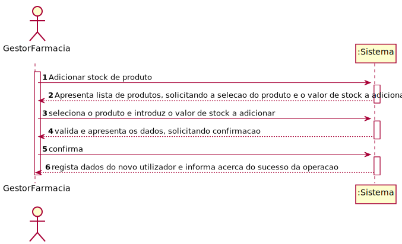
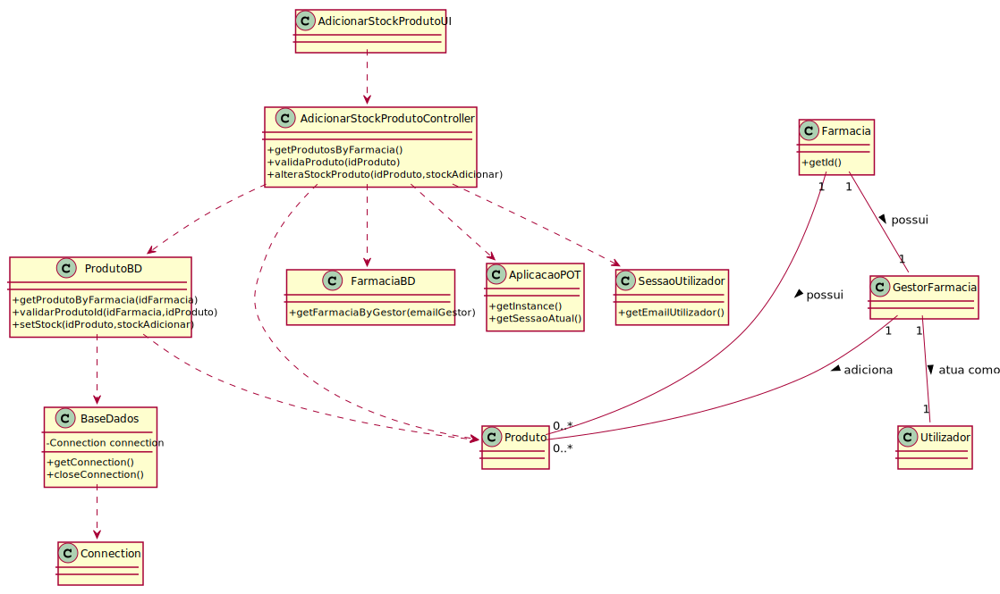

# ReadMe #

## 1. Requisitos
LAP3AP1-21 Como gestor de farmácia, desejo adicionar stock de produtos

A interpretação feita deste requisito foi no sentido de que um gestor de farmácia pretende adicionar stock de produtos
à farmácia. Para tal, introduz a informação necessária, o sistema valida os dados, e guarda a informação correspondente 
no sistema.

## 2. Análise
### Descrição e Regras de Negócio
Foi utilizado o mecanismo de persistência de dados na base de dados.
Desta forma, os dados relativos ao stock da farmácia são inseridos na base de dados,
no respetivo repositório que neste contexto, é o Produto_Farmacia. Desta forma, a
informação deste stock fica guardada, podendo ser utilizada ou alterada posteriormente.

### Pré-condições
O sistema contém todos os repositórios necessários para conter toda a informação introduzida.

### Pós-condições
A informação do novo stock é persistida/guardada no sistema.

### SSD

## 3. Design
### 3.1. Realização da Funcionalidade
#### SD

#### CD

### 3.2. Padrões Aplicados
Aplicamos o padrão de projeto de software MVC, focado na reutilização de código e a separação de conceitos em três camadas interconectadas, onde a apresentação dos dados e a interação dos utilizadores são separados dos métodos que interagem com o a base de dados.

### 3.3. Testes

Teste 1: Verifica que é possível obter uma lista de Produtos de uma farmácia.

    @Test
    void getProdutosByFarmacia() {
        farmaciaBD = mock(FarmaciaBD.class);
        produtoBD = mock(ProdutoBD.class);
        utilizadorBD = mock(UtilizadorBD.class);

        instance= new AdicionarStockProdutoController(farmaciaBD,produtoBD);
        String email = "teste@email.com";
        LugarEstacionamento lE = new LugarEstacionamento(true, 1, 2);

        Produto paracetamol = new Produto(1,"Paracetamol",6.75,6,35);
        Produto viagra = new Produto(2,"Viagra",19.75,66,180);
        Produto produto = new Produto(3,"Produto",2.0,6,80);

        List<Produto> lista = new ArrayList<>();
        lista.add(paracetamol);
        lista.add(viagra);
        lista.add(produto);

        when(utilizadorBD.procuraUtilizador("teste@email.com")).thenReturn(new Utilizador("teste", "teste@email.com", 123456789, 123456789, "password", 1));
        when(farmaciaBD.getFarmaciabyGestor(email)).thenReturn(new Farmacia(1, "farm", 111111111, 919191919, "teste@email.com", email, "1", lE));
        when(produtoBD.getProdutoByFarmacia(1)).thenReturn(lista);

        AplicacaoPOT app = AplicacaoPOT.getInstance();
        app.getAutorizacaoFacade().setUtilizadorBD(utilizadorBD);
        app.getAutorizacaoFacade().doLogin(email,"password");

        List<String> expResult = StringConverter.convertToStringList((ArrayList<Produto>)lista);
        List<String> result = instance.getProdutosByFarmacia();

        assertEquals(expResult,result);

    }

Teste 2: Verifica que os dados introduzidos são válidos.

    @Test
    void validaProdutoSuccess() throws Exception {
        farmaciaBD = mock(FarmaciaBD.class);
        produtoBD = mock(ProdutoBD.class);
        utilizadorBD = mock(UtilizadorBD.class);

        instance= new AdicionarStockProdutoController(farmaciaBD,produtoBD);
        String email = "teste@email.com";
        LugarEstacionamento lE = new LugarEstacionamento(true, 1, 2);
        Produto paracetamol = new Produto(1,"Paracetamol",6.75,6,35);

        when(utilizadorBD.procuraUtilizador("teste@email.com")).thenReturn(new Utilizador("teste", "teste@email.com", 123456789, 123456789, "password", 1));
        when(farmaciaBD.getFarmaciabyGestor(email)).thenReturn(new Farmacia(1, "farm", 111111111, 919191919, "teste@email.com", email, "1", lE));
        when(produtoBD.validarProdutoId(1,1)).thenReturn(true);

        AplicacaoPOT app = AplicacaoPOT.getInstance();
        app.getAutorizacaoFacade().setUtilizadorBD(utilizadorBD);
        app.getAutorizacaoFacade().doLogin(email,"password");

        boolean result = instance.validaProduto(1);
        assertTrue(result);
    }

Teste 3: Verifica que é possível alterar o stock de produto.

    @Test
    void alteraStockProdutoSuccess() {
        farmaciaBD = mock(FarmaciaBD.class);
        produtoBD = mock(ProdutoBD.class);

        instance= new AdicionarStockProdutoController(farmaciaBD,produtoBD);
        utilizadorBD = mock(UtilizadorBD.class);

        String email = "teste@email.com";
        LugarEstacionamento lE = new LugarEstacionamento(true, 1, 2);
        Produto paracetamol = new Produto(1,"Paracetamol",6.75,0,35);

        when(utilizadorBD.procuraUtilizador("teste@email.com")).thenReturn(new Utilizador("teste", "teste@email.com", 123456789, 123456789, "password", 1));
        when(farmaciaBD.getFarmaciabyGestor(email)).thenReturn(new Farmacia(1, "farm", 111111111, 919191919, "teste@email.com", email, "1", lE));
        when(produtoBD.setStock(1,1,0,2)).thenReturn(true);

        boolean result = instance.alteraStockProduto(1,2);
        assertTrue(result);
    }

## 4. Implementação
Métodos Controller:

    public List<String> getProdutosByFarmacia(){}

    public boolean validaProduto(int idProduto) throws InvalidNameException {}

    public boolean alteraStockProduto(int idProduto, int stockAdicionar){}

## 5. Integração/Demonstração
-/
## 6. Observações
-/