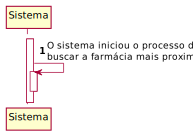
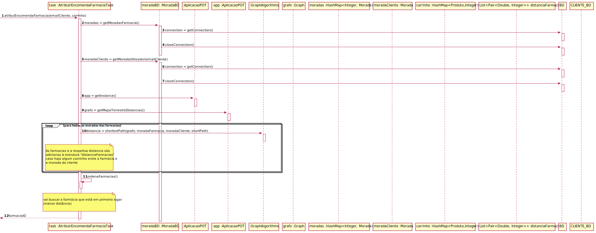
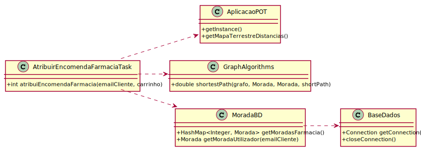

# ReadMe #

## 1. Requisitos
LAP3AP1-191 Como administrador da plataforma, desejo que seja escolhida a farmácia mais próxima para receber a encomenda realizada por um cliente.

A interpretação feita deste requisito foi no sentido de que o gestor de farmácia pretende que o tempo de entrega da encomenda seja o menor possível. Para tal, o sistema deve ir buscar todas as moradas das farmácias existentes na base e dados. De seguida, vai calcular, usando o mapa terrestre, qual é a mais próxima da morada do cliente. Por fim retorna essa farmácia.

## 2. Análise
### Descrição e Regras de Negócio
Foi utilizado o mecanismo de persistência de dados na base de dados. Desta forma, os dados relativos às moradas são utilizados a partir da base de dados, no respetivo repositório que neste contexto é a Morada.

### Pré-condições
- O sistema contém todos os repositórios necessários para conter toda a informação utilizada.
- O sistema contém pelo menos uma morada.

### Pós-condições
- Deve ser devolvida a farmácia mais próxima da morada do cliente.

### SSD

## 3. Design
### 3.1. Realização da Funcionalidade

#### SD - Diagrama de Sequência

#### CD - Diagrama de Classes

### 3.2. Padrões Aplicados
Aplicamos o padrão de projeto de software MVC, focado na reutilização de código e a separação de conceitos em três camadas interconectadas, onde a apresentação dos dados e a interação dos utilizadores são separados dos métodos que interagem com o a base de dados.

### 3.3. Testes

- **Teste 1**: verifica que, dado o email do cliente e para o grafo existente, vai testar se escolheu a farmácia mais próxima. Caso afirmativo, não deve lançar nenhuma exceção. Para além disso, vai ser testado para casos de insucesso. Nesses casos, é testada se está a lançar a exceção correta.   

      @Test
      void atribuiEncomendaFarmacia() {

          String emailCliente = "cliente@email.com";
          int idFarmacia1 = 1;

          String emailEstafeta = "estafeta@gmail.com";
          String password = "password";
          when(utilizadorBD.procuraUtilizador(emailEstafeta)).thenReturn(new Utilizador("estafeta", emailEstafeta, 123456789, 123456789, password, Constantes.PAPEL_ESTAFETA));

          AplicacaoPOT app = AplicacaoPOT.getInstance();
          app.getAutorizacaoFacade().setUtilizadorBD(utilizadorBD);
          app.getAutorizacaoFacade().doLogin(emailEstafeta, password);

          Morada moradaCliente = new Morada("cliente", 10, 10, 10);
          Morada farmarcia1 = new Morada("farmarcia1", 20, 20, 20);
          Morada farmarcia2 = new Morada("farmarcia2", 30, 30, 30);
          Morada farmarcia3 = new Morada("farmarcia3", 40, 40, 40);
          Morada farmarcia4 = new Morada("farmarcia3", 50, 50, 50);
          Morada farmarcia5 = new Morada("farmarcia3", 60, 60, 60);
          Morada farmarcia6 = new Morada("farmarcia3", 70, 70, 70);

          Graph<Morada, Double> grafo = new Graph<>(false);
          grafo.insertEdge(moradaCliente, farmarcia1, 0.0, 1);
          grafo.insertEdge(moradaCliente, farmarcia2, 0.0, 2);
          grafo.insertEdge(farmarcia1, farmarcia3, 0.0, 3);
          grafo.insertEdge(farmarcia3, farmarcia4, 0.0, -2);
          grafo.insertEdge(farmarcia4, farmarcia5, 0.0, 2);
          grafo.insertEdge(farmarcia2, farmarcia6, 0.0, 2);

          app.setMapaTerrestreDistancias(grafo);

          Map<Integer, Morada> moradasFarmacias = new HashMap<>();
          moradasFarmacias.put(1, farmarcia1);
          moradasFarmacias.put(2, farmarcia2);
          moradasFarmacias.put(3, farmarcia3);
          moradasFarmacias.put(4, farmarcia4);
          moradasFarmacias.put(5, farmarcia5);
          moradasFarmacias.put(6, farmarcia6);

          when(moradaBD.getMoradasFarmacia()).thenReturn(moradasFarmacias);
          when(moradaBD.getMoradaUtilizador(emailCliente)).thenReturn(moradaCliente);

          //sucesso
          assertEquals(idFarmacia1, task.atribuiEncomendaFarmacia(emailCliente));

          //sucesso do metodo de ordenacao
          List<Pair<Double, Integer>> farmaciasOrdenadas = new ArrayList<>();
          farmaciasOrdenadas.add(new Pair<>(1.0, 1));
          farmaciasOrdenadas.add(new Pair<>(2.0, 2));
          farmaciasOrdenadas.add(new Pair<>(2.0, 4));
          farmaciasOrdenadas.add(new Pair<>(4.0, 3));
          farmaciasOrdenadas.add(new Pair<>(4.0, 5));
          farmaciasOrdenadas.add(new Pair<>(4.0, 6));

          assertEquals(farmaciasOrdenadas, task.getDistanciaFarmacias());

          // insucesso (não conseguiu obter a morada do cliente)
          when(moradaBD.getMoradaUtilizador(emailCliente)).thenReturn(null);
          try{
              task.atribuiEncomendaFarmacia(emailCliente);
          }catch (Exception e){
              assertEquals("Erro ao ir buscar a morada do cliente", e.getMessage());
          }

          //insucesso (não conseguiu obter as moradas das farmacias)
          when(moradaBD.getMoradasFarmacia()).thenReturn(null);
          try{
              task.atribuiEncomendaFarmacia(emailCliente);
          }catch (Exception e){
              assertEquals("Erro ao ir buscar todas as moradas da farmacia", e.getMessage());
          }
      }

## 4. Implementação

- **Metodos do Controller**

> public void validaFarmacia(String nome, int nif, int telemovel, String email)

> public void validaLugaresEstacionamento(int lugaresComSuporte, int lugaresSemSuporte)

> public void validaGestorFarmacia(String nome, String email, int nif, int telemovel, String password)

> public void validaMoradas(String moradaFarmacia, double latitudeFarmacia, double longitudeFarmacia, double altitudeFarmacia, String moradaGestor, double latitudeGestor, double longitudeGestor, double altitudeGestor)

> public void addDados()

## 5. Integração/Demonstração
-/

## 6. Observações
-/
