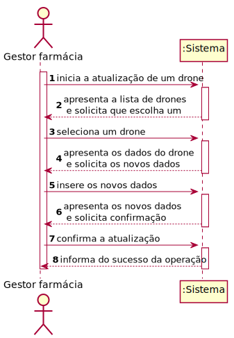
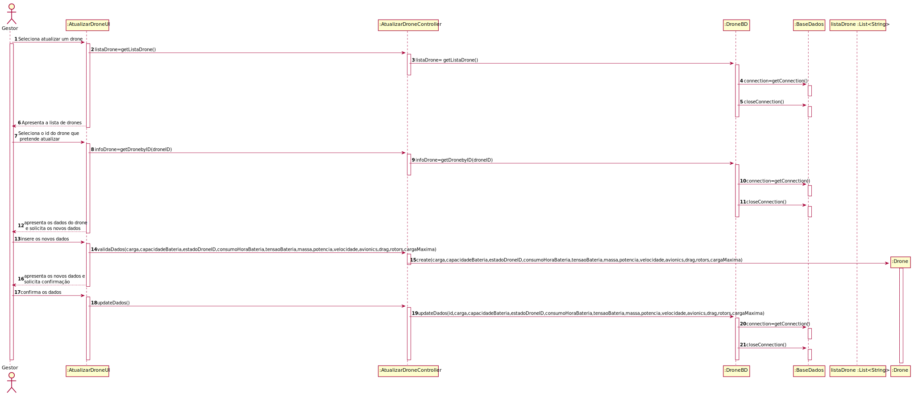
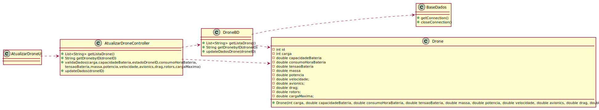

# ReadMe #

## 1. Requisitos
LAP3AP1-109 Como gestor da farmácia pretendo atualizar um drone da minha farmácia.

A interpretação feita deste requisito foi no sentido de que o gestor de farmácia pretende atualizar um drone da lista de drones existentes no sistema, relativas à sua farmácia. Para tal, introduz a informação necessária e o sistema
verifica a possibilidade, informa da possibilidade e guarda a nova informação no drone selecionado.

## 2. Análise
### Descrição e Regras de Negócio
Foi utilizado o mecanismo de persistência de dados na base de dados.
Desta forma, os dados relativos ao drone são inseridos na base de dados,
no respetivo repositório que neste contexto, é o Lugar de estacionamento. Desta forma, a
informação dos drones fica guardada, podendo ser utilizada ou alterada posteriormente.

### Pré-condições
O sistema contém farmácias com drones(um repositório onde se encontra toda a informação dos diferentes drones).

### Pós-condições
A nova informação do drone é persistida/guardada no sistema.

### SSD

## 3. Design
### 3.1. Realização da Funcionalidade
#### SD

#### CD

### 3.2. Padrões Aplicados
Aplicamos o padrão de projeto de software MVC, focado na reutilização de código e a separação de conceitos em três camadas interconectadas, onde a apresentação dos dados e a interação dos utilizadores são separados dos métodos que interagem com a base de dados.

### 3.3. Testes

Teste 1: Verificar que é possível obter a lista de drones da farmácia do gestor

    @Test
    void getListaDrone() {
        droneBD = mock(DroneBD.class);
        instance = new AtualizarDroneController(droneBD);

        Drone drone = new Drone(1,20,300,1,250,50,300,10,8,1.5,4,0.2,3);
        List<String> drones = new ArrayList<>();
        drones.add(drone.getId() + "");

        when(droneBD.getListaDrone()).thenReturn(drones);

        assertEquals(drones, instance.getListaDrone());

    }

Teste 2: Verifica que é possível obter um drone através de um id selecionado

    @Test
    void getDroneByID() {
        droneBD = mock(DroneBD.class);
        instance = new AtualizarDroneController(droneBD);
        Drone drone = new Drone(1,20,300,1,250,50,300,10,8,1.5,4,0.2,3);
        List<String> drones = new ArrayList<>();
        drones.add(drone.getId() + "");//0
        drones.add(drone.getCargaDrone() + "");//1
        drones.add(drone.getCapacidadeBateriaDrone() + "");//2
        drones.add(drone.getEstadoDroneID() + "");
        drones.add(drone.getConsumoHoraBateriaDrone() + "");
        drones.add(drone.getTensaoBateriaDrone() + "");
        drones.add(drone.getMassa() + "");
        drones.add(drone.getPotencia() + "");
        drones.add(drone.getVelocidade() + "");
        drones.add(drone.getAvionics() + "");
        drones.add(drone.getDrag() + "");
        drones.add(drone.getRotors() + "");
        drones.add(drone.getCargaMaxima() + "");

        when(droneBD.getDadosDronebyID(1)).thenReturn(drones);

        assertEquals(drones, instance.getDroneByID(1));

    }

Teste 3: Verifica se os novos dados introduzidos sobre o drone são válidos

    @Test
    void validaDados() {
        droneBD = mock(DroneBD.class);
        instance = new AtualizarDroneController(droneBD);
        instance.validaDados(20,300,1,250,50,300,10,8,1.5,4,0.2,3);
    }

Teste 4: Verifica que os novos dados introduzidos do drone selecionado são registados

    @Test
    void updateDados() {
        droneBD = mock(DroneBD.class);
        instance = new AtualizarDroneController(droneBD);
        Drone drone = new Drone(1,20,300,1,250,50,300,10,8,1.5,4,0.2,3);
        List<String> drones = new ArrayList<>();
        drones.add(drone.getId() + "");//0
        drones.add(drone.getCargaDrone() + "");//1
        drones.add(drone.getCapacidadeBateriaDrone() + "");//2
        drones.add(drone.getEstadoDroneID() + "");
        drones.add(drone.getConsumoHoraBateriaDrone() + "");
        drones.add(drone.getTensaoBateriaDrone() + "");
        drones.add(drone.getMassa() + "");
        drones.add(drone.getPotencia() + "");
        drones.add(drone.getVelocidade() + "");
        drones.add(drone.getAvionics() + "");
        drones.add(drone.getDrag() + "");
        drones.add(drone.getRotors() + "");
        drones.add(drone.getCargaMaxima() + "");

        when(droneBD.getDadosDronebyID(1)).thenReturn(drones);
        instance.getDroneByID(1);
        when(droneBD.updateDadosDrone(1, 20,300,1,250,50,300,10,8,1.5,4,0.2,3)).thenReturn(true);
        boolean result = instance.updateDados();
        assertTrue(result);

    }

## 4. Implementação
Métodos Controller:

    public List<String> getListaDrone(){}

    public List<String> getDroneByID(int droneID) {}

    public void validaDados(int cargaDrone, double capacidadeBateriaDrone, int estadoDroneID, double consumoHoraBateriaDrone, double tensaoBateriaDrone, double massa, double potencia,double velocidade, double avionics, double drag, double rotors, double cargaMaxima) {}
    
    public boolean updateDados() {}

## 5. Integração/Demonstração
-/
## 6. Observações
-/