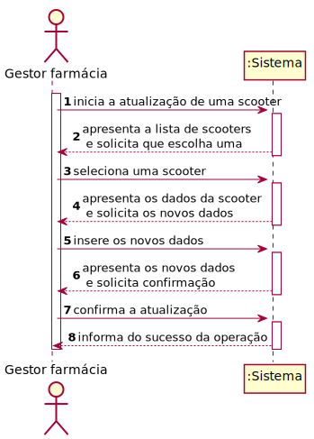
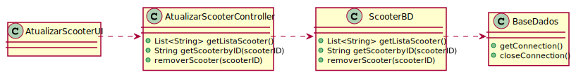

# ReadMe #

## 1. Requisitos
LAP3AP1-174 - Como gestor da farmácia pretendo atualizar uma scooter da minha farmácia.

A interpretação feita deste requisito foi no sentido de que o gestor de farmácia pretende atualizar uma scooter da lista de scooters existentes no sistema, relativas à sua farmácia. Para tal, introduz a informação necessária e o sistema
verifica a possibilidade, informa da possibilidade e guarda a nova informação na scooter selecionada.

## 2. Análise
### Descrição e Regras de Negócio
Foi utilizado o mecanismo de persistência de dados na base de dados.
Desta forma, os dados relativos à scooter são inseridos na base de dados,
no respetivo repositório que neste contexto, é o Lugar de estacionamento. Desta forma, a
informação das scooters fica guardada, podendo ser utilizada ou alterada posteriormente.

### Pré-condições
O sistema contém farmácias com scooters(um repositório onde se encontra toda a informação das diferentes scooters).

### Pós-condições
A nova informação da scooter é persistida/guardada no sistema.

### SSD

## 3. Design
### 3.1. Realização da Funcionalidade

### 3.2. Padrões Aplicados
Aplicamos o padrão de projeto de software MVC, focado na reutilização de código e a separação de conceitos em três camadas interconectadas, onde a apresentação dos dados e a interação dos utilizadores são separados dos métodos que interagem com o a base de dados.

### 3.3. Testes

Teste 1: Verificar que é possível obter a lista de scooters da farmácia do gestor

      @Test
      void getListaScooter() throws IOException, WriterException {
      scooterBD = mock(ScooterBD.class);
      instance = new AtualizarScooterController(scooterBD);

      Scooter s = new Scooter(1, 20, 20, 1, 300, 20, 10, 100);
      List<String> scooters = new ArrayList<>();
      scooters.add(s.getId() + "");

      when(scooterBD.getListaScooter()).thenReturn(scooters);

      assertEquals(scooters, instance.getListaScooter());

  }

Teste 2: Verifica que é possível obter uma scooter através de um id selecionado

      @Test
      void getScooterByID() throws IOException, WriterException {
       scooterBD = mock(ScooterBD.class);
       instance = new AtualizarScooterController(scooterBD);
       Scooter s = new Scooter(1, 20, 20, 1, 300, 20, 10, 100);
       List<String> scooters = new ArrayList<>();
       scooters.add(s.getId() + "");//0
       scooters.add(s.getCarga() + "");//1
       scooters.add(s.getCapacidadeBateria() + "");//2
       scooters.add(s.getEstadoScooterID() + "");
       scooters.add(s.getConsumoHoraBateria() + "");
       scooters.add(s.getTensaoBateria() + "");
       scooters.add(s.getPeso() + "");
       scooters.add(s.getPotenciaMotor() + "");

       when(scooterBD.getDadosScooterbyID(1)).thenReturn(scooters);

       assertEquals(scooters, instance.getScooterByID(1));

      }

  Teste 3: Verifica se os novos dados introduzidos sobre a scooter são válidos

        @Test
        void validaDados() {
         scooterBD = mock(ScooterBD.class);
         instance = new AtualizarScooterController(scooterBD);
         instance.validaDados("20", "20", "1", "300", "20", "10", "100");
        }

  Teste 4: Verifica que os novos dados introduzidos da scooter selecionada são registados

    @Test
    void updateDados() throws IOException, WriterException {
     scooterBD = mock(ScooterBD.class);
     instance = new AtualizarScooterController(scooterBD);
     Scooter s = new Scooter(1, 20, 20, 1, 300, 20, 10, 100);
     List<String> scooters = new ArrayList<>();
     scooters.add(s.getId() + "");//0
     scooters.add(s.getCarga() + "");//1
     scooters.add(s.getCapacidadeBateria() + "");//2
     scooters.add(s.getEstadoScooterID() + "");
     scooters.add(s.getConsumoHoraBateria() + "");
     scooters.add(s.getTensaoBateria() + "");
     scooters.add(s.getPeso() + "");
     scooters.add(s.getPotenciaMotor() + "");

     when(scooterBD.getDadosScooterbyID(1)).thenReturn(scooters);
     instance.getScooterByID(1);
     when(scooterBD.updateDados("1", "20", "20.0", "1", "300.0", "20.0", "10.0", "100.0")).thenReturn(true);
     boolean result = instance.updateDados();
     assertTrue(result);

      }

## 4. Implementação
Métodos Controller:

    public List<String> getListaScooter() {}

    public List<String> getScooterByID(int scooterID) {}

    public void validaDados(String carga, String capacidadeBateria, String estadoScooterID, String consumoHoraBateria, String tensaoBateria, String peso, String potenciaMotor) {}

    public boolean updateDados() {}

## 5. Integração/Demonstração
-/
## 6. Observações
-/
