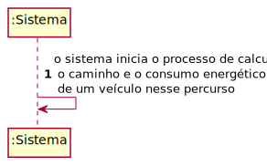
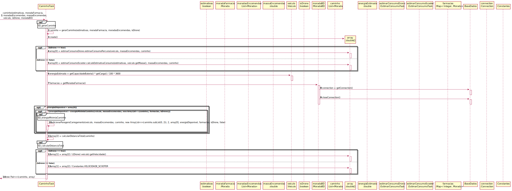
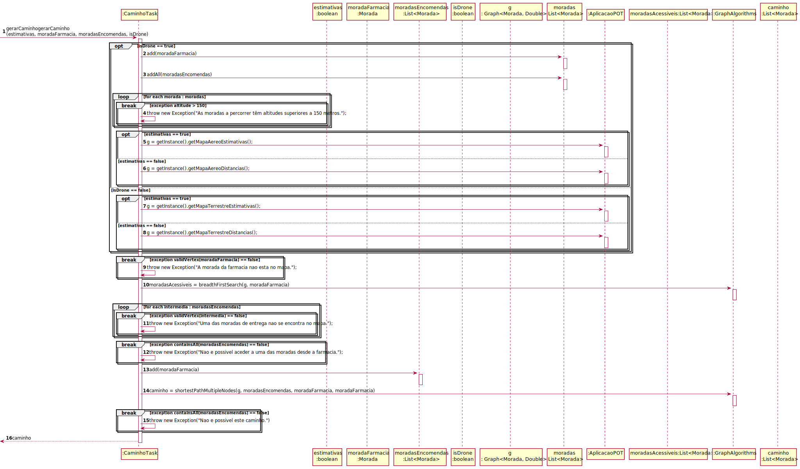
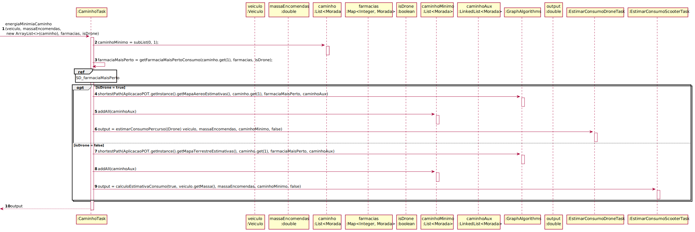
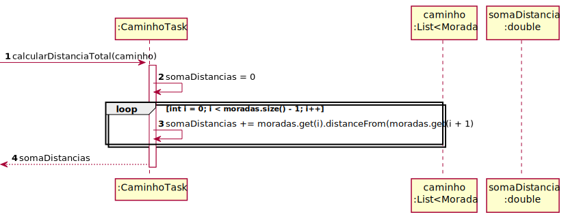
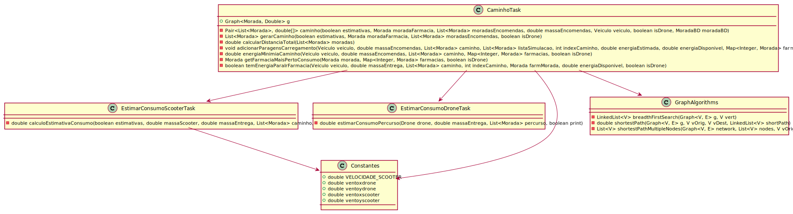

# ReadMe #

## 1. Requisitos
LAP3AP1-197 : Como Gestor da Farmácia quero saber o caminho e consumo energético de um veiculo para uma entrega

A interpretação feita deste requisito foi no sentido de que o gestor da farmácia 
pretende saber o caminho efetuado por um veiculo e o consumo energético do mesmo
quando é efetuada uma dada entrega.

## 2. Análise
### Autor
Sistema

### Descrição e Regras de Negócio
Foi utilizado o mecanismo de persitência de dados na base de dados. 
Desta forma, os dados relativos às farmacias, entregas, encomendas, scooters,
drones e o caminho / distância / consumo final estejam poresentes na base de dados.

### Pré-condições
O sistema contém farmácias, moradas, encomendas, entrega por fazer e veiculos disponiveis.

### Pós-condições
É calculado o percurso e consumo energético de uma entrega com base no veiculo utilizado.

### SSD

## 3. Design
### 3.1. Realização da Funcionalidade

### 3.2. Padrões Aplicados
Aplicamos o padrão de projeto de software MVC, focado na reutilização de código
e a separação de conceitos em três camadas interconectadas, onde a apresentação
dos dados e a interação dos utilizadores são separados dos métodos que interagem
com a base de dados.

### 3.3. Testes

- **Teste 1** - Teste caminho (sucesso e insucesso)

    @Test
    public void testCaminho() throws Exception {
        System.out.println("caminho");

        Graph<Morada, Double> g = new Graph<>(true);
        g.insertVertex(morada);
        g.insertVertex(morada1);
        g.insertVertex(morada2);
        g.insertVertex(morada3);
        g.insertVertex(moradaFarmacia1);
        g.insertVertex(moradaFarmacia2);
        g.insertEdge(morada, morada3, 0.0, 1);
        g.insertEdge(morada3, moradaFarmacia1, 0.0, 1);
        g.insertEdge(moradaFarmacia1, morada2, 0.0, 1);
        g.insertEdge(morada2, morada1, 0.0, 1);
        g.insertEdge(morada1, morada, 0.0, 1);

        g.insertEdge(morada, morada1, 0.0, 3);
        g.insertEdge(morada, morada2, 0.0, 3);
        g.insertEdge(morada, moradaFarmacia1, 0.0, 3);
        g.insertEdge(morada, moradaFarmacia2, 0.0, 3);
        g.insertEdge(morada1, morada2, 0.0, 3);
        g.insertEdge(morada1, morada3, 0.0, 3);
        g.insertEdge(morada1, moradaFarmacia1, 0.0, 3);
        g.insertEdge(morada1, moradaFarmacia2, 0.0, 3);
        g.insertEdge(morada3, morada, 0.0, 3);
        g.insertEdge(morada3, morada1, 0.0, 3);
        g.insertEdge(morada3, morada2, 0.0, 3);
        g.insertEdge(morada3, morada3, 0.0, 3);
        g.insertEdge(morada3, moradaFarmacia2, 0.0, 3);

        AplicacaoPOT.getInstance().setMapaAereoEstimativas(g);
        boolean estimativas = true;
        Morada moradaFarmacia = morada;
        List<Morada> moradasEncomendas = new ArrayList<>(Arrays.asList(morada1, morada2, morada3));
        double massaEncomendas = 3.0;
        Veiculo veiculo = new Drone(1, 100, 1000000, 3, 3, 3, 3, 3, 20, 0.2, 3, 0.5, 3);
        boolean isDrone = true;
        CaminhoTask instance = new CaminhoTask();
        double[] arrayDouble = {1.2891976337643588E8, 294997.54407336126, 5899950.881467225};
        Pair<List<Morada>, double[]> expResult = new Pair<>(new ArrayList<>(Arrays.asList(morada, morada3, moradaFarmacia1, morada2, morada1, morada)), arrayDouble);

        Map<Integer, Morada> farmacias = new HashMap<>();

        farmacias.put(1, moradaFarmacia1);
        farmacias.put(2, moradaFarmacia2);
        when(moradaBD.getMoradasFarmacia()).thenReturn(farmacias);
        Pair<List<Morada>, double[]> result = instance.caminho(estimativas, moradaFarmacia, moradasEncomendas, massaEncomendas, veiculo, isDrone, moradaBD);
        assertEquals(expResult.getKey(), result.getKey());
        assertArrayEquals(expResult.getValue(), result.getValue());
    }

- **Teste 1.2** - Teste caminho (insucesso)

    @Test
    public void testCaminhoException1() throws Exception {
        System.out.println("caminhoException1");

        Graph<Morada, Double> g = new Graph<>(true);
        g.insertVertex(morada);
        g.insertVertex(morada1);
        g.insertVertex(morada2);
        g.insertVertex(morada3);
        g.insertVertex(moradaFarmacia1);
        g.insertVertex(moradaFarmacia2);
        g.insertEdge(morada, morada3, 0.0, 1);
        g.insertEdge(morada3, moradaFarmacia1, 0.0, 1);
        g.insertEdge(moradaFarmacia1, morada2, 0.0, 1);
        g.insertEdge(morada2, morada1, 0.0, 1);
        g.insertEdge(morada1, morada, 0.0, 1);

        g.insertEdge(morada, morada1, 0.0, 3);
        g.insertEdge(morada, morada2, 0.0, 3);
        g.insertEdge(morada, moradaFarmacia1, 0.0, 3);
        g.insertEdge(morada, moradaFarmacia2, 0.0, 3);
        g.insertEdge(morada1, morada2, 0.0, 3);
        g.insertEdge(morada1, morada3, 0.0, 3);
        g.insertEdge(morada1, moradaFarmacia1, 0.0, 3);
        g.insertEdge(morada1, moradaFarmacia2, 0.0, 3);
        g.insertEdge(morada3, morada, 0.0, 3);
        g.insertEdge(morada3, morada1, 0.0, 3);
        g.insertEdge(morada3, morada2, 0.0, 3);
        g.insertEdge(morada3, morada3, 0.0, 3);
        g.insertEdge(morada3, moradaFarmacia2, 0.0, 3);

        AplicacaoPOT.getInstance().setMapaAereoEstimativas(g);
        boolean estimativas = true;
        Morada moradaFarmacia = morada;
        List<Morada> moradasEncomendas = new ArrayList<>(Arrays.asList(morada1, morada2, morada3));
        double massaEncomendas = 3.0;
        Veiculo veiculo = new Drone(1, 100, 10, 3, 3, 3, 3, 3, 20, 0.2, 3, 0.5, 3);
        boolean isDrone = true;
        CaminhoTask instance = new CaminhoTask();

        Map<Integer, Morada> farmacias = new HashMap<>();

        farmacias.put(1, moradaFarmacia1);
        farmacias.put(2, moradaFarmacia2);
        when(moradaBD.getMoradasFarmacia()).thenReturn(farmacias);
        try {
            instance.caminho(estimativas, moradaFarmacia, moradasEncomendas, massaEncomendas, veiculo, isDrone, moradaBD);
        } catch (Exception e) {
            System.out.println(e.getMessage());
            assertEquals("Impossível utilizar este veículo. Não possui carga mínima necessária.", e.getMessage());
        }
    }

- **Teste 2** - Teste gerarCaminho (sucesso e insucesso)

    @Test
    public void testGerarCaminho() throws Exception {
        System.out.println("gerarCaminho");
        boolean estimativas = true;
        boolean isDrone = true;
        Graph<Morada, Double> g = new Graph<>(true);
        g.insertVertex(morada);
        g.insertVertex(morada1);
        g.insertVertex(morada2);
        g.insertVertex(morada3);
        g.insertVertex(moradaFarmacia1);
        g.insertVertex(moradaFarmacia2);
        g.insertEdge(morada, morada3, 0.0, 1);
        g.insertEdge(morada3, morada4, 0.0, 0.8);
        g.insertEdge(morada3, moradaFarmacia1, 0.0, 1);
        g.insertEdge(morada4, morada2, 0.0, 1);
        g.insertEdge(moradaFarmacia1, morada2, 0.0, 1);
        g.insertEdge(morada2, morada1, 0.0, 1);
        g.insertEdge(morada1, morada, 0.0, 1);

        g.insertEdge(morada, morada1, 0.0, 3);
        g.insertEdge(morada, morada2, 0.0, 3);
        g.insertEdge(morada, morada4, 0.0, 3);
        g.insertEdge(morada, moradaFarmacia1, 0.0, 3);
        g.insertEdge(morada, moradaFarmacia2, 0.0, 3);
        g.insertEdge(morada1, morada2, 0.0, 3);
        g.insertEdge(morada1, morada3, 0.0, 3);
        g.insertEdge(morada1, morada4, 0.0, 3);
        g.insertEdge(morada1, moradaFarmacia1, 0.0, 3);
        g.insertEdge(morada1, moradaFarmacia2, 0.0, 3);
        g.insertEdge(morada3, morada, 0.0, 3);
        g.insertEdge(morada3, morada1, 0.0, 3);
        g.insertEdge(morada3, morada2, 0.0, 3);
        g.insertEdge(morada3, moradaFarmacia2, 0.0, 3);

        AplicacaoPOT.getInstance().setMapaAereoEstimativas(g);
        Morada moradaFarmacia = morada;
        List<Morada> moradasEncomendas = new ArrayList<>(Arrays.asList(morada1, morada2, morada3));
        CaminhoTask instance = new CaminhoTask();
        List<Morada> expResult = new ArrayList<>(Arrays.asList(morada, morada3, morada4, morada2, morada1, morada));
        List<Morada> result = instance.gerarCaminho(estimativas, moradaFarmacia, moradasEncomendas, isDrone);
        assertEquals(expResult, result);

        System.out.println("teste gerar caminho fail altitude");

        moradasEncomendas = new ArrayList<>(Arrays.asList(morada1, morada2, morada3));

        List<Morada> moradasEncomendas2 = new ArrayList<>();
        moradasEncomendas2.addAll(moradasEncomendas);
        moradasEncomendas2.add(new Morada("teste", 10, 10, 160));

        Exception exception = new Exception("As moradas a percorrer têm altitudes superiores a 150 metros.");
        try {
            instance.gerarCaminho(estimativas, moradaFarmacia, moradasEncomendas2, isDrone);
        } catch (Exception e) {
            assertEquals(exception.getMessage(), e.getMessage());
        }

        System.out.println("teste farmacia nao esta no grafo");

        exception = new Exception("A morada da farmacia nao esta no mapa.");
        try {
            instance.gerarCaminho(estimativas, new Morada("teste", 40, 40, 40), moradasEncomendas, isDrone);
        } catch (Exception e) {
            assertEquals(exception.getMessage(), e.getMessage());
        }

        System.out.println("teste morada entrega nao esta no grafo");

        moradasEncomendas2 = new ArrayList<>();
        moradasEncomendas2.addAll(moradasEncomendas);
        moradasEncomendas2.add(new Morada("teste", 10, 10, 150));

        exception = new Exception("Uma das moradas de entrega nao se encontra no mapa.");
        try {
            instance.gerarCaminho(estimativas, moradaFarmacia, moradasEncomendas2, isDrone);
        } catch (Exception e) {
            assertEquals(exception.getMessage(), e.getMessage());
        }

        System.out.println("teste morada entrega nao da para alcançar");

        Morada m = new Morada("teste", 10, 10, 150);

        Graph<Morada, Double> testeG = g.clone();
        testeG.insertVertex(m);

        AplicacaoPOT.getInstance().setMapaAereoEstimativas(testeG);

        moradasEncomendas2 = new ArrayList<>();
        moradasEncomendas2.addAll(moradasEncomendas);
        moradasEncomendas2.add(m);

        exception = new Exception("Nao e possivel aceder a uma das moradas desde a farmacia.");
        try {
            instance.gerarCaminho(estimativas, moradaFarmacia, moradasEncomendas2, isDrone);
        } catch (Exception e) {
            assertEquals(exception.getMessage(), e.getMessage());
        }

        //reset
        AplicacaoPOT.getInstance().setMapaAereoEstimativas(g);

        AplicacaoPOT.getInstance().setMapaAereoDistancias(g);

        estimativas = false;
        moradasEncomendas = new ArrayList<>(Arrays.asList(morada1, morada2, morada3));

        result = instance.gerarCaminho(estimativas, moradaFarmacia, new ArrayList<>(moradasEncomendas), isDrone);
        assertEquals(expResult, result);

        AplicacaoPOT.getInstance().setMapaTerrestreDistancias(g);

        moradasEncomendas = new ArrayList<>(Arrays.asList(morada1, morada2, morada3));
        isDrone = false;

        result = instance.gerarCaminho(estimativas, moradaFarmacia, new ArrayList<>(moradasEncomendas), isDrone);
        assertEquals(expResult, result);

        AplicacaoPOT.getInstance().setMapaTerrestreEstimativas(g);

        moradasEncomendas = new ArrayList<>(Arrays.asList(morada1, morada2, morada3));
        estimativas = true;

        result = instance.gerarCaminho(estimativas, moradaFarmacia, new ArrayList<>(moradasEncomendas), isDrone);
        assertEquals(expResult, result);

        Graph<Morada, Double> g2 = new Graph<>(true);
        g2.insertVertex(morada);
        g2.insertVertex(morada1);
        g2.insertVertex(morada2);
        g2.insertVertex(morada3);
        g2.insertVertex(moradaFarmacia1);
        g2.insertVertex(moradaFarmacia2);
        g2.insertEdge(morada, morada3, 0.0, 1);
        g2.insertEdge(moradaFarmacia1, morada2, 0.0, 1);
        g2.insertEdge(morada, morada1, 0.0, 3);
        g2.insertEdge(morada, morada2, 0.0, 3);
        g2.insertEdge(morada, morada4, 0.0, 3);
        g2.insertEdge(morada, moradaFarmacia1, 0.0, 3);
        g2.insertEdge(morada, moradaFarmacia2, 0.0, 3);

        AplicacaoPOT.getInstance().setMapaTerrestreEstimativas(g2);

        moradasEncomendas = new ArrayList<>(Arrays.asList(morada1, morada2, morada3));

        exception = new Exception("Nao e possivel este caminho.");
        try {
            instance.gerarCaminho(estimativas, moradaFarmacia, new ArrayList<>(moradasEncomendas), isDrone);
        } catch (Exception e) {
            assertEquals(exception.getMessage(), e.getMessage());
        }
    }

- **Teste 3** - Teste adicionarParagensCarregamento (sucesso e insucesso)

    @Test
    public void testAdicionarParagensCarregamento() throws Exception {
        System.out.println("adicionarParagensCarregamento");

        Graph<Morada, Double> g = new Graph<>(true);
        g.insertVertex(morada);
        g.insertVertex(morada1);
        g.insertVertex(morada2);
        g.insertVertex(morada3);
        g.insertVertex(moradaFarmacia1);
        g.insertVertex(moradaFarmacia2);
        Morada recarregar = new Morada("farmacia Recarregar", 0, 10.0001, 10);
        g.insertVertex(recarregar);
        g.insertEdge(morada, morada3, 0.0, 1);
        g.insertEdge(morada3, morada4, 0.0, 0.8);
        g.insertEdge(morada3, moradaFarmacia1, 0.0, 1);
        g.insertEdge(morada4, morada2, 0.0, 1);
        g.insertEdge(moradaFarmacia1, morada2, 0.0, 1);
        g.insertEdge(morada2, morada1, 0.0, 1);
        g.insertEdge(morada2, morada3, 0.0, 1);
        g.insertEdge(morada1, morada, 0.0, 1);

        g.insertEdge(morada, morada1, 0.0, 3);
        g.insertEdge(morada, morada2, 0.0, 3);
        g.insertEdge(morada, morada4, 0.0, 3);
        g.insertEdge(morada, moradaFarmacia1, 0.0, 3);
        g.insertEdge(morada, moradaFarmacia2, 0.0, 3);
        g.insertEdge(morada1, morada2, 0.0, 3);
        g.insertEdge(morada1, morada3, 0.0, 3);
        g.insertEdge(morada1, morada4, 0.0, 3);
        g.insertEdge(morada1, moradaFarmacia1, 0.0, 3);
        g.insertEdge(morada1, moradaFarmacia2, 0.0, 3);
        g.insertEdge(morada3, morada, 0.0, 3);
        g.insertEdge(morada3, morada1, 0.0, 3);
        g.insertEdge(morada3, morada2, 0.0, 3);
        g.insertEdge(morada3, moradaFarmacia2, 0.0, 3);
        g.insertEdge(morada2, recarregar, 0.0, 1);
        g.insertEdge(recarregar, morada3, 0.0, 3);

        Map<Integer, Morada> farmacias = new HashMap<>();

        farmacias.put(1, moradaFarmacia1);
        farmacias.put(2, moradaFarmacia2);
        farmacias.put(3, recarregar);

        AplicacaoPOT.getInstance().setMapaAereoEstimativas(g);

        Veiculo veiculo = new Drone(1, 20, 100000, 3, 3, 3, 3, 3, 20, 0.2, 3, 0.5, 3);
        double massaEncomenda = 5;
        List<Morada> caminho = new ArrayList<>(Arrays.asList(morada1, morada2, morada3));
        List<Morada> caminhoBackUp = new ArrayList<>(caminho);
        List<Morada> simulacao = caminho.subList(0, 2);
        List<Morada> simulacaoBackUp = new ArrayList<>(simulacao);
        int index = 2;
        double energiaEstimada = 100000;
        double energiaDisponivel = 90000;
        boolean flag = false;
        boolean isDrone = true;

        CaminhoTask instance = new CaminhoTask();

        instance.gerarCaminho(
                true, morada, new ArrayList<>(caminho), isDrone);

        Exception exception = new Exception("Não encontrou um posto para carregar.");

        try {
            instance.adicionarParagensCarregamento(veiculo, massaEncomenda, caminho, simulacao, index, energiaEstimada, energiaDisponivel, farmacias, isDrone);
        } catch (Exception e) {
            assertEquals(exception.getMessage(), e.getMessage());
        }
        caminho = new ArrayList<>(caminhoBackUp);
        simulacao = new ArrayList<>(simulacaoBackUp);

        energiaEstimada = new EstimarConsumoDroneTask().estimarConsumoPercurso((Drone) veiculo, 5, caminho, false);
        energiaDisponivel = veiculo.getCapacidadeBateria() * veiculo.getCarga() / 100 * 3600;

        System.out.println(energiaEstimada);

        System.out.println(energiaDisponivel);

        instance.adicionarParagensCarregamento(veiculo, massaEncomenda, caminho, simulacao, index, energiaEstimada, energiaDisponivel, farmacias, isDrone);
        List<Morada> expResultList = new ArrayList<>(Arrays.asList(morada1, morada2, recarregar, morada3));

        assertEquals(expResultList, new ArrayList<>(caminho));
    }

- **Teste 4** - Teste energiaMinimiaCaminho (sucesso e insucesso)

    @Test
    public void testEnergiaMinimiaCaminho() throws IOException, WriterException {
        System.out.println("energiaMinimiaCaminho");
        Constantes.setVentoxScooter(1);
        Constantes.setVentoyScooter(2);
        Veiculo veiculo = new Scooter(1, 100, 10000, 3, 10, 10, 60, 30);
        double massaEncomendas = 20.0;

        Graph<Morada, Double> g = new Graph<>(true);

        g.insertVertex(morada);
        g.insertVertex(morada1);
        g.insertVertex(morada2);
        g.insertVertex(morada3);
        g.insertVertex(moradaFarmacia1);
        g.insertVertex(moradaFarmacia2);
        g.insertEdge(morada, morada1, 0.004, 1);
        g.insertEdge(morada, morada2, 0.004, 1);
        g.insertEdge(morada, morada3, 0.004, 1);
        g.insertEdge(morada3, morada1, 0.004, 1);
        g.insertEdge(morada3, morada2, 0.004, 2);
        g.insertEdge(morada3, moradaFarmacia1, 0.004, 1);
        g.insertEdge(morada1, moradaFarmacia1, 0.004, 1);
        g.insertEdge(moradaFarmacia1, moradaFarmacia2, 0.004, 1);

        AplicacaoPOT.getInstance().setMapaTerrestreEstimativas(g);
        List<Morada> caminho = new ArrayList<>(Arrays.asList(morada, morada3, morada4, morada2, morada));
        boolean isDrone = false;
        CaminhoTask instance = new CaminhoTask();
        double expResult = new EstimarConsumoScooterTask().calculoEstimativaConsumo(true, 60, 20, new ArrayList<>(Arrays.asList(morada, morada3, moradaFarmacia1)), false);

        Map<Integer, Morada> farmacias = new HashMap<>();
        farmacias.put(1, moradaFarmacia1);
        farmacias.put(2, moradaFarmacia2);

        double result = instance.energiaMinimiaCaminho(veiculo, massaEncomendas, caminho, farmacias, isDrone);
        assertEquals(expResult, result, 0.0);

        veiculo = new Drone(1, 100, 10000, 3, 3, 3, 3, 3, 20, 0.2, 3, 0.5, 3);
        isDrone = true;
        AplicacaoPOT.getInstance().setMapaAereoEstimativas(g);

        massaEncomendas = 3;
        expResult = new EstimarConsumoDroneTask().estimarConsumoPercurso((Drone) veiculo, massaEncomendas, new ArrayList<>(Arrays.asList(morada, morada3, moradaFarmacia1)), false);
        result = instance.energiaMinimiaCaminho(veiculo, massaEncomendas, caminho, farmacias, isDrone);
        assertEquals(expResult, result, 0.0);
    }

- **Teste 5** - Teste getFarmaciaMaisPertoConsumo (sucesso e insucesso)

    @Test
    public void testGetFarmaciaMaisPertoConsumo() {
        System.out.println("getFarmaciaMaisPertoConsumo");

        Graph<Morada, Double> g = new Graph<>(true);

        g.insertVertex(morada);
        g.insertVertex(morada1);
        g.insertVertex(morada2);
        g.insertVertex(morada3);
        g.insertVertex(moradaFarmacia1);
        g.insertVertex(moradaFarmacia2);
        g.insertEdge(morada, morada1, 0.004, 0.9);
        g.insertEdge(morada, morada2, 0.004, 2);
        g.insertEdge(morada, morada3, 0.004, 1.2);
        g.insertEdge(morada, moradaFarmacia1, 0.004, 1);
        g.insertEdge(morada, moradaFarmacia2, 0.004, 7);

        AplicacaoPOT.getInstance().setMapaTerrestreEstimativas(g);

        Map<Integer, Morada> farmacias = new HashMap<>();
        farmacias.put(1, moradaFarmacia1);
        farmacias.put(2, moradaFarmacia2);

        farmacias.put(3, morada3);
        boolean isDrone = false;
        CaminhoTask instance = new CaminhoTask();
        Morada expResult = moradaFarmacia1;
        Morada result = instance.getFarmaciaMaisPertoConsumo(morada, farmacias, isDrone);
        assertEquals(expResult, result);
        farmacias.replace(1, morada1);
        farmacias.replace(2, morada2);
        expResult = morada1;
        result = instance.getFarmaciaMaisPertoConsumo(morada, farmacias, isDrone);
        assertEquals(expResult, result);
    }

## 4. Implementação

- **Metodos do CaminhoTask**

> public Pair<List<Morada>, double[]> caminho(boolean estimativas, Morada moradaFarmacia, List<Morada> moradasEncomendas, double massaEncomendas, Veiculo veiculo, boolean isDrone, MoradaBD moradaBD) throws Exception
> 
> protected List<Morada> gerarCaminho(boolean estimativas, Morada moradaFarmacia, List<Morada> moradasEncomendas, boolean isDrone) throws Exception
> 
> private double calcularDistanciaTotal(List<Morada> moradas)
> 
> protected void adicionarParagensCarregamento(Veiculo veiculo, double massaEncomendas, List<Morada> caminho, List<Morada> listaSimulacao, int indexCaminho, double energiaEstimada, double energiaDisponivel, Map<Integer, Morada> farmacias, boolean isDrone, boolean flag)
> 
> protected double energiaMinimiaCaminho(Veiculo veiculo, double massaEncomendas, List<Morada> caminho, Map<Integer, Morada> farmacias, boolean isDrone)
> 
> protected Morada getFarmaciaMaisPertoConsumo(Morada morada, Map<Integer, Morada> farmacias, boolean isDrone)
> 
> boolean temEnergiaParaIrFarmacia(Veiculo veiculo, double massaEntrega, List<Morada> caminho, int indexCaminho, Morada farmMorada, double energiaDisponivel, boolean isDrone)

## 5. Integração/Demonstração
-/

## 6. Observações
-/