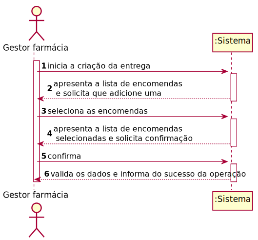

# ReadMe #

## 1. Requisitos
LAP3AP1-190 - Como gestor da farmácia pretendo criar uma entrega.

A interpretação feita deste requisito foi no sentido de que o gestor de farmácia pretende criar uma nova entrega com as encomendas relativas à sua farmácia. Para tal, introduz a informação necessária e o sistema
verifica a possibilidade, informa da possibilidade e guarda a informação correspondente.

## 2. Análise
### Descrição e Regras de Negócio
Foi utilizado o mecanismo de persistência de dados na base de dados.
Desta forma, os dados relativos à entrega são inseridos na base de dados,
no respetivo repositório que neste contexto, é a Entrega. Desta forma, a
informação das entregas fica guardada, podendo ser utilizada ou alterada posteriormente.

### Pré-condições
O sistema contém farmácias com encomendas (um repositório onde se encontra toda a informação relativa às encomendas).

### Pós-condições
A informação da nova entrega é persistida/guardada no sistema.

### SSD

## 3. Design
### 3.1. Realização da Funcionalidade

### 3.2. Padrões Aplicados
Aplicamos o padrão de projeto de software MVC, focado na reutilização de código e a separação de conceitos em três camadas interconectadas, onde a apresentação dos dados e a interação dos utilizadores são separados dos métodos que interagem com o a base de dados.

### 3.3. Testes

Teste 1: Verificar que é possível obter a lista de encomendas e apresentar.

      @Test
      void getEncomendas() {
       Encomenda encomenda1 = new Encomenda(1, "teste@email.com",2,1,1);
       Encomenda encomenda2 = new Encomenda(2, "teste2@email.com",2,1,1);
       Encomenda encomenda3 = new Encomenda(3, "teste3@email.com",2,1,1);

       List<Encomenda> listaEncomendas = new ArrayList<>();
       listaEncomendas.add(encomenda1);
       listaEncomendas.add(encomenda2);
       listaEncomendas.add(encomenda3);
       String email = "teste@email.com";
       AplicacaoPOT app = AplicacaoPOT.getInstance();
       app.getAutorizacaoFacade().setUtilizadorBD(utilizadorBD);
       app.getAutorizacaoFacade().doLogin(email,"password");

       assertEquals(listaEncomendas,instance.getEncomendas());

     }

Teste 2: Verifica que é possível inserir os dados da entrega e criar a entrega.

    @Test
    void validaDadosEstimativa() throws Exception {
     Constantes.setVentoxDrone(1);
     Constantes.setVentoyDrone(2);
     Constantes.setVentoxScooter(1);
     Constantes.setVentoyScooter(2);
     utilizadorBD= mock(UtilizadorBD.class);
     farmaciaBD=mock(FarmaciaBD.class);
     encomendaBD=mock(EncomendaBD.class);
     moradaBD=mock(MoradaBD.class);
     scooterBD= mock(ScooterBD.class);
     droneBD=mock(DroneBD.class);
     estafetaBD=mock(EstafetaBD.class);
     entregaBD=mock(EntregaBD.class);
     instance= new CriarEntregaController(farmaciaBD,encomendaBD,moradaBD,droneBD,scooterBD,estafetaBD,entregaBD);
     estimarConsumoDroneTask= new EstimarConsumoDroneTask();
     estimarConsumoTask= new EstimarConsumoTask();

     when(utilizadorBD.procuraUtilizador("teste@email.com")).thenReturn(new Utilizador("teste", "teste@email.com", 123456789, 123456789, "password", 1));
     LugarEstacionamento lE = new LugarEstacionamento(true, 1, 2);
     String email = "teste@email.com";

     when(farmaciaBD.getFarmaciabyGestor(email)).thenReturn(new Farmacia(1, "farm", 111111111, 919191919, "teste@email.com", email, "1", lE));
     when(moradaBD.getMoradaById(1)).thenReturn(new Morada("Farmacia 1",41.15227, -8.60929, 104));
     Morada moradaFarmacia1 = new Morada("Farm 1", 0.5, 0.5, 10);
     Morada moradaFarmacia2 = new Morada("Farm 2", 0, 1, 10000);
     Map<Integer, Morada> farmacias = new HashMap<>();
     farmacias.put(1, moradaFarmacia1);
     farmacias.put(2, moradaFarmacia2);
     when(moradaBD.getMoradasFarmacia()).thenReturn(farmacias);

     Encomenda encomenda1 = new Encomenda(1, "teste@email.com",2,1,1);
     Encomenda encomenda2 = new Encomenda(2, "teste2@email.com",2,1,1);
     Encomenda encomenda3 = new Encomenda(3, "teste3@email.com",2,1,1);

     List<Encomenda> listaEncomendas = new ArrayList<>();
     listaEncomendas.add(encomenda1);
     listaEncomendas.add(encomenda2);
     listaEncomendas.add(encomenda3);
     when(encomendaBD.getEncomendasByFarmID(1)).thenReturn(listaEncomendas);
     List<Integer> listaEncomendasSelecionadas= new ArrayList<>();
     listaEncomendasSelecionadas.add(1);
     listaEncomendasSelecionadas.add(2);
     listaEncomendasSelecionadas.add(3);

     Morada cliente1 = new Morada("Cliente 1",41.14723, -8.60657, 91);
     Morada cliente2 = new Morada("Cliente 2",41.14871, -8.60746, 87);
     Morada cliente3 = new Morada("Cliente 3",41.14331, -8.60914, 82);
     List<Morada> listaMoradasEntrega = new ArrayList<>();
     listaMoradasEntrega.add(cliente1);
     listaMoradasEntrega.add(cliente2);
     listaMoradasEntrega.add(cliente3);

     when(encomendaBD.getEncomendasByID(listaEncomendasSelecionadas)).thenReturn(listaEncomendas);

     when(encomendaBD.getMoradasClientesByEncomendas(listaEncomendas)).thenReturn(listaMoradasEntrega);

     List<Drone> drones=new ArrayList<>();
     drones.add(new Drone(2,100,16000,1,150,10,5,10,15,0.2,4,0.2,10));
     when(droneBD.getAvailableDronesByFarmID(1)).thenReturn(drones);
     List<Scooter> listaScooters= new ArrayList<>();
     listaScooters.add(new Scooter(1, 100, 100, 1, 20, 20, 70, 40));
     Graph<Morada, Double> mapa = new Graph<>(false);

     Graph<Morada, Double> mapa2 = new Graph<>(true);

     Graph<Morada, Double> mapa3 = new Graph<>(true);

     Graph<Morada, Double> mapa4 = new Graph<>(true);

     List<Morada> moradasGrafo=new ArrayList<>();
     moradasGrafo.add(new Morada("Farmacia 1",41.15227, -8.60929, 104));
     moradasGrafo.add(cliente1);
     moradasGrafo.add(cliente2);
     moradasGrafo.add(cliente3);
     for(Morada m : moradasGrafo){
         for(Morada m2 : moradasGrafo){
             if(!m.equals(m2)){
                 mapa.insertEdge(m,m2,0.004,estimarConsumoDroneTask.estimarConsumoSimples(m,m2));
             }
         }
     }
     AplicacaoPOT.getInstance().setMapaAereoEstimativas(mapa);

     for(Morada m : moradasGrafo){
         for(Morada m2 : moradasGrafo){
             if(!m.equals(m2)){
                 mapa2.insertEdge(m,m2,0.004,estimarConsumoTask.estimativaSimples(m,m2,0.004));
             }
         }
     }

     AplicacaoPOT.getInstance().setMapaTerrestreEstimativas(mapa2);

     for(Morada m : moradasGrafo){
         for(Morada m2 : moradasGrafo){
             if(!m.equals(m2)){
                 mapa3.insertEdge(m,m2,0.004,m.distanceFrom(m2));
             }
         }
     }
     AplicacaoPOT.getInstance().setMapaTerrestreDistancias(mapa3);

     for(Morada m : moradasGrafo){
         for(Morada m2 : moradasGrafo){
             if(!m.equals(m2)){
                 mapa4.insertEdge(m,m2,0.004,m.distanceFromNoHeight(m2));
             }
         }
     }

     AplicacaoPOT.getInstance().setMapaAereoDistancias(mapa4);

     System.out.println(mapa2);

     when(scooterBD.getAvailableScootersByFarmID(1)).thenReturn(listaScooters);
     when(estafetaBD.getEstafetaAvailable(1)).thenReturn("testeEstafeta@email.com");
     Entrega entregaaa= new Entrega(1,6.0,2088.3365112543356,177914.40568477302,1,2);
     when(entregaBD.criarEntrega(6.0,2132.8093754170295,177914.40568477302,2)).thenReturn(entregaaa);
     List<Morada> caminho= new ArrayList<>();
     Morada farmacia1=  new Morada("Farmacia 1",41.15227, -8.60929, 104);
     caminho.add(farmacia1);
     caminho.add(cliente1);
     caminho.add(cliente3);
     caminho.add(cliente2);
     caminho.add(farmacia1);

     List<Morada> resultado= new ArrayList<>();
     Morada farmacia1_1=  new Morada(1,"Farmacia 1",41.15227, -8.60929, 104);
     resultado.add(farmacia1_1);
     Morada cliente1_1 = new Morada(2,"Cliente 1",41.14723, -8.60657, 91);
     Morada cliente2_1 = new Morada(3,"Cliente 2",41.14871, -8.60746, 87);
     Morada cliente3_3 = new Morada(4,"Cliente 3",41.14331, -8.60914, 82);
     resultado.add(cliente1_1);
     resultado.add(cliente3_3);
     resultado.add(cliente2_1);
     resultado.add(farmacia1_1);

     when(entregaBD.getMoradasByCaminho(caminho)).thenReturn(resultado);
     when(entregaBD.setCaminho(1,resultado)).thenReturn(true);
     when(encomendaBD.setIDEntrega(listaEncomendas,entregaaa)).thenReturn(true);
     when(droneBD.setEstadoVeiculo(2,3)).thenReturn(true);
     when(estafetaBD.setEstadoEstafeta("testeEstafeta@email.com",2)).thenReturn(true);

     AplicacaoPOT app = AplicacaoPOT.getInstance();
     app.getAutorizacaoFacade().setUtilizadorBD(utilizadorBD);
     app.getAutorizacaoFacade().doLogin(email,"password");
     instance.getEncomendas();

     Pair<Veiculo,Double> expResult=new Pair<>(new Drone(2,100,16000,1,150,10,5,10,15,0.2,4,0.2,10),177914.40568477302);

     assertEquals(expResult,instance.validaDados(listaEncomendasSelecionadas,true));

    }

## 4. Implementação
Métodos Controller:

    public List<Encomenda> getEncomendas(){}

    public Pair<Veiculo, Double> validaDados(List<Integer> encomendas, boolean estimativa) throws Exception {}

    protected Veiculo getVeiculoMaisEficiente() {}

    protected double calcularCargaTotal() {}

    protected List<Drone> getDronesCapazes() {}  

## 5. Integração/Demonstração
-/
## 6. Observações
-/
