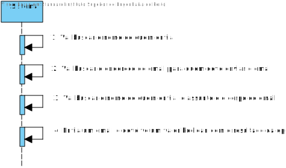

# ReadMe #

## 1. Requisitos
LAP3AP1-76  Como Sistema, eu pretendo enviar emails automáticos.

A interpretação feita deste requisito foi no sentido de que o sistema, após um certo processo, envia um email a um usuário com a informação relativa processo.

## 2. Análise
### Descrição e Regras de Negócio
Foi utilizado o mecanismo de API.
Desta forma, os dados relativos ao email são recebidos pela API.
A API processa a informação e envia os emails.

### Pré-condições
O sistema contém um catálogo de produtos (um repositório onde se encontra toda a informação relativa aos produtos).

### Pós-condições
> n/a

### SSD

## 3. Design
### 3.1. Realização da Funcionalidade

### 3.2. Padrões Aplicados
> n/a

### 3.3. Testes
Nesta secção deve sistematizar como os testes foram concebidos para permitir uma correta aferição da
satisfação dos requisitos.

* Teste 1: Verificar se com um endereço inválido, dá erro a enviar o email.
* Teste 2: Verificar se envia um email com sucesso.
* Teste 3: Verificar se envia email para si próprio e o conteúdo do email não sofre alterações.

## 4. Implementação
Nesta secção a equipa deve providenciar, se necessário, algumas evidências de que a implementação está em conformidade
com o design efetuado. Para além disso, deve mencionar/descrever a existência de outros ficheiros (e.g. de configuração)
relevantes e destacar commits relevantes;

Recomenda-se que organize este conteúdo por subsecções.
> n/a

## 5. Integração/Demonstração
Como tinhamos um método static que recebia como parametro o nome de quem enviava, o email do recetor, o assunto do email e o corpo do mesmo,
a integração do restante código com esta UC foi fácil.

## 6. Observações
Criamos um email nosso (para o projeto), de modo a termos um email de onde enviamos os nossos emails com as informações.
