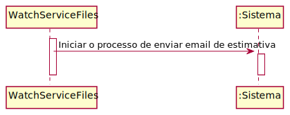

# ReadMe #

LAP3AP1-41 Como gerente de farmácia/estafeta desejo saber o tempo para um veiculo atingir a carga total.

A interpretação feita deste requisito foi no sentido de que o gerente de farmácia/estafeta tenha acesso ao tempo estimado de carregamento. Para tal, o sistema tem a informação nenecssária pare esse calculo e o posterior envio do email.

## 2. Análise
### Descrição e Regras de Negócio
Foi utilizado o mecanismo de persitência na medida em que os dados relativos aos produto são acedidos a partir da base de dados. Desta forma, a
informação dos veiculos é utilizada para o calculo e o envio do email.

### Pré-condições
O sistema contém as informações relativas ao veiculo e a base de carregamento.

### Pós-condições
Enviado o email.

### SSD

## 3. Design
### 3.1. Realização da Funcionalidade

### 3.2. Padrões Aplicados

### 3.3. Testes

Teste 1: Verificar se o metodo envia o email. Para isso tem de ler direito o ficheiro relativo a uma scooter e criar as informações necessárias para o enviar do email.
    
    @Test
    void sendEmail() {
        scooterBD = mock(ScooterBD.class);
        droneBD=mock(DroneBD.class);
        try (FileWriter fileWriter = new FileWriter("src\\main\\resources\\ScooterInfo"+"\\"+"estimate_[datetime].data.flag.txt")) {
            fileWriter.write(1+";"+24+";"+"email@gmail.com");
        } catch (IOException e) {
            e.printStackTrace();
        }
        try (FileWriter fileWriter = new FileWriter("src\\main\\resources\\ScooterInfo"+"\\"+"estimate_[datetime].data.txt")) {
            fileWriter.write(1+";"+24+";"+"email@gmail.com");
        } catch (IOException e) {
            e.printStackTrace();
        }
        String name="estimate_[datetime].data.flag.txt";
        when(scooterBD.getScooterByID(1)).thenReturn("1");
        when(droneBD.getDroneByID(1)).thenReturn("1");
        when(scooterBD.isScooter(1)).thenReturn(true);
        when(droneBD.isDrone(1)).thenReturn(false);
        Pair<String, Pair<String,Integer>>  expResult=new Pair<>("email@gmail.com",new Pair<>("1",24));
        assertTrue(EnviarEmailEstimativaTask.sendEmail(name,scooterBD,droneBD));
    }

Teste 2: Verificar se o metodo envia o email. Para isso tem de ler direito o ficheiro relativo a um drone e criar as informações necessárias para o enviar do email.
    
    @Test
    void sendEmail1() {
            scooterBD = mock(ScooterBD.class);
            droneBD=mock(DroneBD.class);
            try (FileWriter fileWriter = new FileWriter("src\\main\\resources\\ScooterInfo"+"\\"+"estimate_[datetime].data.flag.txt")) {
                fileWriter.write(1+";"+24+";"+"email@gmail.com");
            } catch (IOException e) {
                e.printStackTrace();
            }
            try (FileWriter fileWriter = new FileWriter("src\\main\\resources\\ScooterInfo"+"\\"+"estimate_[datetime].data.txt")) {
                fileWriter.write(1+";"+24+";"+"email@gmail.com");
            } catch (IOException e) {
                e.printStackTrace();
            }
            String name="estimate_[datetime].data.flag.txt";
            when(scooterBD.getScooterByID(1)).thenReturn("1");
            when(scooterBD.isScooter(1)).thenReturn(true);
            when(droneBD.isDrone(1)).thenReturn(false);
            Pair<String, Pair<String,Integer>>  expResult=new Pair<>("email@gmail.com",new Pair<>("1",24));
            assertTrue(EnviarEmailEstimativaTask.sendEmail(name,scooterBD,droneBD));
        }
Teste 3: Verificar se o metodo não envia o email. 
    
    @Test
    void sendEmail2() {
           scooterBD = mock(ScooterBD.class);
           droneBD=mock(DroneBD.class);
           try (FileWriter fileWriter = new FileWriter("src\\main\\resources\\ScooterInfo"+"\\"+"estimate_[datetime].data.flag.txt")) {
               fileWriter.write(1+";"+24+";"+"email@gmail.com");
           } catch (IOException e) {
               e.printStackTrace();
           }
           try (FileWriter fileWriter = new FileWriter("src\\main\\resources\\ScooterInfo"+"\\"+"estimate_[datetime].data.txt")) {
               fileWriter.write(1+";"+24+";"+"email@gmail.com");
           } catch (IOException e) {
               e.printStackTrace();
           }
           String name="estimate_[datetime].data.flag.txt";
           Pair<String, Pair<String,Integer>>  expResult=new Pair<>("email@gmail.com",new Pair<>("1",24));
           assertFalse(EnviarEmailEstimativaTask.sendEmail(name,scooterBD,droneBD));
       }
       
## 4. Implementação
Metodos da task:

    public static boolean sendEmail(String name, ScooterBD scooterBD, DroneBD droneBD) {
    }

## 5. Integração/Demonstração

## 6. Observações
