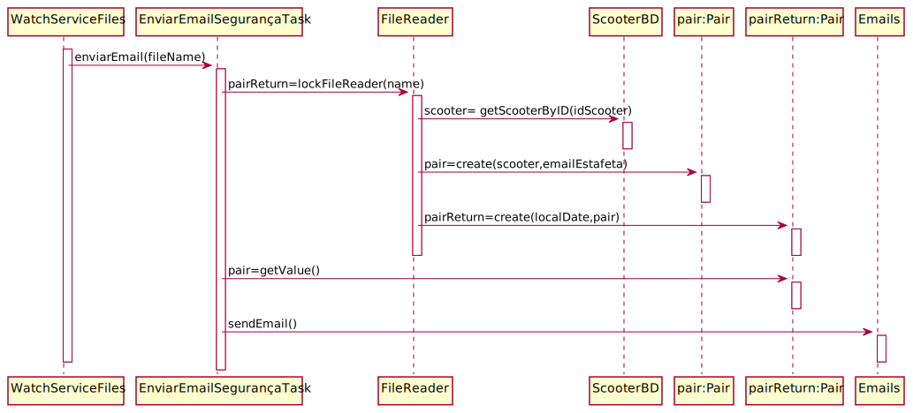

# ReadMe #

## 1. Requisitos
LAP3AP1-40 Como estafeta/gestor da farmacia desejo receber um email de segurança (se está devidamente trancado)

A interpretação feita deste requisito foi no sentido de que o estafeta/gestor da farmacia pretende que o sistema envie um
email de segurança. Para tal, o sistema lê um ficheiro e envia um email para as informações obtidas.

## 2. Análise
### Descrição e Regras de Negócio
Foi utilizado o mecanismo de persitência de dados na base de dados. 
Desta forma, os dados relativos ao veiculo sao acedidos a partir da base de dados.

### Pré-condições
O sistema contém informação sobre o veiculo em questão bem como do estafeta/gestor da farmacia.
### Pós-condições

### SSD

## 3. Design
### 3.1. Realização da Funcionalidade

### 3.2. Padrões Aplicados
N/a

### 3.3. Testes
Teste 1: Verificar que é possível enviar email de uma scooter.

    @Test
    void sendEmail() {
        scooterBD = mock(ScooterBD.class);
        droneBD=mock(DroneBD.class);
        try (FileWriter fileWriter = new FileWriter("src\\main\\resources\\ScooterInfo"+"\\"+"estimate_[datetime].data.flag.txt")) {
            fileWriter.write(1+";"+24+";"+"email@gmail.com");
        } catch (IOException e) {
            e.printStackTrace();
        }
        try (FileWriter fileWriter = new FileWriter("src\\main\\resources\\ScooterInfo"+"\\"+"estimate_[datetime].data.txt")) {
            fileWriter.write(1+";"+24+";"+"email@gmail.com");
        } catch (IOException e) {
            e.printStackTrace();
        }
        String name="estimate_[datetime].data.flag.txt";
        when(scooterBD.getScooterByID(1)).thenReturn("1");
        when(droneBD.getDroneByID(1)).thenReturn("1");
        when(scooterBD.isScooter(1)).thenReturn(true);
        when(droneBD.isDrone(1)).thenReturn(false);
        Pair<String, Pair<String,Integer>>  expResult=new Pair<>("email@gmail.com",new Pair<>("1",24));
        assertTrue(EnviarEmailEstimativaTask.sendEmail(name,scooterBD,droneBD));
    }
Teste 2: Verificar que é possível enviar email de um drone.

    @Test
     void sendEmail1() {
            scooterBD = mock(ScooterBD.class);
            droneBD=mock(DroneBD.class);
            try (FileWriter fileWriter = new FileWriter("src\\main\\resources\\ScooterInfo"+"\\"+"lock_2020_12_32_12_34_54.data.flag.txt")) {
                fileWriter.write(1+";"+20+";"+"email@gmail.com");
            } catch (IOException e) {
                e.printStackTrace();
            }
            try (FileWriter fileWriter = new FileWriter("src\\main\\resources\\ScooterInfo"+"\\"+"lock_2020_12_32_12_34_54.data.txt")) {
                fileWriter.write(1+";"+20+";"+"email@gmail.com");
            } catch (IOException e) {
                e.printStackTrace();
            }
            String name="lock_2020_12_32_12_34_54.data.flag.txt";
            when(scooterBD.isScooter(1)).thenReturn(false);
            when(droneBD.isDrone(1)).thenReturn(true);
            when(droneBD.getDroneByID(1)).thenReturn("1");
            assertTrue( EnviarEmailSegurancaTask.sendEmail(name,scooterBD,droneBD));;
        }
Teste 3: Verificar que é possível enviar email de um drone.

       @Test
       void sendEmail3() {
           scooterBD = mock(ScooterBD.class);
           droneBD=mock(DroneBD.class);
           try (FileWriter fileWriter = new FileWriter("src\\main\\resources\\ScooterInfo"+"\\"+"lock_2020_12_32_12_34_54.data.flag.txt")) {
               fileWriter.write(1+";"+20+";"+"email@gmail.com");
           } catch (IOException e) {
               e.printStackTrace();
           }
           try (FileWriter fileWriter = new FileWriter("src\\main\\resources\\ScooterInfo"+"\\"+"lock_2020_12_32_12_34_54.data.txt")) {
               fileWriter.write(1+";"+20+";"+"email@gmail.com");
           } catch (IOException e) {
               e.printStackTrace();
           }
           String name="lock_2020_12_32_12_34_54.data.flag.txt";
           when(scooterBD.isScooter(1)).thenReturn(false);
           when(droneBD.isDrone(1)).thenReturn(false);
           assertFalse( EnviarEmailSegurancaTask.sendEmail(name,scooterBD,droneBD));;
       }
    
 
## 4. Implementação
Nesta secção a equipa deve providenciar, se necessário, algumas evidências de que a implementação está em conformidade 
com o design efetuado. Para além disso, deve mencionar/descrever a existência de outros ficheiros (e.g. de configuração) 
relevantes e destacar commits relevantes;

Recomenda-se que organize este conteúdo por subsecções.

## 5. Integração/Demonstração

## 6. Observações
