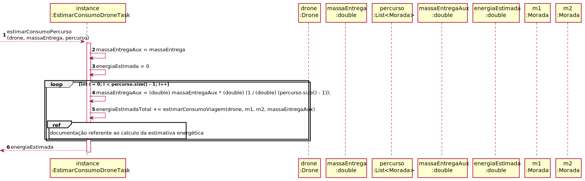
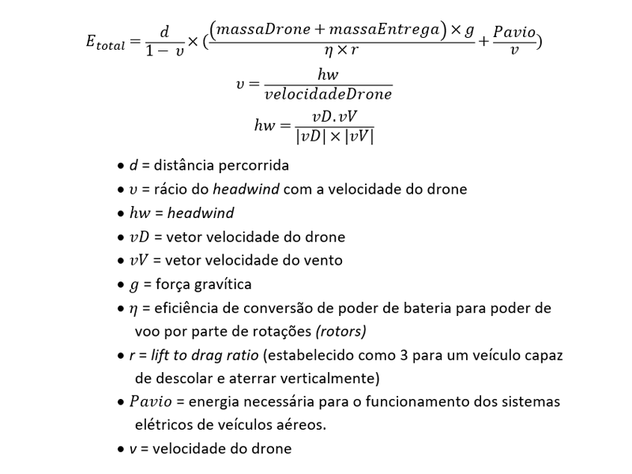

# ReadMe #

## 1. Requisitos
LAP3AP1-193: Como gestor de farmácia desejo estimar o consumo energético de um drone quando este realiza uma determinada entrega

A interpretação feita deste requisito foi no sentido de que o gestor da farmácia 
pretende que o sistema estime o consumo energético de um drone para um determinado percurso.
Para tal, o sistema possui as fórmulas e dados necessários para essa estimativa.

## 2. Análise
### Descrição e Regras de Negócio
De modo a calcular o consumo energético de um drone ao longo de um determinado percurso,
foram utilizadas fórmulas disponibilizadas pelos docentes, sendo estas complementadas por documentação
realizada pela *College of Business Administration* pertencente à *University of Missouri-St. Louis* (1)
e pelo *IEEE* (2).

### Pré-condições
O sistema calcula o caminho a percorrer pelo drone.

### Pós-condições
É estimada a energia consumida por um drone para um determinado percurso.

## 3. Design
### 3.1. Realização da Funcionalidade
Para a documentação desta funcionalidade, opto por recorrer à explicação da relação entre o código e
as fórmulas aplicadas, de modo a estruturar de maneira mais precisa o raciocinio.

 - **documentação referente ao cálculo da estimativa energética**

- **fórmula geral do cálculo energético**

    protected double estimarConsumoViagem(Drone drone, Morada m1, Morada m2, double massaEntrega) {
        double massaTotal = drone.getMassa() + massaEntrega;
        double distanciaComVento = distanciaComVento(drone, m1, m2);

        double calculo1 = (massaTotal * ACELERACAO_GRAVITICA) / (drone.getRotors() * drone.getDrag());
        double calculo2 = drone.getAvionics() / drone.getVelocidade();
        double calculo3 = calculo1 + calculo2;

        return distanciaComVento * calculo3;
    }

- **fórmula da distância a dividir por 1 subtraindo o rácio do headwind (e cálculo do dito rácio)**

    protected double distanciaComVento(Drone drone, Morada m1, Morada m2) {
        double distancia = m1.distanceFromNoHeight(m2);

        double[] vetorVento = new double[2];
        vetorVento[0] = Constantes.VENTOX_DRONE * 3.6;
        vetorVento[1] = Constantes.VENTOY_DRONE * 3.6;

        double[] vetorVelocidade = calcularVetor(drone.getVelocidade(), m1, m2);

        double headwind = produtoEscalar(vetorVelocidade, vetorVento) / drone.getVelocidade();

        double ratioHeadwind = headwind / drone.getVelocidade();

        double divisor = 1 - ratioHeadwind;

        return distancia / divisor;
    }

- **fórmula do cálculo do vetor velocidade**

    protected double[] calcularVetor(double modulo, Morada m1, Morada m2) {
        double[] vetor = new double[2];

        vetor[0] = m2.getLongitude() - m1.getLongitude();
        vetor[1] = m2.getLatitude() - m1.getLatitude();

        double k = Math.pow(Math.abs(vetor[0]), 2) + Math.pow(Math.abs(vetor[1]), 2);
        double i = Math.sqrt((modulo * modulo) / k);

        vetor[0] *= i;
        vetor[1] *= i;

        return vetor;
    }

- **fórmula do produto escalar entre o vetor velocidade do drone e vetor velocidade do vento**

    protected double produtoEscalar(double[] vetor1, double[] vetor2) {
        double resultado = 0;
        for (int i = 0; i < vetor1.length; i++) {
        resultado += vetor1[i] * vetor2[i];
        }
        return resultado;
    }

### 3.2. Padrões Aplicados
-/

### 3.3. Testes

- **Setup**

      @BeforeAll
      static void setup(){
          Constantes.setVentoxDrone(1);
          Constantes.setVentoyDrone(2);
      }

- **Teste 1** - Estimar o consumo energético num determinado percurso (sucesso e insucesso)

        @Test
        void estimarConsumoPercursoTest() {
            Morada m = new Morada("Rua1,BuenosAires", -34.6131500, -58.3772300, 43.513);
            Morada m2 = new Morada("Rua2,Lapaz", -16.5000000, -68.1500000, 456.567);
            Morada f1 = new Morada("Rua14,Brasilia", -15.7797200, -47.9297200, 1320.349);
    
            List<Morada> list = new ArrayList<>();
    
            assertEquals(0,task.estimarConsumoPercurso(drone,cargaEntrega,list));
    
            list.add(m);
            list.add(m2);
            list.add(f1);
    
            assertEquals(1.7915590972491884E8, task.estimarConsumoPercurso(drone,cargaEntrega,list));
            assertNotEquals(55555, task.estimarConsumoPercurso(drone,cargaEntrega,list));
        }

- **Teste 2** - Estimativa de consumo base para efeitos de configuração do mapa a utilizar

        @Test
        void estimarConsumoSimplesTest() {
            Morada m = new Morada("Rua1,BuenosAires", -34.6131500, -58.3772300, 43.513);
            Morada m2 = new Morada("Rua2,Lapaz", -16.5000000, -68.1500000, 456.567);
    
            assertEquals(2.5938262085664433E8, task.estimarConsumoSimples(m,m2));
            assertNotEquals(668, task.estimarConsumoSimples(m,m2));
    
            Constantes.setVentoxDrone(999999999);
            Constantes.setVentoyDrone(999999999);
    
            assertEquals(0, task.estimarConsumoSimples(m,m2));
            assertNotEquals(444, task.estimarConsumoSimples(m,m2));
        }

- **Teste 3** - Estimativa do consumo entre dois pontos (sucesso e insucesso)

        @Test
        void estimarConsumoViagemTest() {
            Constantes.setVentoxDrone(1);
            Constantes.setVentoyDrone(2);
    
            Morada m = new Morada("Rua1,BuenosAires", -34.6131500, -58.3772300, 43.513);
            Morada m2 = new Morada("Rua2,Lapaz", -16.5000000, -68.1500000, 456.567);
    
            assertEquals(1.2870722474303733E8, task.estimarConsumoViagem(drone, m, m2, cargaEntrega));
            assertNotEquals(356, task.estimarConsumoViagem(drone, m, m2, cargaEntrega));
        }

- **Teste 4** - Cálculo da divisão entre a distância e a subtração entre 1 e o rácio do *headwind* (sucesso e insucesso)

        @Test
        void distanciaComVentoTest() {
            Morada m = new Morada("Rua1,BuenosAires", -34.6131500, -58.3772300, 43.513);
            Morada m2 = new Morada("Rua2,Lapaz", -16.5000000, -68.1500000, 456.567);
    
            assertEquals(2910176.7882459275, task.distanciaComVento(drone, m, m2));
            assertNotEquals(566, task.distanciaComVento(drone, m, m2));
        }

- **Teste 5** - Cálculo do produto escalar entre dois vetores (sucesso e insucesso)

        @Test
        void produtoEscalarTest() {
            double[] vetor1 = new double[3];
            vetor1[0] = 5;
            vetor1[1] = 2;
            vetor1[2] = 2;
    
            double[] vetor2 = new double[3];
            vetor2[0] = 2;
            vetor2[1] = 3;
            vetor2[2] = 4;
    
            assertEquals(24,task.produtoEscalar(vetor1, vetor2));
            assertNotEquals(0,task.produtoEscalar(vetor1, vetor2));
        }

- **Teste 6** - Calculo do vetor velocidade (sucesso e insucesso)

        @Test
        void calcularVetorTest() {
            Morada m = new Morada("Rua1,BuenosAires", -34.6131500, -58.3772300, 43.513);
            Morada m2 = new Morada("Rua2,Lapaz", -16.5000000, -68.1500000, 456.567);
    
            double[] expResult = {-1.4245064633210403, 2.6402237283905663};
    
            assertEquals(Arrays.toString(expResult), Arrays.toString(task.calcularVetor(3, m, m2)));
    
            double[] expResult2 = {5, 5, 5};
    
            assertNotEquals(Arrays.toString(expResult2), Arrays.toString(task.calcularVetor(3, m, m2)));
        }

## 4. Implementação

- **Metodos da Task**

> public double estimarConsumoPercurso(Drone drone, double massaEntrega, List<Morada> percurso)
> 
> public double estimarConsumoSimples(Morada m1, Morada m2)
> 
> protected double estimarConsumoViagem(Drone drone, Morada m1, Morada m2, double massaEntrega)
>
> protected double distanciaComVento(Drone drone, Morada m1, Morada m2)
> 
> protected double produtoEscalar(double[] vetor1, double[] vetor2)
> 
> protected double[] calcularVetor(double modulo, Morada m1, Morada m2)

## 5. Integração/Demonstração
-/

## 6. Observações
- **Referências**
- **1**: https://www.sciencedirect.com/science/article/pii/S1361920920308531?via%3Dihub#s0090
- **2**: https://ieeexplore.ieee.org/stamp/stamp.jsp?tp=&arnumber=6827242