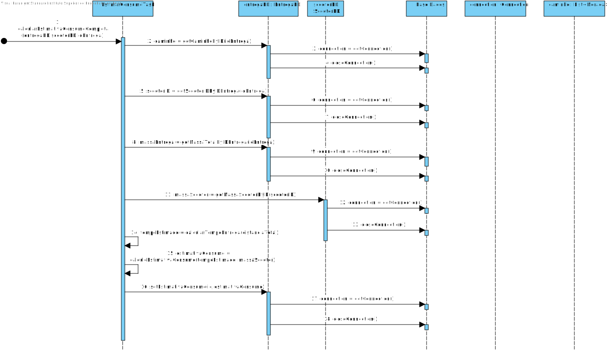
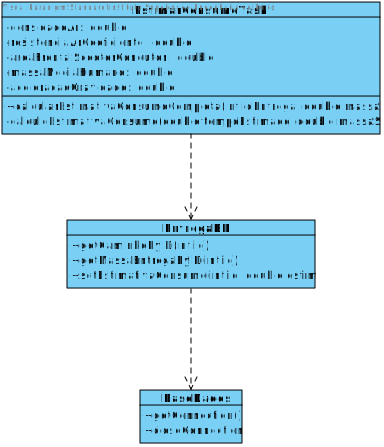

# ReadMe #

## 1. Requisitos
LAP3AP1-27 - Como Sistema pretendo estimar o consumo energético da scooter.

## 2. Análise
### Descrição e Regras de Negócio
Foi utilizado a fórmula fornecia pelos professores para estimar o consumo de uma scooter, do seguinte website:
EV design – energy consumption – x-engineer.org. (n.d.). Retrieved January 26, 2021, from https://x-engineer.org/automotive-engineering/vehicle/electric-vehicles/ev-design-energy-consumption/

### Pré-condições
O sistema possui um caminho já selecionado e um veículo também.

### Pós-condições
A informação do consumo é devolvida.

### SSD

## 3. Design
### 3.1. Realização da Funcionalidade

### 3.2. Padrões Aplicados
Nesta secção deve apresentar e explicar quais e como foram os padrões de design aplicados e as melhores práticas

> É uma Task, não possuí padrões 
> n/a

### 3.3. Testes
Nesta secção deve sistematizar como os testes foram concebidos para permitir uma correta aferição da 
satisfação dos requisitos.

Teste 1: Verificar se o valor de estimar Consumo é o correto para uma altitude de 0.
Teste 2: Verificar o resultado da velocidade da scooter em relação ao vento
Teste 3: Verificar a força aplicada na scooter graças à inclinação na rua

## 4. Implementação
Nesta secção a equipa deve providenciar, se necessário, algumas evidências de que a implementação está em conformidade 
com o design efetuado. Para além disso, deve mencionar/descrever a existência de outros ficheiros (e.g. de configuração) 
relevantes e destacar commits relevantes;

As fórmulas utilizadas para calcular a estimativa de energia foram as seguintes:

*Ftot=Fi+Fs+Fr+Fa*

> Ftot [N] - total road load;
> Fi [N] – inertial force (será nula porque a velocidade é sempre constante, logo a aceleração é nula)
> Fs [N] – road slope force
> Fr [N] – road load force
> Fa [N] – aerodynamic drag force

*Fi=mv⋅av*

> mv [kg] – total vehicle mass
> av [m/s2] – vehicle acceleration

*Fs=mv⋅g⋅sin(αs)*

> g [m/s2] – gravitational acceleration
> αs [rad] – road slope angle

*Fr=mv⋅g⋅crr⋅cos(αs)*

> crr [-] – road rolling resistance coefficient

*Fa=1/2⋅ρ⋅cd⋅A^2⋅v*

> ρ [kg/m^3] – air density at 20 °C
> cd [-] – air drag coefficient
> A [m^2] – vehicle frontal area
> vv [m/s] – vehicle speed (velocidade do veículo em relação ao vento)

*Ptot=Ftot⋅vv*

> Ptot - total power

*Etot=∫Ptot⋅dt*

> Etot = total energy

## 5. Integração/Demonstração
Nesta secção a equipa deve descrever os esforços realizados no sentido de integrar a funcionalidade desenvolvida com as 
restantes funcionalidades do sistema.

> n/a

## 6. Observações
Nesta secção sugere-se que a equipa apresente uma perspetiva critica sobre o trabalho desenvolvido apontando, 
por exemplo, outras alternativas e ou trabalhos futuros relacionados.

> n/a