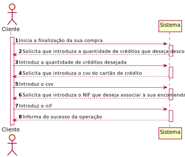
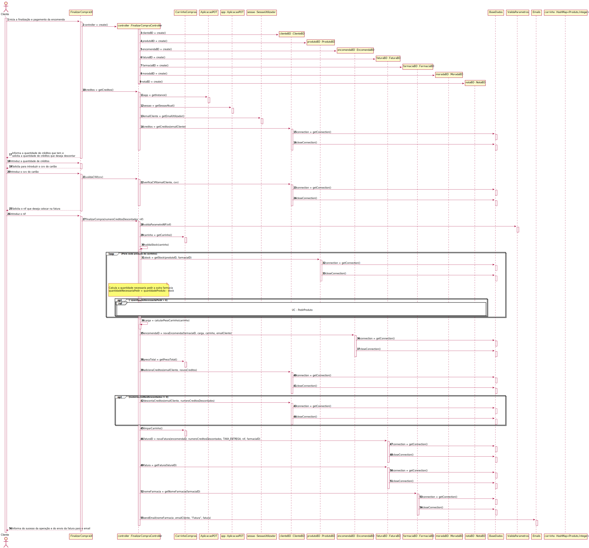
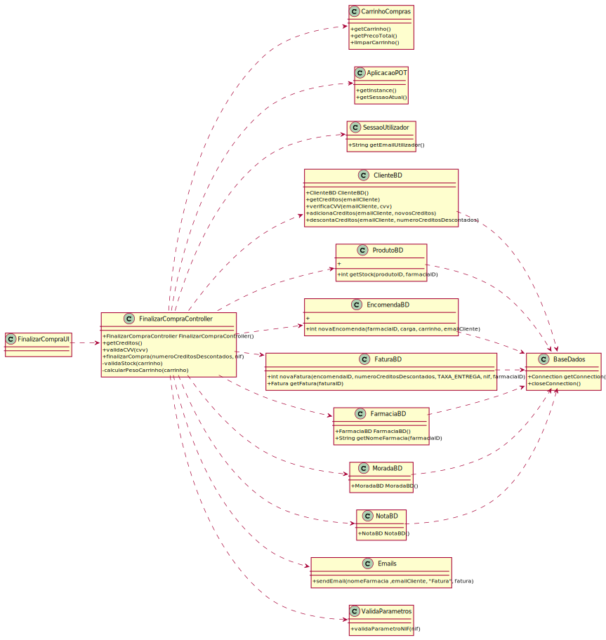

# ReadMe #

## 1. Requisitos
LAP3AP1-74 Como Cliente, desejo finalizar a minha compra.

A interpretação feita deste requisito foi no sentido de que o cliente após ter selecionado todos os produtos e as respetivas quantidades que deseja comprar, quer finalizar/pagar para que a sua encomenda seja processada e enviada para sua casa. Para tal, indica que quer finalizar a sua compra e de seguida indicada a quantidade de créditos que deseja descontar na sua compra, tomando por base os créditos existentes na sua conta, introduz o número CVV do seu cartão de crédito e introduz o NIF que deseja que a encomenda fique associado. Depois o sistema valida todos os parâmetros introduzidos. Posteriormente, o sistema começa o processamento da encomenda (pedir produtos a outras farmácias próximas se necessário (UC-Pedir Produto), criar a encomenda e atribuir a encomenda a uma entrega) e envia um email para o cliente com a fatura referente à sua encomenda.

## 2. Análise
### Descrição e Regras de Negócio
Foi utilizado o mecanismo de persistência de dados na base de dados. Desta forma, os dados relativos à encomenda, à fatura e ao produto são inseridos/atualizados na base de dados, no respetivo repositório que neste contexto, é, respetivamente, a Encomenda/LinhaEncomendaProduto, Fatura/LinhaFatura e Produto. Desta forma, a informação do processo de finalização da compra ficam guardados, podendo ser utilizados posteriormente.

### Pré-condições
- o sistema contém toda a informação necessária para a realização da tarefa.
- O sistema contém todos os repositórios necessários para conter toda a informação introduzida.

### Pós-condições
- Todas as informações da finalização da compra são persistidas/guardadas no sistema.

### SSD

## 3. Design
### 3.1. Realização da Funcionalidade

#### SD - Diagrama de Sequência

#### CD - Diagrama de Classes

### 3.2. Padrões Aplicados
Aplicamos o padrão de projeto de software MVC, focado na reutilização de código e a separação de conceitos em três camadas interconectadas, onde a apresentação dos dados e a interação dos utilizadores são separados dos métodos que interagem com o a base de dados.

### 3.3. Testes

**Teste 1**: Verifica o método.

    @Test
    void getCreditos() {
        int numeroCreditos = 5;
        when(clienteBD.getCreditos(emailCliente)).thenReturn(numeroCreditos);
        assertEquals(numeroCreditos, controller.getCreditos());
    }

**Teste 2**: Verifica se caso o cvv introduzido esteja correto, retorna true, caso contrário, retorna false.

    @Test
    public void validaCVVTest() {

        when(clienteBD.verificaCVV(emailCliente, 123)).thenReturn(true);
        assertTrue(controller.validaCVV(123));

        when(clienteBD.verificaCVV(emailCliente, 123)).thenReturn(false);
        assertFalse(controller.validaCVV(123));
    }

**Teste 3**: Verifica o caso de sucesso do da finalização da compra, sem necessitar de pedir de nenhum produto a outra farmácia.

    @Test
    public void finalizarCompraTestSucesso1() {

        //UC - ATRIBUIR FARMACIA PROXIMA
        when(moradaBD.getMoradasFarmacia()).thenReturn(moradasFarmacias);
        when(moradaBD.getMoradaUtilizador(emailCliente)).thenReturn(moradaCliente);

        // sucesso
        when(produtoBD.getStock(idProduto1, farmaciaID)).thenReturn(quantidadeProduto);
        when(produtoBD.getStock(idProduto2, farmaciaID)).thenReturn(quantidadeProduto);
        when(produtoBD.getStock(idProduto3, farmaciaID)).thenReturn(quantidadeProduto);
        when(produtoBD.getStock(idProduto4, farmaciaID)).thenReturn(quantidadeProduto);
        when(encomendaBD.novaEncomenda(farmaciaID, carga, CarrinhoCompras.getCarrinho(), emailCliente)).thenReturn(encomendaID);
        when(clienteBD.adicionaCreditos(emailCliente, 4)).thenReturn(true);
        when(clienteBD.descontaCreditos(emailCliente, numeroCreditos)).thenReturn(true);
        when(faturaBD.novaFatura(encomendaID, numeroCreditos, Constantes.TAXA_ENTREGA, nif, farmaciaID)).thenReturn(faturaID);
        when(faturaBD.getFatura(faturaID)).thenReturn(new Fatura(new Date(), 45, Constantes.TAXA_ENTREGA, nif));
        when(farmaciaBD.getNomeFarmacia(farmaciaID)).thenReturn("Teste");

        assertTrue(controller.finalizarCompra(numeroCreditos, nif));
        assertEquals(0, CarrinhoCompras.getCarrinho().size());
    }

**Teste 4**: Verifica o caso de sucesso do da finalização da compra, pedindo algum produto a outra farmácia.

    @Test
    public void finalizarCompraTestSucesso2() {

      //necessario para que a UC - pedir produto consiga produzir o output correto
      int quantidadeNecessaria = 1;

      String nomeProduto = "produto";

      Produto produto = new Produto(1, nomeProduto, 2.30, 5, 100);

      //UC - ATRIBUIR FARMACIA PROXIMA
      when(moradaBD.getMoradasFarmacia()).thenReturn(moradasFarmacias);
      when(moradaBD.getMoradaUtilizador(emailCliente)).thenReturn(moradaCliente);

      //UC - PEDIR PRODUTO
      when(produtoBD.getProdutoById(idProduto1)).thenReturn(produto);
      when(produtoBD.verificaStock(farmaciaEmissoraID, idProduto1, quantidadeNecessaria)).thenReturn(true);
      when(produtoBD.getIDProduto(nomeProduto, farmaciaEmissoraID)).thenReturn(2);
      when(notaBD.gerarNotas(farmaciaRecetoraID, farmaciaEmissoraID, idProduto1, quantidadeNecessaria)).thenReturn(1);

      // sucesso
      when(produtoBD.getStock(idProduto1, farmaciaID)).thenReturn(quantidadeProduto-1);
      when(produtoBD.getStock(idProduto2, farmaciaID)).thenReturn(quantidadeProduto);
      when(produtoBD.getStock(idProduto3, farmaciaID)).thenReturn(quantidadeProduto+1);
      when(produtoBD.getStock(idProduto4, farmaciaID)).thenReturn(quantidadeProduto);
      when(encomendaBD.novaEncomenda(farmaciaID, carga, CarrinhoCompras.getCarrinho(), emailCliente)).thenReturn(encomendaID);
      when(clienteBD.adicionaCreditos(emailCliente, 4)).thenReturn(true);
      when(faturaBD.novaFatura(encomendaID, 0, Constantes.TAXA_ENTREGA, nif, farmaciaID)).thenReturn(faturaID);
      when(faturaBD.getFatura(faturaID)).thenReturn(new Fatura(new Date(), 45, Constantes.TAXA_ENTREGA, nif));
      when(farmaciaBD.getNomeFarmacia(farmaciaID)).thenReturn("Teste");

      assertTrue(controller.finalizarCompra(0, nif));
    }

**CASOS DE INSUCESSO**:

**Teste 5**

    @Test
    public void finalizarCompraTestInsucesso1() {

        int quantidadeNecessaria = 1;

        int farmaciaEmissoraID = 2;
        String nomeProduto = "produto";

        Produto produto = new Produto(1, nomeProduto, 2.30, 5, 100);

        //UC - ATRIBUIR FARMACIA PROXIMA
        when(moradaBD.getMoradasFarmacia()).thenReturn(moradasFarmacias);
        when(moradaBD.getMoradaUtilizador(emailCliente)).thenReturn(moradaCliente);

        //UC - PEDIR PRODUTO
        when(produtoBD.getProdutoById(idProduto1)).thenReturn(produto);
        when(produtoBD.verificaStock(farmaciaEmissoraID, idProduto1, quantidadeNecessaria)).thenReturn(false);

        //insucesso (nenhuma farmacia tem a quantidade nessessaria para satisfazer aquela encomenda)
        when(produtoBD.getStock(idProduto1, farmaciaID)).thenReturn(quantidadeProduto-quantidadeNecessaria);

        try {
            controller.finalizarCompra(numeroCreditos, nif);
        } catch (Exception e) {
            assertEquals("ERRO - nao ha nenhuma farmacia que possa satisfazer o pedido", e.getMessage());
        }
    }

**Teste 6**:

    @Test
    public void finalizarCompraTesteInsucesso2(){

        // insucesso (nif inválido)

        try {
            controller.finalizarCompra(numeroCreditos, 1);
        } catch (Exception e) {
            assertEquals("NIF inválido", e.getMessage());
        }
    }

**Teste 7**:

  @Test
  public void finalizarCompraTestInsucesso3() {

      //UC - ATRIBUIR FARMACIA PROXIMA
      when(moradaBD.getMoradasFarmacia()).thenReturn(moradasFarmacias);
      when(moradaBD.getMoradaUtilizador(emailCliente)).thenReturn(moradaCliente);

      when(produtoBD.getStock(idProduto1, farmaciaID)).thenReturn(quantidadeProduto);
      when(produtoBD.getStock(idProduto2, farmaciaID)).thenReturn(quantidadeProduto);
      when(produtoBD.getStock(idProduto3, farmaciaID)).thenReturn(quantidadeProduto);
      when(produtoBD.getStock(idProduto4, farmaciaID)).thenReturn(quantidadeProduto);
      when(encomendaBD.novaEncomenda(farmaciaID, carga, CarrinhoCompras.getCarrinho(), emailCliente)).thenThrow(new IllegalArgumentException("ERRO - encomenda não criada na base de dados"));

      try {
          controller.finalizarCompra(numeroCreditos, nif);
      } catch (Exception e) {
          assertEquals("ERRO - encomenda não criada na base de dados", e.getMessage());
      }
    }

**Teste 8**:

    @Test
    public void finalizarCompraTestInsucesso5() {

      //UC - ATRIBUIR FARMACIA PROXIMA
      when(moradaBD.getMoradasFarmacia()).thenReturn(moradasFarmacias);
      when(moradaBD.getMoradaUtilizador(emailCliente)).thenReturn(moradaCliente);

      when(produtoBD.getStock(idProduto1, farmaciaID)).thenReturn(quantidadeProduto);
      when(produtoBD.getStock(idProduto2, farmaciaID)).thenReturn(quantidadeProduto);
      when(produtoBD.getStock(idProduto3, farmaciaID)).thenReturn(quantidadeProduto);
      when(produtoBD.getStock(idProduto4, farmaciaID)).thenReturn(quantidadeProduto);
      when(encomendaBD.novaEncomenda(farmaciaID, carga, CarrinhoCompras.getCarrinho(), emailCliente)).thenReturn(encomendaID);
      when(clienteBD.adicionaCreditos(emailCliente, 4)).thenReturn(false);

      try {
          controller.finalizarCompra(numeroCreditos, nif);
      } catch (Exception e) {
          assertEquals("ERRO - novos creditos nao adicionados", e.getMessage());
      }
    }

**Teste 9**:

    @Test
    public void finalizarCompraTestInsucesso6() {

      //UC - ATRIBUIR FARMACIA PROXIMA
      when(moradaBD.getMoradasFarmacia()).thenReturn(moradasFarmacias);
      when(moradaBD.getMoradaUtilizador(emailCliente)).thenReturn(moradaCliente);

      when(produtoBD.getStock(idProduto1, farmaciaID)).thenReturn(quantidadeProduto);
      when(produtoBD.getStock(idProduto2, farmaciaID)).thenReturn(quantidadeProduto);
      when(produtoBD.getStock(idProduto3, farmaciaID)).thenReturn(quantidadeProduto);
      when(produtoBD.getStock(idProduto4, farmaciaID)).thenReturn(quantidadeProduto);
      when(encomendaBD.novaEncomenda(farmaciaID, carga, CarrinhoCompras.getCarrinho(), emailCliente)).thenReturn(encomendaID);
      when(clienteBD.adicionaCreditos(emailCliente, 4)).thenReturn(true);
      when(clienteBD.descontaCreditos(emailCliente, numeroCreditos)).thenReturn(false);

      try {
          controller.finalizarCompra(numeroCreditos, nif);
      } catch (Exception e) {
          assertEquals("ERRO - creditos de desconto nao descontados da conta do cliente", e.getMessage());
      }
    }

**Teste 10**:

    @Test
    public void finalizarCompraTestInsucesso7() {

      //UC - ATRIBUIR FARMACIA PROXIMA
      when(moradaBD.getMoradasFarmacia()).thenReturn(moradasFarmacias);
      when(moradaBD.getMoradaUtilizador(emailCliente)).thenReturn(moradaCliente);

      when(produtoBD.getStock(idProduto1, farmaciaID)).thenReturn(quantidadeProduto);
      when(produtoBD.getStock(idProduto2, farmaciaID)).thenReturn(quantidadeProduto);
      when(produtoBD.getStock(idProduto3, farmaciaID)).thenReturn(quantidadeProduto);
      when(produtoBD.getStock(idProduto4, farmaciaID)).thenReturn(quantidadeProduto);
      when(encomendaBD.novaEncomenda(farmaciaID, carga, CarrinhoCompras.getCarrinho(), emailCliente)).thenReturn(encomendaID);
      when(clienteBD.adicionaCreditos(emailCliente, 4)).thenReturn(true);
      when(clienteBD.descontaCreditos(emailCliente, numeroCreditos)).thenReturn(true);
      when(faturaBD.novaFatura(encomendaID, numeroCreditos, Constantes.TAXA_ENTREGA, nif, farmaciaID)).thenThrow(new IllegalArgumentException("ERRO - fatura nao criada"));

      try {
          controller.finalizarCompra(numeroCreditos, nif);
      } catch (Exception e) {
          assertEquals("ERRO - fatura nao criada", e.getMessage());
      }
    }

**Teste 11**:

    @Test
    public void finalizarCompraTestInsucesso8() {

      //UC - ATRIBUIR FARMACIA PROXIMA
      when(moradaBD.getMoradasFarmacia()).thenReturn(moradasFarmacias);
      when(moradaBD.getMoradaUtilizador(emailCliente)).thenReturn(moradaCliente);

      when(produtoBD.getStock(idProduto1, farmaciaID)).thenReturn(quantidadeProduto);
      when(produtoBD.getStock(idProduto2, farmaciaID)).thenReturn(quantidadeProduto);
      when(produtoBD.getStock(idProduto3, farmaciaID)).thenReturn(quantidadeProduto);
      when(produtoBD.getStock(idProduto4, farmaciaID)).thenReturn(quantidadeProduto);
      when(encomendaBD.novaEncomenda(farmaciaID, carga, CarrinhoCompras.getCarrinho(), emailCliente)).thenReturn(encomendaID);
      when(clienteBD.adicionaCreditos(emailCliente, 4)).thenReturn(true);
      when(clienteBD.descontaCreditos(emailCliente, numeroCreditos)).thenReturn(true);
      when(faturaBD.novaFatura(encomendaID, numeroCreditos, Constantes.TAXA_ENTREGA, nif, farmaciaID)).thenReturn(faturaID);
      when(faturaBD.getFatura(faturaID)).thenThrow(new IllegalArgumentException("ERRO - falha na obtencao da fatura da base de dados"));

      try {
          controller.finalizarCompra(numeroCreditos, nif);
      } catch (Exception e) {
          assertEquals("ERRO - falha na obtencao da fatura da base de dados", e.getMessage());
      }
    }

**Teste 12**:

    @Test
    public void finalizarCompraTestInsucesso9() {

      //UC - ATRIBUIR FARMACIA PROXIMA
      when(moradaBD.getMoradasFarmacia()).thenReturn(moradasFarmacias);
      when(moradaBD.getMoradaUtilizador(emailCliente)).thenReturn(moradaCliente);

      when(produtoBD.getStock(idProduto1, farmaciaID)).thenReturn(quantidadeProduto);
      when(produtoBD.getStock(idProduto2, farmaciaID)).thenReturn(quantidadeProduto);
      when(produtoBD.getStock(idProduto3, farmaciaID)).thenReturn(quantidadeProduto);
      when(produtoBD.getStock(idProduto4, farmaciaID)).thenReturn(quantidadeProduto);
      when(encomendaBD.novaEncomenda(farmaciaID, carga, CarrinhoCompras.getCarrinho(), emailCliente)).thenReturn(encomendaID);
      when(clienteBD.adicionaCreditos(emailCliente, 4)).thenReturn(true);
      when(clienteBD.descontaCreditos(emailCliente, numeroCreditos)).thenReturn(true);
      when(faturaBD.novaFatura(encomendaID, numeroCreditos, Constantes.TAXA_ENTREGA, nif, farmaciaID)).thenReturn(faturaID);
      when(faturaBD.getFatura(faturaID)).thenReturn(new Fatura(new Date(), 45, Constantes.TAXA_ENTREGA, nif));
      when(farmaciaBD.getNomeFarmacia(farmaciaID)).thenThrow(new IllegalArgumentException("ERRO - falha na obtencao do nome da farmacia"));

      try {
          controller.finalizarCompra(numeroCreditos, nif);
      } catch (Exception e) {
          assertEquals("ERRO - falha na obtencao do nome da farmacia", e.getMessage());
      }
    }

**Teste 13**:

    @Test
    public void finalizarCompraTesteInsucesso10(){

      //UC - ATRIBUIR FARMACIA PROXIMA
      when(moradaBD.getMoradasFarmacia()).thenReturn(moradasFarmacias);
      when(moradaBD.getMoradaUtilizador(emailCliente)).thenReturn(moradaCliente);

      when(utilizadorBD.procuraUtilizador(null)).thenReturn(new Utilizador("teste", null, 123456789, 123456789, password, Constantes.PAPEL_CLIENTE));

      //simulacao do log-in
      app = AplicacaoPOT.getInstance();
      app.getAutorizacaoFacade().setUtilizadorBD(utilizadorBD);
      app.getAutorizacaoFacade().doLogin(null, password);

      // necessário para que o email do cliente fique guardado no controller
      when(clienteBD.getCreditos(null)).thenReturn(0);
      controller.getCreditos();

      // insucesso (não enviou email)
      when(produtoBD.getStock(idProduto1, farmaciaID)).thenReturn(quantidadeProduto);
      when(produtoBD.getStock(idProduto2, farmaciaID)).thenReturn(quantidadeProduto);
      when(produtoBD.getStock(idProduto3, farmaciaID)).thenReturn(quantidadeProduto);
      when(produtoBD.getStock(idProduto4, farmaciaID)).thenReturn(quantidadeProduto);
      when(encomendaBD.novaEncomenda(farmaciaID, carga, CarrinhoCompras.getCarrinho(), null)).thenReturn(encomendaID);
      when(clienteBD.adicionaCreditos(null, 4)).thenReturn(true);
      when(clienteBD.descontaCreditos(null, numeroCreditos)).thenReturn(true);
      when(faturaBD.novaFatura(encomendaID, numeroCreditos, Constantes.TAXA_ENTREGA, nif, farmaciaID)).thenReturn(faturaID);
      when(faturaBD.getFatura(faturaID)).thenReturn(new Fatura(new Date(), 45, Constantes.TAXA_ENTREGA, nif));
      when(farmaciaBD.getNomeFarmacia(farmaciaID)).thenReturn("Teste");

      assertFalse(controller.finalizarCompra(numeroCreditos, nif));
    }

## 4. Implementação
> public int getCreditos()

> public boolean validaCVV(int cvv)

> public boolean finalizarCompra(int numeroCreditosDescontados, int nif)

>  private boolean validaStock(Map<Produto, Integer> carrinho, int farmaciaID)

> calcularPesoCarrinho(Map<Produto, Integer> carrinho)

## 5. Integração/Demonstração
-/

## 6. Observações
-/
