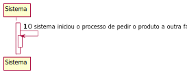
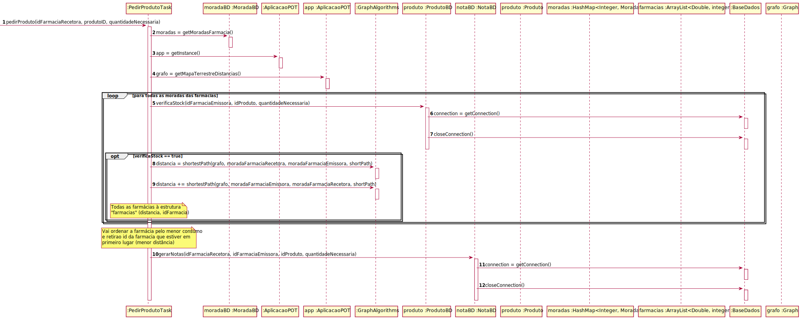
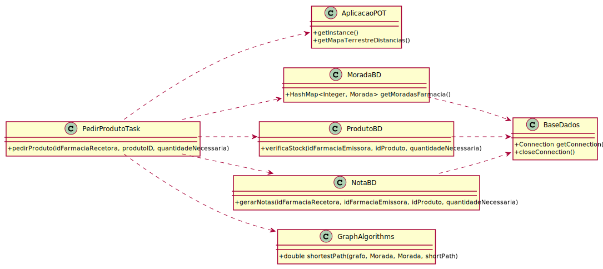

# ReadMe #

## 1. Requisitos
LAP3AP1-113 Como Gestor de Farmácia, desejo puder solicitar um produto a outra farmácia.

A interpretação feita deste requisito foi no sentido de que, quando a minha farmácia não tiver stock suficiente para satisfazer a demanda do cliente, possa solicitar a quantidade necessária a um das farmácias mais próximas. Para tal, o sistema vai buscar todas as moradas referentes às farmácias. De seguida vai realizar calcular o caminho com menor custo de ida e volta (que naturalmente vai ser uma das farmácias mais próximas). De seguida vai criar a nota e emissão da farmácia que fornece o produto e a nota de receção da farmácia que recebeu o produto.

## 2. Análise
### Descrição e Regras de Negócio
Foi utilizado o mecanismo de persistência de dados na base de dados. Desta forma, os dados relativos às notas e aos produtos são inseridos/atualizados na base de dados, no respetivo repositório que neste contexto, é, respetivamente, Nota e Produto. Desta forma, a informação do pedido e o envio do produto por parte das farmácias ficam guardados, podendo ser utilizados posteriormente.

### Pré-condições
- O sistema contém toda a informação necessária para a realização da tarefa.
- O sistema contém todos os repositórios necessários para conter toda a informação criada.

### Pós-condições
- Todas as informações relativas às notas devem ser persistidas/guardadas no sistema
- O stock do produto pedido deve ser atualizado em ambas as farmácias

### SSD

## 3. Design
### 3.1. Realização da Funcionalidade

#### SD - Diagrama de Sequência

#### CD - Diagrama de Classes

### 3.2. Padrões Aplicados
Aplicamos o padrão de projeto de software MVC, focado na reutilização de código e a separação de conceitos em três camadas interconectadas, onde a apresentação dos dados e a interação dos utilizadores são separados dos métodos que interagem com o a base de dados.

### 3.3. Testes

**Teste 1**: Verifica se dado um id da farmácia, o id do produto e a quantidade necessária pedir, é possível pedir a outra farmácia. Caso seja possível deve retornar true, caso contrário, deve retornar false. Para além disso, é testado os casos dar algum problema durante a execução, e consequentemente, lançar uma exceção com a mensagem apropriada.

    @Test
    void pedirProduto() {

        Map<Integer, Morada> moradas = new HashMap<>();
        int farmaciaRecetoraID = 1;
        int farmaciaEmissoraID = 2;
        String nomeProduto = "produto1";
        Produto produto;
        int idProduto = 2;
        int quantidadeNecessaria = 5;

        String emailEstafeta = "estafeta@gmail.com";
        String password = "password";
        when(utilizadorBD.procuraUtilizador(emailEstafeta)).thenReturn(new Utilizador("estafeta", emailEstafeta, 123456789, 123456789, password, Constantes.PAPEL_ESTAFETA));

        AplicacaoPOT app = AplicacaoPOT.getInstance();
        app.getAutorizacaoFacade().setUtilizadorBD(utilizadorBD);
        app.getAutorizacaoFacade().doLogin(emailEstafeta, password);

        Morada partida = new Morada(1, "Rua1,BuenosAires", -1, -1, 1);
        Morada chegada = new Morada(2, "Rua2,Lapaz", -2, -2, 2);
        Morada pontoExtra1 = new Morada(3, "Rua3,Alpendurada", -3, -3, 3);
        Morada pontoExtra2 = new Morada(4, "Rua4,Porto", -4, -4, 4);
        Morada pontoExtra3 = new Morada(5, "Rua5,Porto", -5, -5, 5);
        Morada pontoExtra4 = new Morada(6, "Rua6,Porto", -6, -6, 6);
        Morada pontoExtra5 = new Morada(7, "Rua7,Porto", -7, -7, 7);
        Morada pontoExtra6 = new Morada(8, "Rua8,Porto", -8, -8, 8);
        Morada pontoExtra7 = new Morada(9, "Rua9,Porto", -9, -9, 9);
        Morada pontoExtra8 = new Morada(10, "Rua10,Porto", -10, -10, 10);

        Graph<Morada, Double> graph = new Graph<>(false);
        graph.insertVertex(partida);
        graph.insertVertex(chegada);
        graph.insertVertex(pontoExtra1);
        graph.insertVertex(pontoExtra2);
        graph.insertVertex(pontoExtra3);
        graph.insertVertex(pontoExtra4);
        graph.insertVertex(pontoExtra5);
        graph.insertVertex(pontoExtra6);
        graph.insertVertex(pontoExtra7);
        graph.insertVertex(pontoExtra8);
        graph.insertEdge(partida, chegada, 0.0, 1);
        graph.insertEdge(partida, pontoExtra1, 0.0, 2);
        graph.insertEdge(partida, pontoExtra3, 0.0, 2);
        graph.insertEdge(chegada, pontoExtra6, 0.0, 2);
        graph.insertEdge(pontoExtra1, pontoExtra2, 0.0, 2);
        graph.insertEdge(pontoExtra1, pontoExtra5, 0.0, 2);
        graph.insertEdge(pontoExtra2, pontoExtra4, 0.0, -2);
        graph.insertEdge(pontoExtra2, pontoExtra7, 0.0, 2);
        graph.insertEdge(pontoExtra3, pontoExtra8, 0.0, 2);
        graph.insertEdge(pontoExtra6, pontoExtra7, 0.0, 2);

        app.setMapaTerrestreDistancias(graph);

        moradas.put(farmaciaRecetoraID, partida);
        moradas.put(farmaciaEmissoraID, chegada);
        moradas.put(3, pontoExtra1);
        moradas.put(4, pontoExtra2);
        moradas.put(5, pontoExtra3);
        moradas.put(6, pontoExtra4);
        moradas.put(7, pontoExtra5);
        moradas.put(8, pontoExtra6);
        moradas.put(9, pontoExtra7);
        moradas.put(10, pontoExtra8);

        produto = new Produto(idProduto, nomeProduto, 2.30, 5, 100);

        //sucesso
        when(moradaBD.getMoradasFarmacia()).thenReturn(moradas);
        when(produtoBD.getProdutoById(idProduto)).thenReturn(produto);
        when(produtoBD.verificaStock(farmaciaEmissoraID, idProduto, quantidadeNecessaria)).thenReturn(true);
        when(produtoBD.verificaStock(3, idProduto, quantidadeNecessaria)).thenReturn(true);
        when(produtoBD.verificaStock(4, idProduto, quantidadeNecessaria)).thenReturn(true);
        when(produtoBD.verificaStock(5, idProduto, quantidadeNecessaria)).thenReturn(true);
        when(produtoBD.verificaStock(6, idProduto, quantidadeNecessaria)).thenReturn(true);
        when(produtoBD.verificaStock(7, idProduto, quantidadeNecessaria)).thenReturn(true);
        when(produtoBD.verificaStock(8, idProduto, quantidadeNecessaria)).thenReturn(true);
        when(produtoBD.verificaStock(9, idProduto, quantidadeNecessaria)).thenReturn(true);
        when(produtoBD.verificaStock(10, idProduto, quantidadeNecessaria)).thenReturn(true);
        when(produtoBD.getIDProduto(nomeProduto, farmaciaEmissoraID)).thenReturn(idProduto);
        when(notaBD.gerarNotas(farmaciaRecetoraID, farmaciaEmissoraID, idProduto, quantidadeNecessaria)).thenReturn(1);

        assertTrue(task.pedirProduto(farmaciaRecetoraID, idProduto, quantidadeNecessaria));

        // testa que o metodo de ordenacao esta correto
        List<Pair<Double, Integer>> expected = new ArrayList<>();
        expected.add(new Pair<>(2.0,2));
        expected.add(new Pair<>(4.0,3));
        expected.add(new Pair<>(4.0,5));
        expected.add(new Pair<>(4.0,6));
        expected.add(new Pair<>(6.0,8));
        expected.add(new Pair<>(8.0,4));
        expected.add(new Pair<>(8.0,7));
        expected.add(new Pair<>(8.0,10));
        expected.add(new Pair<>(10.0,9));
        assertEquals(expected, task.getFarmacias());

        //insucesso (não existe stock em nenhuma farmacia)
        moradas.put(farmaciaRecetoraID, partida);
        when(moradaBD.getMoradasFarmacia()).thenReturn(moradas);
        when(produtoBD.getProdutoById(idProduto)).thenReturn(produto);
        when(produtoBD.verificaStock(farmaciaEmissoraID, idProduto, quantidadeNecessaria)).thenReturn(false);
        when(produtoBD.verificaStock(3, idProduto, quantidadeNecessaria)).thenReturn(false);
        when(produtoBD.verificaStock(4, idProduto, quantidadeNecessaria)).thenReturn(false);
        when(produtoBD.verificaStock(5, idProduto, quantidadeNecessaria)).thenReturn(false);
        when(produtoBD.verificaStock(6, idProduto, quantidadeNecessaria)).thenReturn(false);
        when(produtoBD.verificaStock(7, idProduto, quantidadeNecessaria)).thenReturn(false);
        when(produtoBD.verificaStock(8, idProduto, quantidadeNecessaria)).thenReturn(false);
        when(produtoBD.verificaStock(9, idProduto, quantidadeNecessaria)).thenReturn(false);
        when(produtoBD.verificaStock(10, idProduto, quantidadeNecessaria)).thenReturn(false);

        assertFalse(task.pedirProduto(farmaciaRecetoraID, idProduto, quantidadeNecessaria));

        //insucesso
        moradas.put(farmaciaRecetoraID, partida);
        when(moradaBD.getMoradasFarmacia()).thenReturn(moradas);
        when(produtoBD.getProdutoById(idProduto)).thenReturn(null);

        try {
            task.pedirProduto(farmaciaRecetoraID, idProduto, quantidadeNecessaria);
        } catch (Exception e) {
            assertEquals("Erro ao ir buscar o produto a base de dados", e.getMessage());
        }

        //insucesso
        moradas.put(farmaciaRecetoraID, partida);
        when(moradaBD.getMoradasFarmacia()).thenReturn(null);

        try {
            task.pedirProduto(farmaciaRecetoraID, idProduto, quantidadeNecessaria);
        } catch (Exception e) {
            assertEquals("Erro ao ir buscar todas as moradas da farmacia", e.getMessage());
        }

        //insucesso
        moradas.put(farmaciaRecetoraID, partida);
        when(moradaBD.getMoradasFarmacia()).thenReturn(moradas);
        when(produtoBD.getProdutoById(idProduto)).thenReturn(produto);
        when(produtoBD.verificaStock(farmaciaEmissoraID, idProduto, quantidadeNecessaria)).thenReturn(true);
        when(produtoBD.verificaStock(3, idProduto, quantidadeNecessaria)).thenReturn(true);
        when(produtoBD.verificaStock(4, idProduto, quantidadeNecessaria)).thenReturn(true);
        when(produtoBD.verificaStock(5, idProduto, quantidadeNecessaria)).thenReturn(true);
        when(produtoBD.verificaStock(6, idProduto, quantidadeNecessaria)).thenReturn(true);
        when(produtoBD.verificaStock(7, idProduto, quantidadeNecessaria)).thenReturn(true);
        when(produtoBD.verificaStock(8, idProduto, quantidadeNecessaria)).thenReturn(true);
        when(produtoBD.verificaStock(9, idProduto, quantidadeNecessaria)).thenReturn(true);
        when(produtoBD.verificaStock(10, idProduto, quantidadeNecessaria)).thenReturn(true);
        when(produtoBD.getIDProduto(nomeProduto, farmaciaEmissoraID)).thenReturn(0);

        try {
            task.pedirProduto(farmaciaRecetoraID, idProduto, quantidadeNecessaria);
        } catch (Exception e) {
            assertEquals("Erro ao ir buscar o id do produto a base de dados", e.getMessage());
        }

        //insucesso
        moradas.put(farmaciaRecetoraID, partida);
        when(moradaBD.getMoradasFarmacia()).thenReturn(moradas);
        when(produtoBD.getProdutoById(idProduto)).thenReturn(produto);
        when(produtoBD.verificaStock(farmaciaEmissoraID, idProduto, quantidadeNecessaria)).thenReturn(true);
        when(produtoBD.verificaStock(3, idProduto, quantidadeNecessaria)).thenReturn(true);
        when(produtoBD.verificaStock(4, idProduto, quantidadeNecessaria)).thenReturn(true);
        when(produtoBD.verificaStock(5, idProduto, quantidadeNecessaria)).thenReturn(true);
        when(produtoBD.verificaStock(6, idProduto, quantidadeNecessaria)).thenReturn(true);
        when(produtoBD.verificaStock(7, idProduto, quantidadeNecessaria)).thenReturn(true);
        when(produtoBD.verificaStock(8, idProduto, quantidadeNecessaria)).thenReturn(true);
        when(produtoBD.verificaStock(9, idProduto, quantidadeNecessaria)).thenReturn(true);
        when(produtoBD.verificaStock(10, idProduto, quantidadeNecessaria)).thenReturn(true);
        when(produtoBD.getIDProduto(nomeProduto, farmaciaEmissoraID)).thenReturn(idProduto);
        when(notaBD.gerarNotas(farmaciaRecetoraID, farmaciaEmissoraID, idProduto, quantidadeNecessaria)).thenReturn(0);
        try {
            task.pedirProduto(farmaciaRecetoraID, idProduto, quantidadeNecessaria);
        } catch (Exception e) {
            assertEquals("Erro ao criar as notas de emissão e receção", e.getMessage());
        }
    }

## 4. Implementação

## 5. Integração/Demonstração
-/

## 6. Observações
-/
