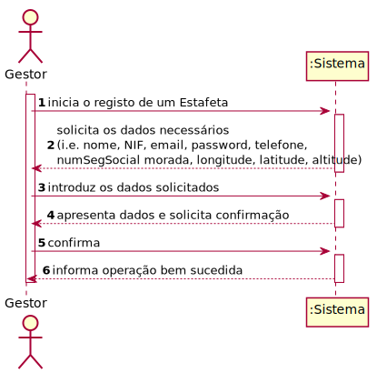

# ReadMe #

## 1. Requisitos
LAP3AP1-49 : Como gestor de farmácia desejo registar um estafeta

A interpretação feita deste requisito foi no sentido de que o gestor da farmácia 
pretende adicionar estafetas responsáveis pelas entregas de uma farmácia. Para tal, 
o gestor introduz os dados referentes ao estafeta. 

## 2. Análise
### Descrição e Regras de Negócio
Foi utilizado o mecanismo de persitência de dados na base de dados. 
Desta forma, os dados relativos ao login e dados pessoais do estafeta, bem como à farmácia
que o emprega estão presentes na base de dados.

### Pré-condições
O sistema contém farmácias e moradas na base de dados.

### Pós-condições
Um estafeta é registado no sistema.

### SSD

## 3. Design
### 3.1. Realização da Funcionalidade

### 3.2. Padrões Aplicados
Aplicamos o padrão de projeto de software MVC, focado na reutilização de código
e a separação de conceitos em três camadas interconectadas, onde a apresentação
dos dados e a interação dos utilizadores são separados dos métodos que interagem
com a base de dados.

### 3.3. Testes

- **Teste 1** - Registo do estafeta com sucesso

        @Test
        void validarEstafetaSuccess() {
            farmaciaBD = mock(FarmaciaBD.class);
            utilizadorBD = mock(UtilizadorBD.class);
            estafetaBD = mock(EstafetaBD.class);
            moradaBD = mock(MoradaBD.class);
            instance = new RegistarEstafetaController(farmaciaBD, utilizadorBD, estafetaBD, moradaBD);
            when(estafetaBD.validaEstafeta("teste@email.com",123456789,"12345678987")).thenReturn(true);
            when(moradaBD.validaMorada("rua",55,55,55)).thenReturn(true);
            instance.validarEstafeta("teste@email.com","password","Nome",123456789,123456789,"12345678987",10,"rua",55,55,55);
        }

- **Teste 2** - Estafeta inválido na base de dados

        @Test
        void validarEstafetaValidaFail() {
            farmaciaBD = mock(FarmaciaBD.class);
            utilizadorBD = mock(UtilizadorBD.class);
            estafetaBD = mock(EstafetaBD.class);
            moradaBD = mock(MoradaBD.class);
            instance = new RegistarEstafetaController(farmaciaBD, utilizadorBD, estafetaBD, moradaBD);
            IllegalArgumentException exception = new IllegalArgumentException("Estafeta inválido");
            try{
                when(moradaBD.validaMorada("rua",55,55,55)).thenReturn(true);
                when(estafetaBD.validaEstafeta("teste@email.com",2,"12345678987")).thenReturn(false);
                instance.validarEstafeta("teste@email.com","password","Nome",123456789,123456789,"12345678987",10,"rua",55,55,55);
            }catch(IllegalArgumentException e){
                assertEquals(exception.getMessage(),e.getMessage());
            }
        }

- **Teste 3** - Morada inválida na base de dados

        @Test
        void validarEstafetaValidaFail2() {
            farmaciaBD = mock(FarmaciaBD.class);
            utilizadorBD = mock(UtilizadorBD.class);
            estafetaBD = mock(EstafetaBD.class);
            moradaBD = mock(MoradaBD.class);
            instance = new RegistarEstafetaController(farmaciaBD, utilizadorBD, estafetaBD, moradaBD);
            IllegalArgumentException exception = new IllegalArgumentException("Morada inválida");
            try{
                when(moradaBD.validaMorada("rua",55,55,55)).thenReturn(false);
                when(estafetaBD.validaEstafeta("teste@email.com",2,"12345678987")).thenReturn(false);
                instance.validarEstafeta("teste@email.com","password","Nome",123456789,123456789,"12345678987",10,"rua",55,55,55);
            }catch(IllegalArgumentException e){
                assertEquals(exception.getMessage(),e.getMessage());
            }
        }

- **Teste 4** - Parâmetros do estafeta inválidos

        @Test
        void validarEstafetaParametrosEstafetaFail() {
            IllegalArgumentException exception = new IllegalArgumentException("Número de Segurança Social inválido");
            try{
                instance = new RegistarEstafetaController(farmaciaBD, utilizadorBD, estafetaBD, moradaBD);
                instance.validarEstafeta("teste@email.com","password","Nome",123456789,123456789,"2",10,"Rua teste",55,55,55);
            }catch(IllegalArgumentException e){
                assertEquals(exception.getMessage(),e.getMessage());
            }
            exception = new IllegalArgumentException("Carga Máxima não pode ser igual ou inferior a 0");
            try{
                instance = new RegistarEstafetaController(farmaciaBD, utilizadorBD, estafetaBD, moradaBD);
                instance.validarEstafeta("teste@email.com","password","Nome",123456789,123456789,"12345678987",0,"Rua teste",55,55,55);
            }catch(IllegalArgumentException e){
                assertEquals(exception.getMessage(),e.getMessage());
            }
        }

- **Teste 5** - Parâmetros do utilizador inválidos

        @Test
        void validarEstafetaParametrosUtilizadorFail() {
            IllegalArgumentException exception = new IllegalArgumentException("Endereço de email inválido.");
            try{
                instance = new RegistarEstafetaController(farmaciaBD, utilizadorBD, estafetaBD, moradaBD);
                instance.validarEstafeta("fail","password","Nome",123456789,123456789,"12345678987",10,"Rua teste",55,55,55);
            }catch(IllegalArgumentException e){
                assertEquals(exception.getMessage(),e.getMessage());
            }
        }

- **Teste 6** - Parâmetros da morada inválidos

        @Test
        void validarEstafetaParametrosMoradaFail() {
            IllegalArgumentException exception = new IllegalArgumentException("Morada inválida");
            try{
                instance = new RegistarEstafetaController(farmaciaBD, utilizadorBD, estafetaBD, moradaBD);
                instance.validarEstafeta("teste@email.com","password","Nome",123456789,123456789,"12345678987",10,"",55,55,55);
            }catch(IllegalArgumentException e){
                assertEquals(exception.getMessage(),e.getMessage());
            }
        }

- **Teste 7** - Registo do estafeta

        @Test
        void registarEstafeta() throws Exception {
            farmaciaBD = mock(FarmaciaBD.class);
            utilizadorBD = mock(UtilizadorBD.class);
            estafetaBD = mock(EstafetaBD.class);
            moradaBD = mock(MoradaBD.class);
            instance = new RegistarEstafetaController(farmaciaBD, utilizadorBD, estafetaBD, moradaBD);
            when(utilizadorBD.procuraUtilizador("teste@email.com")).thenReturn(new Utilizador("teste","teste@email.com",123456789,123456789,"password",1));
            when(farmaciaBD.getFarmaciabyGestor("teste@email.com")).thenReturn(new Farmacia(1,"teste",123456789,123456789,"teste@email.com","teste2@email.com","1"));
            when(estafetaBD.registaEstafeta("teste@email.com",1,"12345678987",10)).thenReturn(true);
            AplicacaoPOT app = AplicacaoPOT.getInstance();
            app.getAutorizacaoFacade().setUtilizadorBD(utilizadorBD);
            app.doLogin("teste@email.com","password");
            boolean result = instance.registarEstafeta("teste@email.com","password","Nome",123456789,123456789,"12345678987",10,"Rua teste",55,55,115.0);
            assertTrue(result);
        }

## 4. Implementação

- **Metodos do Controller**

> public void validarEstafeta(String email, String password, String nome, int nif, int telefone, String numSegSocial,double cargaMaxima, String morada, double latitude, double longitude, double altitude)
> 
> public boolean registarEstafeta(String email, String password, String nome, int nif, int telefone, String numSegSocial, double cargaMaxima, String morada, double latitude, double longitude, double altitude) throws SQLException

## 5. Integração/Demonstração
-/

## 6. Observações
-/