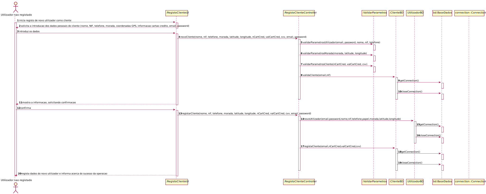
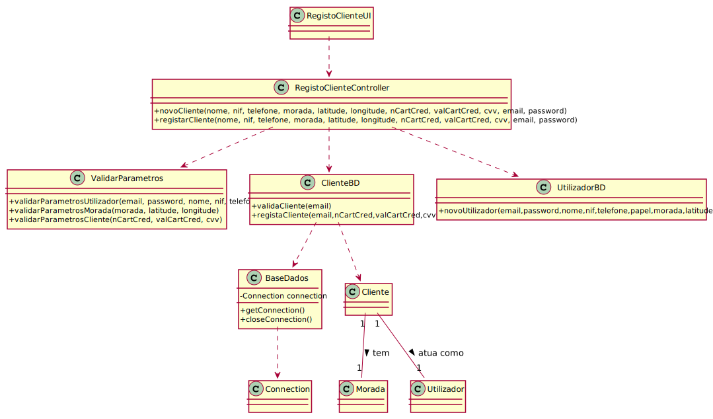

# ReadMe #

## 1. Requisitos
LAP3AP1-52 Como utilizador não registado desejo registar-me na aplicação como cliente

A interpretação feita deste requisito foi no sentido de que um utilizador não registado se pretende registar no sistema
como cliente. Para tal, introduz a informação necessária, o sistema valida os dados, e guarda a informação correspondente no sistema.

## 2. Análise
### Descrição e Regras de Negócio
Foi utilizado o mecanismo de persistência de dados na base de dados.
Desta forma, os dados relativos ao Cliente são inseridos na base de dados,
no respetivo repositório que neste contexto, é o Utilizador. Desta forma, a
informação do Cliente fica guardada, podendo ser utilizada ou alterada posteriormente.

### Pré-condições
O sistema contém todos os repositórios necessários para conter toda a informação introduzida.

### Pós-condições
A informação do novo cliente é persistida/guardada no sistema.

### SSD

## 3. Design
### 3.1. Realização da Funcionalidade
#### SD

#### CD

### 3.2. Padrões Aplicados
Aplicamos o padrão de projeto de software MVC, focado na reutilização de código e a separação de conceitos em três camadas interconectadas, onde a apresentação dos dados e a interação dos utilizadores são separados dos métodos que interagem com o a base de dados.

### 3.3. Testes

Teste 1: Verifica que os dados introduzidos são válidos.

    @Test
    void novoClienteSuccess() {
        when(moradaBD.validaMorada("Rua aaasd", 25.5,90.5,15)).thenReturn(true);
        when(clienteBD.validaCliente("joao@email.com")).thenReturn(true);
        instance.novoCliente("joao@email.com","asddd","Joao",123456789,911234567,"Rua aaasd", 25.5,90.5,15,"1234567891234569","05/25",123);
    }

Teste 2: Verifica que é possível registar o cliente como novo utilizador do sistema.

    @Test
    void registarClienteSuccess() {
        when(utilizadorBD.novoUtilizador("joao@email.com","asddd","Joao",123456789,911234567, Constantes.PAPEL_CLIENTE,"Rua aaasd", 25.5,90.5,115.0)).thenReturn(true);
        when(clienteBD.registaCliente("joao@email.com","1234567891234569","05/25",123)).thenReturn(true);
        boolean result = instance.registarCliente("joao@email.com","asddd","Joao",123456789,911234567,"Rua aaasd", 25.5,90.5,115.0,"1234567891234569","05/25",123);
        assertTrue(result);
    }

## 4. Implementação
Métodos Controller:

    public void novoCliente(String email, String password, String nome, int nif, int telefone, String morada, double latitude, double longitude, double altitude, String nCartCred, String valCartCred, int cvv) {}

    public boolean registarCliente(String email, String password, String nome, int nif, int telefone, String morada, double latitude, double longitude, double altitude, String nCartCred, String valCartCred, int cvv) {}

## 5. Integração/Demonstração
-/
## 6. Observações
-/