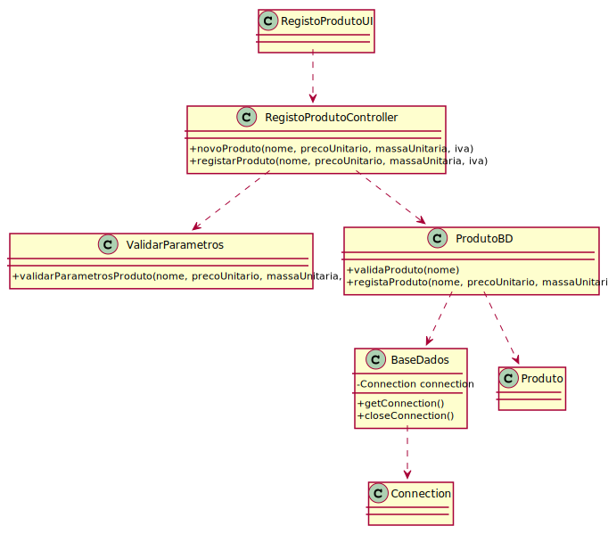

# ReadMe #

## 1. Requisitos
LAP3AP1-64 Como administrador, desejo adicionar um novo produto ao sistema

A interpretação feita deste requisito foi no sentido de que o administrador pretende adicionar produtos ao sistema e às 
suas farmácias. Para tal, introduz a informação necessária, o sistema valida os dados, e guarda a informação 
correspondente no sistema.

## 2. Análise
### Descrição e Regras de Negócio
Foi utilizado o mecanismo de persistência de dados na base de dados.
Desta forma, os dados relativos ao Produto são inseridos na base de dados,
nos respetivos repositórios que neste contexto, são o Produto e o Produto_Farmacia. Desta forma, a
informação deste Produto fica guardada, podendo ser utilizada ou alterada posteriormente.

### Pré-condições
O sistema contém todos os repositórios necessários para conter toda a informação introduzida.

### Pós-condições
A informação do novo produto é persistida/guardada no sistema.

### SSD

## 3. Design
### 3.1. Realização da Funcionalidade
#### SD

#### CD

### 3.2. Padrões Aplicados
Aplicamos o padrão de projeto de software MVC, focado na reutilização de código e a separação de conceitos em três camadas interconectadas, onde a apresentação dos dados e a interação dos utilizadores são separados dos métodos que interagem com o a base de dados.

### 3.3. Testes

Teste 1: Verifica que os dados introduzidos são válidos.

    @Test
    void novoProdutoSuccess() {
        produtoBD = mock(ProdutoBD.class);
        instance= new RegistoProdutoController(produtoBD);
        when(produtoBD.validaProduto("viagra")).thenReturn(true);
        instance.novoProduto("viagra",19.75,55,6);
    }

Teste 2: Verifica que é possível registar o produto.

    @Test
    void registarProdutoSuccess() throws Exception {
        produtoBD = mock(ProdutoBD.class);
        instance= new RegistoProdutoController(produtoBD);
        when(produtoBD.registaProduto("viagra",19.75,180,6)).thenReturn(true);

        boolean result = instance.registarProduto("viagra",19.75,180,6);
        assertTrue(result);
    }

## 4. Implementação
Métodos Controller:

    public void novoProduto(String nome, double precoUnitario, int pesoUnitario,int iva){}

    public boolean registarProduto(String nome, double precoUnitario, int pesoUnitario,int iva) throws SQLException {}

## 5. Integração/Demonstração
-/
## 6. Observações
-/