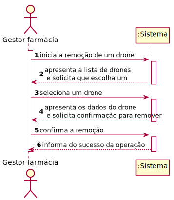
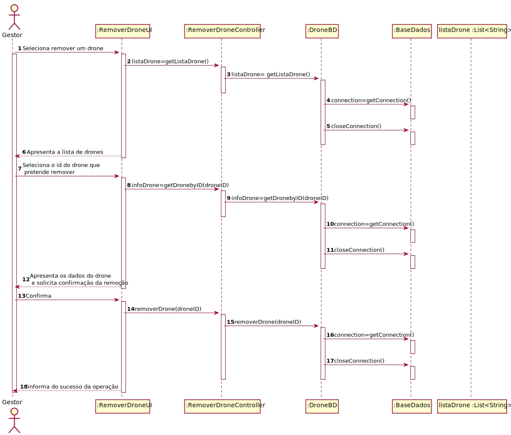
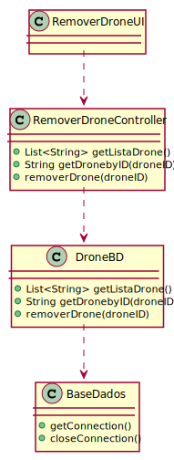

# ReadMe #

## 1. Requisitos
LAP3AP1-110 Como gestor da farmácia pretendo remover um drone da farmácia.

A interpretação feita deste requisito foi no sentido de que o gestor de farmácia pretende remover um drone da lista de drones existentes no sistema, relativas à sua farmácia. Para tal, introduz a informação necessária e o sistema
verifica a possibilidade, informa da possibilidade e remove a informação correspondente a um drone.

## 2. Análise
### Descrição e Regras de Negócio
Foi utilizado o mecanismo de persistência de dados na base de dados.
Desta forma, os dados relativos ao drone são inseridos na base de dados,
no respetivo repositório que neste contexto, é o Lugar de estacionamento. Desta forma, a
informação dos drones fica guardada, podendo ser utilizada ou alterada posteriormente.

### Pré-condições
O sistema contém farmácias com drones(um repositório onde se encontra toda a informação das diferentes drones).

### Pós-condições
A informação do drone selecionada é removida do sistema.

### SSD

## 3. Design
### 3.1. Realização da Funcionalidade
#### SD

#### CD

### 3.2. Padrões Aplicados
Aplicamos o padrão de projeto de software MVC, focado na reutilização de código e a separação de conceitos em três camadas interconectadas, onde a apresentação dos dados e a interação dos utilizadores são separados dos métodos que interagem com a base de dados.

### 3.3. Testes

Teste 1: Verifica que é possível obter a lista de drones da farmácia do gestor

    @Test
    void getListaDrone() {
        droneBD=mock(DroneBD.class);
        instance= new RemoverDroneController(droneBD);

        Drone drone = new Drone(1, 20, 20, 1, 300, 20, 10, 100);
        List<String> drones= new ArrayList<>();
        drones.add(drone.getId()+"");

        when(droneBD.getListaDrone()).thenReturn(drones);

        assertEquals(drones,instance.getListaDrone());
    }

Teste 2: Verifica que é possível obter um drone através de um id selecionado

    @Test
    void getDroneByID() {
        droneBD=mock(DroneBD.class);
        instance= new RemoverDroneController(droneBD);
        when(droneBD.getDroneByID(1)).thenReturn("Drone: 1");

        String result= instance.getDroneByID(1);

        assertTrue(result.equalsIgnoreCase("Drone: 1"));
    }

Teste 3: Verifica que é possível remover o drone selecionado

    @Test
    void removerDrone() {
        droneBD=mock(DroneBD.class);
        instance= new RemoverDroneController(droneBD);
        when(droneBD.removerDrone(1)).thenReturn(true);

        boolean result=instance.removerDrone(1);
        assertTrue(result);
    }

## 4. Implementação
Métodos Controller:

    public List<String> getListaDrone (){}

    public String getDroneByID(int scooterID){}

    public boolean removerDrone(int scooterID){}

## 5. Integração/Demonstração
-/
## 6. Observações
-/
