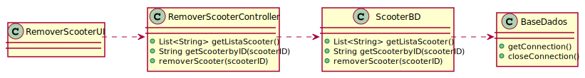

# ReadMe #

## 1. Requisitos
LAP3AP1-39 - Como gestor da farmácia pretendo remover uma scooter da farmácia.

A interpretação feita deste requisito foi no sentido de que o gestor de farmácia pretende remover uma scooter da lista de scooters existentes no sistema, relativas à sua farmácia. Para tal, introduz a informação necessária e o sistema
verifica a possibilidade, informa da possibilidade e remove a informação correspondente a uma scooter.

## 2. Análise
### Descrição e Regras de Negócio
Foi utilizado o mecanismo de persistência de dados na base de dados.
Desta forma, os dados relativos à scooter são inseridos na base de dados,
no respetivo repositório que neste contexto, é o Lugar de estacionamento. Desta forma, a
informação das scooters fica guardada, podendo ser utilizada ou alterada posteriormente.

### Pré-condições
O sistema contém farmácias com scooters(um repositório onde se encontra toda a informação das diferentes scooters).

### Pós-condições
A informação da scooter selecionada é removida do sistema.

### SSD

## 3. Design
### 3.1. Realização da Funcionalidade

### 3.2. Padrões Aplicados
Aplicamos o padrão de projeto de software MVC, focado na reutilização de código e a separação de conceitos em três camadas interconectadas, onde a apresentação dos dados e a interação dos utilizadores são separados dos métodos que interagem com o a base de dados.

### 3.3. Testes

Teste 1: Verifica que é possível obter a lista de scooters da farmácia do gestor

    @Test
    void getListaScooter() throws IOException, WriterException {
    scooterBD=mock(ScooterBD.class);
    instance= new RemoverScooterController(scooterBD);

    Scooter s = new Scooter(1, 20, 20, 1, 300, 20, 10, 100);
    List<String> scooters= new ArrayList<>();
    scooters.add(s.getId()+"");

    when(scooterBD.getListaScooter()).thenReturn(scooters);

    assertEquals(scooters,instance.getListaScooter());
    }

Teste 2:  Verifica que é possível obter uma scooter através de um id selecionado

      @Test
      void getScooterByID() {
      scooterBD=mock(ScooterBD.class);
      instance= new RemoverScooterController(scooterBD);
      when(scooterBD.getScooterByID(1)).thenReturn("Scooter: 1");

      String result= instance.getScooterByID(1);

      assertTrue(result.equalsIgnoreCase("Scooter: 1"));
      }

 Teste 3: Verifica que é possível remover a scooter selecionada

      @Test
      void removerScooter() {
      scooterBD=mock(ScooterBD.class);
      instance= new RemoverScooterController(scooterBD);
      when(scooterBD.removerScooter(1)).thenReturn(true);

      boolean result=instance.removerScooter(1);
      assertTrue(result);
      }

## 4. Implementação
Métodos Controller:

    public List<String> getListaScooter (){}

    public String getScooterByID(int scooterID){}

    public boolean removerScooter(int scooterID){}

## 5. Integração/Demonstração
-/
## 6. Observações
-/
