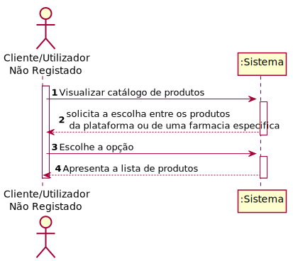
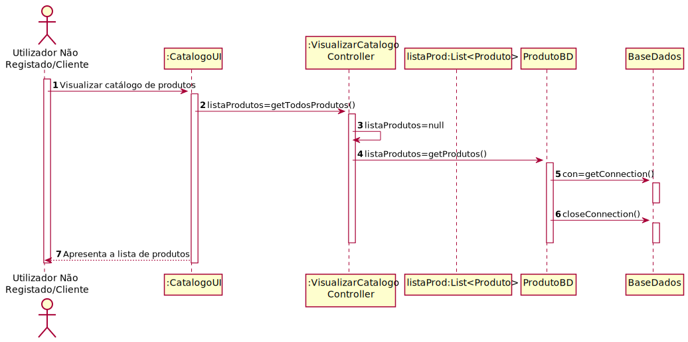
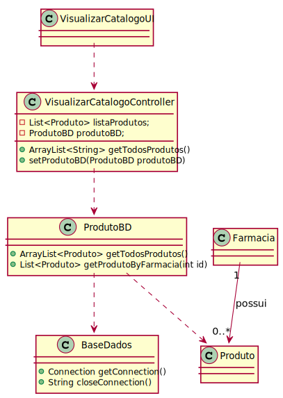

# ReadMe #

## 1. Requisitos
LAP3AP1-69 Como cliente/utilizador não registado desejo visualizar o catálogo de produtos.

A interpretação feita deste requisito foi no sentido de que o cliente/utilizador não registado pretende visualizar o catálogo de produtos existente no sistema. Para tal, introduz a informação necessária e o sistema
verifica a possibilidade, informa da possibilidade e guarda a informação correspondente no catálogo.

## 2. Análise
### Descrição e Regras de Negócio
Foi utilizado o mecanismo de persitência de dados na base de dados.
Desta forma, os dados relativos ao Produto e a farmácia são acedidos a partir da base de dados.

### Pré-condições
O sistema contém um catálogo de produtos e farmacias registadas.

### Pós-condições
N/A 

### SSD

## 3. Design
### 3.1. Realização da Funcionalidade

### 3.2. Padrões Aplicados
Aplicamos o padrão de projeto de software MVC, focado na reutilização de código e a separação de conceitos em três camadas interconectadas, onde a apresentação dos dados e a interação dos utilizadores são separados dos métodos que interagem com o a base de dados.
### 3.3. Testes
Nesta secção deve sistematizar como os testes foram concebidos para permitir uma correta aferição da
satisfação dos requisitos.

Teste 1: Verificar se o metodo vai buscar os produtos relativos a uma farmácia.

    @Test
    void getProdutosByFarmacia() {
        VisualizarCatalogoController visualizarCatalogoController=new VisualizarCatalogoController();
        produtoBD = mock(ProdutoBD.class);
        ArrayList<Produto> lista=new ArrayList<>();
        Produto produto1=new Produto(1,"nome",1,1,1);
        Produto produto2=new Produto(2,"nome",12,13,2);
        lista.add(produto1);
        lista.add(produto2);
        when(produtoBD.getProdutoByFarmacia(1)).thenReturn(lista);
        visualizarCatalogoController.setProdutoBD(produtoBD);
        ArrayList<String> listaString=new ArrayList<>();
        listaString.add(produto1.toString());
        listaString.add(produto2.toString());
        assertEquals(listaString,visualizarCatalogoController.getProdutosByFarmacia(1));
    }
    
Teste 2: Verificar se o metodo vai buscar os produtos relativos a todas as farmácias.

     @Test
        void getProdutosByFarmacia() {
            VisualizarCatalogoController visualizarCatalogoController=new VisualizarCatalogoController();
            produtoBD = mock(ProdutoBD.class);
            ArrayList<Produto> lista=new ArrayList<>();
            Produto produto1=new Produto(1,"nome",1,1,1);
            Produto produto2=new Produto(2,"nome",12,13,2);
            lista.add(produto1);
            lista.add(produto2);
            when(produtoBD.getProdutoByFarmacia(1)).thenReturn(lista);
            visualizarCatalogoController.setProdutoBD(produtoBD);
            ArrayList<String> listaString=new ArrayList<>();
            listaString.add(produto1.toString());
            listaString.add(produto2.toString());
            assertEquals(listaString,visualizarCatalogoController.getProdutosByFarmacia(1));
        }
Teste 3: Verificar se o metodo vai buscar a informaçáo relativa as farmacias.

     @Test
         void getFarmacias() {
             VisualizarCatalogoController visualizarCatalogoController=new VisualizarCatalogoController();
             farmaciaBD = mock(FarmaciaBD.class);
     
             ArrayList<Farmacia> lista=new ArrayList<>();
             Farmacia farmacia1=new Farmacia("farmacia1",2,2,"farmacia1@gmail.com");
             Farmacia farmacia2=new Farmacia("farmacia2",2,2,"farmacia2@gmail.com");
             lista.add(farmacia1);
             lista.add(farmacia2);
             when(farmaciaBD.getFarmacias()).thenReturn(lista);
             visualizarCatalogoController.setFarmaciaBD(farmaciaBD);
             ArrayList<String> listaString=new ArrayList<>();
             listaString.add(farmacia1.toString());
             listaString.add(farmacia2.toString());
             assertEquals(listaString,visualizarCatalogoController.getFarmacias());
         }
## 4. Implementação
Estrutura do controller:

    public VisualizarCatalogoController() {
    }

    public ArrayList<String> getFarmacias(){
    }

    public ArrayList<String> getTodosProdutos(){
    }

     public List<String> getProdutosByFarmacia(int id){
    }

    public void setProdutoBD(ProdutoBD produtoBD) {
    }

    public void setFarmaciaBD(FarmaciaBD farmaciaBD) {
    }

## 5. Integração/Demonstração

## 6. Observações
